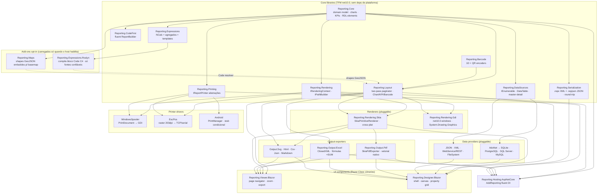

# OmniReport

[](.github/workflows/ci.yml)
[](LICENSE)
[](https://dotnet.microsoft.com/)
[](#)
[](#)

**Motor profissional de relatórios bandados para .NET 10**, com duas modalidades de autoria
(code-first fluent + designer visual Blazor) e pipeline de renderização pluggable
(SkiaSharp, GDI/Windows, PDF vetorial, XLSX, HTML/SVG/CSV/JSON/Markdown, ESC/POS térmico,
Android Print Framework). Gráficos nativos (barras/linhas/pizza), medidores KPI
(gauge/data-bar/sparkline/indicator), Tablix, mapas vetoriais e códigos de barras/QR;
conectores de dados para SQL (SQLite/PostgreSQL/SQL Server/MySQL), JSON, XML, REST e
sistema de arquivos.

Equivalente em capacidade a Crystal Reports / SSRS / FastReport, original, MIT, com foco
em cenários brasileiros (PDV, NFC-e, DANFE, ABNT NBR 5891).

## Sumário

- [Arquitetura](#arquitetura)
- [Quickstarts](#quickstarts)
  - [Primeiro relatório code-first em 5 minutos](#primeiro-relatório-code-first-em-5-minutos)
  - [Primeiro relatório no designer em 5 minutos](#primeiro-relatório-no-designer-em-5-minutos)
  - [Canvas low-level (sem bandas)](#canvas-low-level-sem-bandas)
  - [Hospedando em ASP.NET Core / Blazor / MAUI](#hospedando-em-aspnet-core--blazor--maui)
- [Samples](#samples)
- [Status](#status)
- [Documentação](#documentação)
- [Contribuindo](#contribuindo)

## Arquitetura



**Princípios**:

- `Reporting.Core` é puro: zero dependência de plataforma, GUI ou framework de UI.
- Bandas + elementos imutáveis (`sealed record`) compõem o `ReportDefinition`.
- A paginação produz `LayoutPrimitive`s posicionados em coordenadas absolutas — qualquer
  renderer (Skia, GDI) consome a mesma sequência.
- Renderers/exporters/printers são plug-and-play via DI.
- Designer e Viewer são Razor Class Libraries: o mesmo binário roda em Blazor Server,
  Blazor Web App e MAUI Blazor Hybrid (Windows + Android).

## Quickstarts

> **Requisitos:** SDK do .NET 10. O núcleo, o Skia, os exporters e o ESC/POS são
> cross-platform; o renderer GDI e o `WindowsSpoolerPrinter` exigem `net10.0-windows`
> (Windows) e o `AndroidPrintFrameworkPrinter` exige `net10.0-android`.

### Primeiro relatório code-first em 5 minutos

```csharp
using Reporting.CodeFirst;
using Reporting.Output.Pdf;
using Reporting.Layout;
using Reporting.Rendering.Skia;

var vendas = new[]
{
    new { Cliente = "Ana",  Produto = "Caneta",  Total = 25.00m },
    new { Cliente = "Ana",  Produto = "Caderno", Total = 27.40m },
    new { Cliente = "Beto", Produto = "Lápis",   Total = 10.80m },
};

var report = ReportBuilder.Create("Vendas")
    .Page(p => p.A4().Portrait().Margins(20))
    .DataSource("Vendas", vendas)
    .ReportHeader(h => h.Height(15)
        .Text("Relatório de Vendas").At(0, 0).Size(170, 12).Center().Bold().Font("Arial", 16))
    .Group("PorCliente", "Fields.Cliente", g => g
        .Header(h => h.Height(8)
            .Text("Cliente: {Fields.Cliente}").At(0, 1).Size(170, 6).Bold())
        .Detail(d => d.Height(6)
            .Text("{Fields.Produto}").At(0, 0).Size(100, 6)
            .Text("{Fields.Total:C}").At(140, 0).Size(30, 6).AlignRight()))
    .ReportFooter(f => f.Height(10)
        .Text("Total: {Sum(Fields.Total):C}").At(0, 2).Size(170, 6).AlignRight().Bold())
    .Build();

var rendered = await report.PaginateAsync();
new SkiaPdfExporter().ExportToFile(rendered, "vendas.pdf");
```

Resultado: PDF vetorial com texto selecionável, fórmulas pt-BR (R$ 53,40), agrupado por cliente.

### Primeiro relatório no designer em 5 minutos

1. Adicione ao seu app Blazor o pacote `Reporting.Designer.Blazor`:
   ```xml
   <PackageReference Include="Reporting.Designer.Blazor" />
   ```
2. No `App.razor` (ou `_Host.cshtml`) carregue as folhas de estilo do designer no `<head>`
   — as cinco são necessárias, na ordem abaixo (tokens → base → layout → componentes → overlays):
   ```html
   <link rel="stylesheet" href="_content/Reporting.Designer.Blazor/css/tokens.css" />
   <link rel="stylesheet" href="_content/Reporting.Designer.Blazor/css/base.css" />
   <link rel="stylesheet" href="_content/Reporting.Designer.Blazor/css/layout.css" />
   <link rel="stylesheet" href="_content/Reporting.Designer.Blazor/css/components.css" />
   <link rel="stylesheet" href="_content/Reporting.Designer.Blazor/css/overlays.css" />
   ```
   E, antes de `</body>`, o módulo JS (drag/resize, marquee, smart-guides, réguas e zoom):
   ```html
   <script src="_content/Reporting.Designer.Blazor/js/designer.js"></script>
   ```
3. Em uma página:
   ```razor
   @page "/designer"
   @rendermode InteractiveServer
   @using Reporting.Designer.Blazor

   <ReportDesigner OnSaved="@HandleSaved" />

   @code {
       private async Task HandleSaved(byte[] repxBytes)
       {
           // Persist em DB, S3, etc.
           await File.WriteAllBytesAsync("user-report.repx", repxBytes);
       }
   }
   ```
4. Navegue, arraste do toolbox, edite no property grid, salve. O `.repx` é compatível com
   `RepxSerializer.Load` e roda igual no pipeline de paginação code-first.

### Canvas low-level (sem bandas)

Quando o modelo bandado não encaixa (certificados, crachás, etiquetas, layouts computados),
fale **direto** com `IRenderingContext` — sem `ReportDefinition`, sem paginador. Você posiciona
cada primitivo em milímetros:

```csharp
using Reporting.Geometry;
using Reporting.Paper;
using Reporting.Rendering;
using Reporting.Rendering.Skia;
using Reporting.Styling;

using var ctx = new SkiaRenderingContext();      // é IRenderingContext E ITextMeasurer
ctx.BeginPage(PageSetup.A4Portrait);

ctx.DrawRectangle(                                // faixa laranja preenchida
    new Rectangle(Unit.FromMm(20), Unit.FromMm(20), Unit.FromMm(170), Unit.FromMm(16)),
    pen: null, fill: new BrushStyle(Color.FromRgb(0xC2, 0x41, 0x0C)));

ctx.DrawText("CRACHÁ DE ACESSO",                  // título centralizado
    new Rectangle(Unit.FromMm(20), Unit.FromMm(24), Unit.FromMm(170), Unit.FromMm(10)),
    new TextStyle(new Font("Arial", 20, FontStyle.Bold), Color.White, HorizontalAlignment.Center));

ctx.DrawPath(b => b                               // losango: contorno + preenchimento
        .MoveTo(new Point(Unit.FromMm(105), Unit.FromMm(42)))
        .LineTo(new Point(Unit.FromMm(110), Unit.FromMm(47)))
        .LineTo(new Point(Unit.FromMm(105), Unit.FromMm(52)))
        .LineTo(new Point(Unit.FromMm(100), Unit.FromMm(47)))
        .Close(),
    new PenStyle(Color.Black, Unit.FromPoint(0.7)),
    new BrushStyle(Color.FromRgb(0x96, 0x6C, 0x29)));

ctx.EndPage();
File.WriteAllBytes("cracha.png", ctx.GetPagePng(0));
```

O **mesmo** código de desenho roda contra qualquer backend: troque `SkiaRenderingContext` por
`SkiaPdfRenderingContext` (PDF vetorial) ou `RecordingRenderingContext` (→ XLSX) sem mudar uma
linha. Guia completo em [`docs/low-level-canvas.md`](docs/low-level-canvas.md).

### Hospedando em ASP.NET Core / Blazor / MAUI

```csharp
using Reporting.Hosting;

builder.Services.AddReporting(opts => opts
    .UseSkiaRendering()                                        // padrão; pode chamar UseGdi() em Windows
    .UsePdfOutput(new PdfExportOptions { Author = "Acme" })
    .UseExcelOutput()
    .UsePrinter<WindowsSpoolerPrinter>()                       // ou EscPosPrinter, AndroidPrintFrameworkPrinter
    .AddDataSource("Vendas", await LoadVendasAsync()));
```

A partir daí, qualquer componente Razor (`<ReportViewer />`, `<ReportDesigner />`) ou serviço
custom recebe via DI: `IRenderingContext`, `IReportPaginator`, `SkiaPdfExporter`,
`ExcelExporter`, `IReportPrinter`, `DataSourceRegistry`, `RepxSerializer`.

## Samples

| Sample | Plataforma | O que demonstra |
|---|---|---|
| `samples/Reporting.Samples.CodeFirst` | Console | 15 relatórios reais — Vendas, Produtos, Caixa, Cupom NFC-e, conectores (JSON/XML/REST/FileSystem/SQLite) e componentes visuais (Dashboard, Tablix, Mapa, bloco Code) → PDF/PNG/XLSX/HTML/SVG/CSV/JSON/Markdown/.repx/.repjson/.escpos.bin |
| `samples/Reporting.Samples.DatabaseReport` | Console | Relatório a partir de banco SQLite via AdoNet/SqliteDataSource |
| `samples/Reporting.Samples.WindowsPrinting` | Windows console | Lista impressoras + imprime sample 1 em "Microsoft Print to PDF" via WindowsSpoolerPrinter |
| `samples/Reporting.Samples.BlazorServer` | Blazor Web App | Galeria com `<ReportViewer />` + rota `/designer` com `<ReportDesigner />` e faixa **Sandbox** que carrega os samples (Dashboard/Tablix/Mapa renderizam **com dados** no preview) |
| `samples/Reporting.Samples.MauiHybrid` | MAUI (Windows + Android cond.) | Mesmos componentes Razor em desktop nativo e Android nativo |

```powershell
# rodar os samples principais (gera PDFs, XLSX, .repx, .repjson):
dotnet run --project samples/Reporting.Samples.CodeFirst -c Release -- ./out
# iniciar Blazor Server (designer + viewer):
dotnet run --project samples/Reporting.Samples.BlazorServer
# Windows + designer/viewer in-process via MAUI WebView:
dotnet run --project samples/Reporting.Samples.MauiHybrid -f net10.0-windows10.0.19041.0
```

## Status

A v0.1.0 entregou as 11 etapas do roteiro original (17 bibliotecas, 375 testes). Desde então o
projeto **mais que dobrou**: hoje são **36 bibliotecas** em `src/`, **726 testes** verdes (22
projetos de teste) e cobertura ≥ 80% no núcleo.

**Adicionado após a v0.1.0:**

| Área | Módulos / recursos | Status |
|---|---|---|
| Conectores de dados | AdoNet · SQLite · PostgreSQL · SQL Server · MySQL · JSON · XML · WebService/REST · FileSystem | ✅ |
| Exporters de texto | SVG · HTML · CSV · JSON · Markdown (com testes) | ✅ |
| Código de barras | `Reporting.Barcode` — 1D (Code128/39/Codabar/ITF/EAN/UPC/ISBN/ISSN) + QR Code 2D | ✅ |
| Master-detail | sub-bandas + relações pai→filho (paginador e designer) | ✅ |
| Designer | DataConnect (conexão/schema/query/preview/relações), impressão (browser + nativo), formatação condicional, RDL Phase 1, **editores visuais dos 7 elementos avançados**, réguas dual-axis com guias arrastáveis/snap, status bar e diálogo "Sobre" reais | ✅ |
| Gráficos | `ChartElement` barras/linhas/pizza **renderizando** + fluente `.Chart()` | ✅ |
| KPIs | Gauge · DataBar · Sparkline · Indicator **renderizando** + API fluente | ✅ |
| Tablix (tabela) | data region bandada **renderizando** + fluente `.Tablix()` (matrix/grupos aninhados: futuro) | ✅ |
| Map | **mapa vetorial**: projeção Web Mercator + graticule + shapes GeoJSON (basemap offline) + marcadores projetados · pacote opt-in `Reporting.Maps` com shapes embutidos · fluente `.Map().ShapeSet()/.Shapes()/.Graticule()` (tiles online: futuro) | ✅ |
| Code (C#/Roslyn) | avaliação `Code.X(...)` via pacote **opt-in** `Reporting.Expressions.Roslyn` (executa C# — só fontes confiáveis) | ✅ |

Veja [CHANGELOG.md](CHANGELOG.md) para o histórico e [docs/](docs/) para guias por área.

### Roadmap (ainda não implementado)

- **Tablix matrix** — grupos de linha/coluna aninhados e células de interseção (hoje: tabela
  bandada com colunas fixas).
- **Map · tiles online** — basemap raster (OSM/Bing) como camada opt-in (hoje: basemap vetorial
  offline a partir de shapes GeoJSON).
- **`Reporting.Maps`** — os shapes embutidos hoje cobrem apenas um contorno simplificado do Brasil;
  conjuntos detalhados (estados, América do Sul, mundo) podem ser registrados pelo host via
  `MapShapeRegistry.Register(nome, geoJson)`.

## Documentação

- [`docs/expressions.md`](docs/expressions.md) — NCalc estendido, templates `{expr:fmt}`, agregados, scopes
- [`docs/data-sources.md`](docs/data-sources.md) — IEnumerable&lt;T&gt;, DataTable, scaffold para SQL/JSON
- [`docs/low-level-canvas.md`](docs/low-level-canvas.md) — desenho direto via `IRenderingContext` (sem bandas) e retarget de backend
- [`docs/designer.md`](docs/designer.md) — designer Blazor: shell, canvas, property grid, undo/redo
- [`docs/printing.md`](docs/printing.md) — Windows spooler, ESC/POS térmico, Android Print Framework
- [`docs/master-detail.md`](docs/master-detail.md) — relatórios master-detail e sub-bandas
- [`docs/printing-from-designer.md`](docs/printing-from-designer.md) — impressão no designer (browser + nativo)

## Contribuindo

Conventional Commits, branch model `main` + feature branches. Veja [CONTRIBUTING.md](CONTRIBUTING.md).

Build e testes localmente (a solução usa o formato `.slnx`):

```powershell
dotnet build OmniReport.slnx -c Release
dotnet test  OmniReport.slnx
```

Projetos de produção compilam com `TreatWarningsAsErrors` — mantenha o build sem warnings.

## License

MIT — see [LICENSE](LICENSE).
