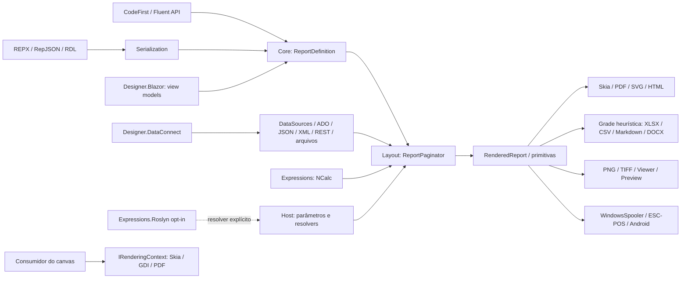

# Auditoria técnica profunda do OmniReport — 05/09/2026

> **Atualização posterior — tratamento de F01 a F27 em 08/09/2026.** A rodada atual aprovou 1.919 testes, com 0 falhas e 30 integrações ignoradas; builds Release da solução e do Android real sem avisos/erros. A situação de cada item, alterações de contrato, reprodução e limitações estão em [Correções F01–F27](correcoes-f01-f27-2026-09-08.md). F24 inclui diagnósticos ORL024 para três semânticas de grupo ainda não suportadas; F25 reduz releituras e agregações repetidas, mas mantém materialização. Os achados e números do corpo original abaixo são históricos.

> **Atualização posterior à auditoria — F13 corrigido em 07/09/2026.** O canvas direto PDF/Skia/GDI calcula a altura do papel contínuo pelos desenhos e recortes, com limites configuráveis antes da alocação do raster. Conteúdo até 110 mm com margem inferior de 5 mm produziu 303 × 436 pixels a 96 DPI, 640 × 921 a 203 DPI e PDF de 227 × 327 pontos. Foram adicionados 44 casos; a suíte completa final teve 1.868 aprovados, 0 falhas e 30 integrações ignoradas. A validação independente confirmou conteúdo, imagem, margem e texto selecionável. Contratos, diferenças de antialiasing e evidências estão em [Correção F13](correcao-f13-2026-09-07.md). Não houve impressão física; o corpo original permanece histórico.

> **Atualização posterior à auditoria — F15 corrigido em 05/09/2026.** ESC/POS e Windows Spooler usam o player comum, incluindo polígonos e recortes retangulares/arredondados, com restauração de estado após falhas. Foram adicionados 23 casos; a rodada completa final teve 1.824 aprovados, 0 falhas e 30 integrações ignoradas. As capturas ESC/POS tiveram zero divergências contra o PNG de referência, e os arquivos do driver Microsoft Print to PDF preservaram as duas figuras com recorte. Detalhes, ocorrência intermediária de teste PDF, logs e limites da evidência estão em [Correção F15](correcao-f15-2026-09-05.md). Não houve impressão física; o corpo original abaixo permanece histórico.

> **Atualização posterior à auditoria — F03 e F04 corrigidos em 05/09/2026.** PNG vertical agora possui orçamento explícito de pixels e rejeição antes da alocação; a nova API por página e o TIFF progressivo evitam buffers de pixels de todo o relatório. Grupos aninhados mantêm acumuladores independentes, inclusive em cabeçalhos repetidos e escopos nomeados. A reprodução F04 passou de total externo zero para 3,75. Foram adicionados 33 testes: a suíte final tem 1.801 aprovados, 0 falhas e 30 ignorados. Implementação, mudança de compatibilidade do PNG, 54 medições finais de 1/10/100 páginas com concorrência 1/5 e comandos de reprodução estão em [Correções F03 e F04](correcoes-f03-f04-2026-09-05.md). Os achados e números do corpo original permanecem como registro histórico.

> **Atualização posterior à auditoria — F01 corrigido em 05/09/2026.** A correção valida a área útil antes de ler fontes, rejeita quebras sem espaço após cabeçalhos repetidos e verifica cancelamento nos laços de divisão de bandas/tablix. Mantém papel térmico, elementos indivisíveis maiores que uma página e continuação após cabeçalho único. Implementação em [ReportPaginator.Validation.cs](../src/Reporting.Layout/ReportPaginator.Validation.cs) e [ReportPaginator.cs](../src/Reporting.Layout/ReportPaginator.cs); 22 novos casos em [PaginationProgressTests.cs](../tests/Reporting.Layout.Tests/PaginationProgressTests.cs).
>
> Validação da correção: 154 testes de layout e 1.768 testes da solução aprovados, nenhuma falha e 30 integrações ignoradas. Build Release com 0 erros e 6 avisos preexistentes do designer. A reprodução com exceção tratada rejeitou a entrada original em 37,17 ms, com 8.843.264 bytes privados após a rejeição, e executou um relatório válido no mesmo paginador. Ver `artifacts/correcao-f01/reproduction-handled.log`, `artifacts/correcao-f01-build.log` e `artifacts/correcao-f01/test-summary.json`. Os achados, métricas e trechos abaixo preservam a base original da auditoria; o adendo não marca os demais itens como corrigidos.

**Objeto:** biblioteca reutilizável, designer e adaptadores dos 39 projetos de `src`. **Base:** commit `9ceddf8916cd510b98aa0054921770fe5d82424c`; diretório inicialmente limpo. A auditoria não alterou código de produto, testes versionados, dependências nem APIs. Harnesses, métricas e capturas estão em `artifacts/auditoria-2026-09-05`; as propostas abaixo dependem de implementação e validação futuras.

## Mapa inicial, antes dos achados

O núcleo é um modelo imutável de definição (`ReportDefinition`, bandas, elementos, estilos e geometria). A Fluent API monta esse modelo; os serializers o importam/exportam; o designer mantém uma projeção mutável em view models. A paginação transforma definição e dados em `RenderedReport`, composto por páginas e primitivas posicionadas. Renderers e exporters consomem essas primitivas. Há ainda um caminho de canvas: o consumidor chama `IRenderingContext` diretamente, com `BeginPage`, operações de desenho e `EndPage`; esse caminho não passa pelo paginador e precisa ser validado separadamente.



Esse desenho representa **fluxo de execução**, não dependências de assemblies. O grafo completo de `ProjectReference`, extraído dos `.csproj`, está em `artifacts/auditoria-2026-09-05/dependencies.mmd`; não foram encontrados ciclos. O inventário também preserva referências de pacotes e frameworks condicionais. Dependências não declaradas por projeto, carregamento dinâmico e uso de delegates não são detectados pelo teste de ciclos.

```mermaid
flowchart LR
  Reporting_Viewer_Blazor["Reporting.Viewer.Blazor"] --> Reporting_Core["Reporting.Core"]
  Reporting_Viewer_Blazor["Reporting.Viewer.Blazor"] --> Reporting_Layout["Reporting.Layout"]
  Reporting_Viewer_Blazor["Reporting.Viewer.Blazor"] --> Reporting_Rendering["Reporting.Rendering"]
  Reporting_Viewer_Blazor["Reporting.Viewer.Blazor"] --> Reporting_Rendering_Skia["Reporting.Rendering.Skia"]
  Reporting_Viewer_Blazor["Reporting.Viewer.Blazor"] --> Reporting_Output_Pdf["Reporting.Output.Pdf"]
  Reporting_Viewer_Blazor["Reporting.Viewer.Blazor"] --> Reporting_Output_Excel["Reporting.Output.Excel"]
  Reporting_Viewer_Blazor["Reporting.Viewer.Blazor"] --> Reporting_Output_Html["Reporting.Output.Html"]
  Reporting_Viewer_Blazor["Reporting.Viewer.Blazor"] --> Reporting_Output_Svg["Reporting.Output.Svg"]
  Reporting_Viewer_Blazor["Reporting.Viewer.Blazor"] --> Reporting_Output_Csv["Reporting.Output.Csv"]
  Reporting_Viewer_Blazor["Reporting.Viewer.Blazor"] --> Reporting_Output_Json["Reporting.Output.Json"]
  Reporting_Viewer_Blazor["Reporting.Viewer.Blazor"] --> Reporting_Output_Markdown["Reporting.Output.Markdown"]
  Reporting_Viewer_Blazor["Reporting.Viewer.Blazor"] --> Reporting_Printing["Reporting.Printing"]
  Reporting_Serialization["Reporting.Serialization"] --> Reporting_Core["Reporting.Core"]
  Reporting_Rendering_Skia["Reporting.Rendering.Skia"] --> Reporting_Core["Reporting.Core"]
  Reporting_Rendering_Skia["Reporting.Rendering.Skia"] --> Reporting_Rendering["Reporting.Rendering"]
  Reporting_Rendering_Gdi["Reporting.Rendering.Gdi"] --> Reporting_Core["Reporting.Core"]
  Reporting_Rendering_Gdi["Reporting.Rendering.Gdi"] --> Reporting_Rendering["Reporting.Rendering"]
  Reporting_Rendering["Reporting.Rendering"] --> Reporting_Core["Reporting.Core"]
  Reporting_Printing_WindowsSpooler["Reporting.Printing.WindowsSpooler"] --> Reporting_Core["Reporting.Core"]
  Reporting_Printing_WindowsSpooler["Reporting.Printing.WindowsSpooler"] --> Reporting_Layout["Reporting.Layout"]
  Reporting_Printing_WindowsSpooler["Reporting.Printing.WindowsSpooler"] --> Reporting_Rendering["Reporting.Rendering"]
  Reporting_Printing_WindowsSpooler["Reporting.Printing.WindowsSpooler"] --> Reporting_Rendering_Gdi["Reporting.Rendering.Gdi"]
  Reporting_Printing_WindowsSpooler["Reporting.Printing.WindowsSpooler"] --> Reporting_Printing["Reporting.Printing"]
  Reporting_Printing_EscPos["Reporting.Printing.EscPos"] --> Reporting_Core["Reporting.Core"]
  Reporting_Printing_EscPos["Reporting.Printing.EscPos"] --> Reporting_Layout["Reporting.Layout"]
  Reporting_Printing_EscPos["Reporting.Printing.EscPos"] --> Reporting_Rendering["Reporting.Rendering"]
  Reporting_Printing_EscPos["Reporting.Printing.EscPos"] --> Reporting_Rendering_Skia["Reporting.Rendering.Skia"]
  Reporting_Printing_EscPos["Reporting.Printing.EscPos"] --> Reporting_Printing["Reporting.Printing"]
  Reporting_Printing_Android["Reporting.Printing.Android"] --> Reporting_Core["Reporting.Core"]
  Reporting_Printing_Android["Reporting.Printing.Android"] --> Reporting_Layout["Reporting.Layout"]
  Reporting_Printing_Android["Reporting.Printing.Android"] --> Reporting_Printing["Reporting.Printing"]
  Reporting_Printing_Android["Reporting.Printing.Android"] --> Reporting_Output_Pdf["Reporting.Output.Pdf"]
  Reporting_Layout["Reporting.Layout"] --> Reporting_Barcode["Reporting.Barcode"]
  Reporting_Layout["Reporting.Layout"] --> Reporting_Core["Reporting.Core"]
  Reporting_Layout["Reporting.Layout"] --> Reporting_Expressions["Reporting.Expressions"]
  Reporting_Layout["Reporting.Layout"] --> Reporting_DataSources["Reporting.DataSources"]
  Reporting_Layout["Reporting.Layout"] --> Reporting_Rendering["Reporting.Rendering"]
  Reporting_Printing["Reporting.Printing"] --> Reporting_Core["Reporting.Core"]
  Reporting_Printing["Reporting.Printing"] --> Reporting_Layout["Reporting.Layout"]
  Reporting_Output_Xml["Reporting.Output.Xml"] --> Reporting_Core["Reporting.Core"]
  Reporting_Output_Xml["Reporting.Output.Xml"] --> Reporting_Layout["Reporting.Layout"]
  Reporting_Output_Xml["Reporting.Output.Xml"] --> Reporting_Output_Pdf["Reporting.Output.Pdf"]
  Reporting_Output_Svg["Reporting.Output.Svg"] --> Reporting_Core["Reporting.Core"]
  Reporting_Output_Svg["Reporting.Output.Svg"] --> Reporting_Layout["Reporting.Layout"]
  Reporting_Output_Svg["Reporting.Output.Svg"] --> Reporting_Rendering["Reporting.Rendering"]
  Reporting_Output_Svg["Reporting.Output.Svg"] --> Reporting_Rendering_Skia["Reporting.Rendering.Skia"]
  Reporting_Output_Svg["Reporting.Output.Svg"] --> Reporting_Output_Pdf["Reporting.Output.Pdf"]
  Reporting_Output_Pdf["Reporting.Output.Pdf"] --> Reporting_Core["Reporting.Core"]
  Reporting_Output_Pdf["Reporting.Output.Pdf"] --> Reporting_Layout["Reporting.Layout"]
  Reporting_Output_Pdf["Reporting.Output.Pdf"] --> Reporting_Rendering["Reporting.Rendering"]
  Reporting_Output_Pdf["Reporting.Output.Pdf"] --> Reporting_Rendering_Skia["Reporting.Rendering.Skia"]
  Reporting_Output_Markdown["Reporting.Output.Markdown"] --> Reporting_Core["Reporting.Core"]
  Reporting_Output_Markdown["Reporting.Output.Markdown"] --> Reporting_Layout["Reporting.Layout"]
  Reporting_Output_Markdown["Reporting.Output.Markdown"] --> Reporting_Output_Pdf["Reporting.Output.Pdf"]
  Reporting_Output_Json["Reporting.Output.Json"] --> Reporting_Core["Reporting.Core"]
  Reporting_Output_Json["Reporting.Output.Json"] --> Reporting_Layout["Reporting.Layout"]
  Reporting_Output_Json["Reporting.Output.Json"] --> Reporting_Output_Pdf["Reporting.Output.Pdf"]
  Reporting_Output_Image["Reporting.Output.Image"] --> Reporting_Core["Reporting.Core"]
  Reporting_Output_Image["Reporting.Output.Image"] --> Reporting_Layout["Reporting.Layout"]
  Reporting_Output_Image["Reporting.Output.Image"] --> Reporting_Rendering["Reporting.Rendering"]
  Reporting_Output_Image["Reporting.Output.Image"] --> Reporting_Rendering_Skia["Reporting.Rendering.Skia"]
  Reporting_Output_Image["Reporting.Output.Image"] --> Reporting_Output_Pdf["Reporting.Output.Pdf"]
  Reporting_Output_Html["Reporting.Output.Html"] --> Reporting_Core["Reporting.Core"]
  Reporting_Output_Html["Reporting.Output.Html"] --> Reporting_Layout["Reporting.Layout"]
  Reporting_Output_Html["Reporting.Output.Html"] --> Reporting_Output_Pdf["Reporting.Output.Pdf"]
  Reporting_Output_Html["Reporting.Output.Html"] --> Reporting_Output_Svg["Reporting.Output.Svg"]
  Reporting_Output_Excel["Reporting.Output.Excel"] --> Reporting_Core["Reporting.Core"]
  Reporting_Output_Excel["Reporting.Output.Excel"] --> Reporting_Layout["Reporting.Layout"]
  Reporting_Output_Excel["Reporting.Output.Excel"] --> Reporting_Output_Pdf["Reporting.Output.Pdf"]
  Reporting_Output_Docx["Reporting.Output.Docx"] --> Reporting_Core["Reporting.Core"]
  Reporting_Output_Docx["Reporting.Output.Docx"] --> Reporting_Layout["Reporting.Layout"]
  Reporting_Output_Docx["Reporting.Output.Docx"] --> Reporting_Output_Pdf["Reporting.Output.Pdf"]
  Reporting_Output_Docx["Reporting.Output.Docx"] --> Reporting_Output_Image["Reporting.Output.Image"]
  Reporting_Output_Csv["Reporting.Output.Csv"] --> Reporting_Core["Reporting.Core"]
  Reporting_Output_Csv["Reporting.Output.Csv"] --> Reporting_Layout["Reporting.Layout"]
  Reporting_Output_Csv["Reporting.Output.Csv"] --> Reporting_Output_Pdf["Reporting.Output.Pdf"]
  Reporting_Hosting_AspNetCore["Reporting.Hosting.AspNetCore"] --> Reporting_Core["Reporting.Core"]
  Reporting_Hosting_AspNetCore["Reporting.Hosting.AspNetCore"] --> Reporting_DataSources["Reporting.DataSources"]
  Reporting_Hosting_AspNetCore["Reporting.Hosting.AspNetCore"] --> Reporting_Expressions["Reporting.Expressions"]
  Reporting_Hosting_AspNetCore["Reporting.Hosting.AspNetCore"] --> Reporting_Layout["Reporting.Layout"]
  Reporting_Hosting_AspNetCore["Reporting.Hosting.AspNetCore"] --> Reporting_Rendering["Reporting.Rendering"]
  Reporting_Hosting_AspNetCore["Reporting.Hosting.AspNetCore"] --> Reporting_Rendering_Skia["Reporting.Rendering.Skia"]
  Reporting_Hosting_AspNetCore["Reporting.Hosting.AspNetCore"] --> Reporting_Output_Pdf["Reporting.Output.Pdf"]
  Reporting_Hosting_AspNetCore["Reporting.Hosting.AspNetCore"] --> Reporting_Output_Excel["Reporting.Output.Excel"]
  Reporting_Hosting_AspNetCore["Reporting.Hosting.AspNetCore"] --> Reporting_Output_Docx["Reporting.Output.Docx"]
  Reporting_Hosting_AspNetCore["Reporting.Hosting.AspNetCore"] --> Reporting_Printing["Reporting.Printing"]
  Reporting_Hosting_AspNetCore["Reporting.Hosting.AspNetCore"] --> Reporting_Serialization["Reporting.Serialization"]
  Reporting_Maps["Reporting.Maps"] --> Reporting_Core["Reporting.Core"]
  Reporting_DataSources_MySql["Reporting.DataSources.MySql"] --> Reporting_DataSources["Reporting.DataSources"]
  Reporting_DataSources_MySql["Reporting.DataSources.MySql"] --> Reporting_DataSources_AdoNet["Reporting.DataSources.AdoNet"]
  Reporting_Expressions_Roslyn["Reporting.Expressions.Roslyn"] --> Reporting_Core["Reporting.Core"]
  Reporting_Expressions_Roslyn["Reporting.Expressions.Roslyn"] --> Reporting_Expressions["Reporting.Expressions"]
  Reporting_DataSources_Json["Reporting.DataSources.Json"] --> Reporting_DataSources["Reporting.DataSources"]
  Reporting_Expressions["Reporting.Expressions"] --> Reporting_Core["Reporting.Core"]
  Reporting_DataSources_FileSystem["Reporting.DataSources.FileSystem"] --> Reporting_DataSources["Reporting.DataSources"]
  Reporting_Designer_Blazor_DataConnect["Reporting.Designer.Blazor.DataConnect"] --> Reporting_Core["Reporting.Core"]
  Reporting_Designer_Blazor_DataConnect["Reporting.Designer.Blazor.DataConnect"] --> Reporting_DataSources["Reporting.DataSources"]
  Reporting_Designer_Blazor_DataConnect["Reporting.Designer.Blazor.DataConnect"] --> Reporting_DataSources_AdoNet["Reporting.DataSources.AdoNet"]
  Reporting_Designer_Blazor_DataConnect["Reporting.Designer.Blazor.DataConnect"] --> Reporting_DataSources_Sqlite["Reporting.DataSources.Sqlite"]
  Reporting_Designer_Blazor_DataConnect["Reporting.Designer.Blazor.DataConnect"] --> Reporting_DataSources_PostgreSql["Reporting.DataSources.PostgreSql"]
  Reporting_Designer_Blazor_DataConnect["Reporting.Designer.Blazor.DataConnect"] --> Reporting_DataSources_SqlServer["Reporting.DataSources.SqlServer"]
  Reporting_Designer_Blazor_DataConnect["Reporting.Designer.Blazor.DataConnect"] --> Reporting_DataSources_MySql["Reporting.DataSources.MySql"]
  Reporting_Designer_Blazor_DataConnect["Reporting.Designer.Blazor.DataConnect"] --> Reporting_Designer_Blazor["Reporting.Designer.Blazor"]
  Reporting_DataSources_AdoNet["Reporting.DataSources.AdoNet"] --> Reporting_Core["Reporting.Core"]
  Reporting_DataSources_AdoNet["Reporting.DataSources.AdoNet"] --> Reporting_DataSources["Reporting.DataSources"]
  Reporting_DataSources["Reporting.DataSources"] --> Reporting_Core["Reporting.Core"]
  Reporting_Core["Reporting.Core"]
  Reporting_Designer_Blazor["Reporting.Designer.Blazor"] --> Reporting_Core["Reporting.Core"]
  Reporting_Designer_Blazor["Reporting.Designer.Blazor"] --> Reporting_CodeFirst["Reporting.CodeFirst"]
  Reporting_Designer_Blazor["Reporting.Designer.Blazor"] --> Reporting_Layout["Reporting.Layout"]
  Reporting_Designer_Blazor["Reporting.Designer.Blazor"] --> Reporting_Serialization["Reporting.Serialization"]
  Reporting_Designer_Blazor["Reporting.Designer.Blazor"] --> Reporting_Printing["Reporting.Printing"]
  Reporting_Designer_Blazor["Reporting.Designer.Blazor"] --> Reporting_Viewer_Blazor["Reporting.Viewer.Blazor"]
  Reporting_Designer_Blazor["Reporting.Designer.Blazor"] --> Reporting_Output_Pdf["Reporting.Output.Pdf"]
  Reporting_Designer_Blazor["Reporting.Designer.Blazor"] --> Reporting_Output_Excel["Reporting.Output.Excel"]
  Reporting_Designer_Blazor["Reporting.Designer.Blazor"] --> Reporting_Output_Docx["Reporting.Output.Docx"]
  Reporting_Designer_Blazor["Reporting.Designer.Blazor"] --> Reporting_Output_Html["Reporting.Output.Html"]
  Reporting_Designer_Blazor["Reporting.Designer.Blazor"] --> Reporting_Output_Svg["Reporting.Output.Svg"]
  Reporting_Designer_Blazor["Reporting.Designer.Blazor"] --> Reporting_Output_Csv["Reporting.Output.Csv"]
  Reporting_Designer_Blazor["Reporting.Designer.Blazor"] --> Reporting_Output_Json["Reporting.Output.Json"]
  Reporting_Designer_Blazor["Reporting.Designer.Blazor"] --> Reporting_Output_Xml["Reporting.Output.Xml"]
  Reporting_Designer_Blazor["Reporting.Designer.Blazor"] --> Reporting_Output_Markdown["Reporting.Output.Markdown"]
  Reporting_CodeFirst["Reporting.CodeFirst"] --> Reporting_Core["Reporting.Core"]
  Reporting_CodeFirst["Reporting.CodeFirst"] --> Reporting_Expressions["Reporting.Expressions"]
  Reporting_CodeFirst["Reporting.CodeFirst"] --> Reporting_DataSources["Reporting.DataSources"]
  Reporting_CodeFirst["Reporting.CodeFirst"] --> Reporting_Layout["Reporting.Layout"]
  Reporting_Barcode["Reporting.Barcode"]
  Reporting_DataSources_SqlServer["Reporting.DataSources.SqlServer"] --> Reporting_DataSources["Reporting.DataSources"]
  Reporting_DataSources_SqlServer["Reporting.DataSources.SqlServer"] --> Reporting_DataSources_AdoNet["Reporting.DataSources.AdoNet"]
  Reporting_DataSources_Sqlite["Reporting.DataSources.Sqlite"] --> Reporting_DataSources["Reporting.DataSources"]
  Reporting_DataSources_Sqlite["Reporting.DataSources.Sqlite"] --> Reporting_DataSources_AdoNet["Reporting.DataSources.AdoNet"]
  Reporting_DataSources_PostgreSql["Reporting.DataSources.PostgreSql"] --> Reporting_DataSources["Reporting.DataSources"]
  Reporting_DataSources_PostgreSql["Reporting.DataSources.PostgreSql"] --> Reporting_DataSources_AdoNet["Reporting.DataSources.AdoNet"]
  Reporting_DataSources_Xml["Reporting.DataSources.Xml"] --> Reporting_DataSources["Reporting.DataSources"]
  Reporting_DataSources_WebService["Reporting.DataSources.WebService"] --> Reporting_DataSources["Reporting.DataSources"]
  Reporting_DataSources_WebService["Reporting.DataSources.WebService"] --> Reporting_DataSources_Json["Reporting.DataSources.Json"]
  Reporting_DataSources_WebService["Reporting.DataSources.WebService"] --> Reporting_DataSources_Xml["Reporting.DataSources.Xml"]
```

<details>
<summary>Grafo completo de referências entre os 39 projetos</summary>



</details>

### Registro da base

- Browser: sample Blazor Server compilado em Release, executado com environment **Development**, HTTP local em 5219; sem simulação de latência de rede.
- Windows 11 x64; Intel Core i7-12700H; SDK .NET 10.0.400, runtime 10.0.11. Inventário detalhado em `dotnet-info.txt`.
- 39 projetos de bibliotecas, 25 projetos de testes, seis projetos de exemplos e um projeto BenchmarkDotNet. Asserções e exemplos foram evidência, não parte do produto alterado.
- Build Release da solução: **sucesso, 0 erros e 7 warnings**. Foram preservados os avisos XML/doc e IDE0011: QrEncoderTests:88; PrintRequest:25/47; ReportDesigner:1298; DataSourceCatalog:362; ExpressionValidator:66/170. Ver `build.log`.
- Suíte existente: **1.776 casos, 1.746 aprovados, 0 falhas e 30 ignorados**. TRX por assembly em `TestResults`; totais recalculados com leitura literal dos nomes de arquivo, incluindo os que contêm colchetes.
- Compilação Android real: **falha com 15 erros**, em execução separada. A solução padrão compilou o stub `net10.0`, não a implementação Android. Não houve execução em dispositivo.
- Docker foi consultado novamente: o executável está instalado, mas o daemon não respondeu. SQL Server, PostgreSQL e MySQL reais ficaram sem validação nesta execução; SQLite local foi exercitado por testes e navegador.
- Versões verificadas no checkout: SkiaSharp 4.151.1, NCalcSync 7.1.0 e Microsoft.CodeAnalysis.CSharp 5.6.0. Não se usaram resultados de auditorias anteriores como medição atual.

### Responsabilidades de biblioteca e host

`AddReporting` registra um paginador singleton, mas `PaginateAsync` cria uma instância de execução e compartilha apenas o compilador/cache. Cinco relatórios com fontes e parâmetros distintos pelo mesmo container ficaram isolados no ensaio. Isso não torna todo objeto registrado thread-safe: `MasterDetailDataSource`, importadores mutáveis usados diretamente e conexões ADO.NET emprestadas precisam de análise própria.

O host fornece identidade, autorização, proteção de endpoints, política de arquivos/URLs, conexão e credenciais, limites de recursos e seleção de resolvers. O motor padrão NCalc não executa blocos C#. `CodeFunctionResolver` é nulo por padrão; a biblioteca Roslyn é opcional e declara executar código com privilégios do host. Os achados de segredos e HTML pressupõem que conteúdo ou autoria não confiável chegue a essas capacidades; não são alegações de endpoint público vulnerável no Core.

As referências físicas mostram uma separação útil de Core, dados, layout e adaptadores, mas `IReportExporter` fica em `Reporting.Output.Pdf`, levando outros formatos a depender desse pacote. Layout depende de Barcode, Core, Expressions, DataSources e Rendering; não referencia os serializers. Os switches de elementos concretos ficam no layout e os serializers têm seus próprios dispatches. São custos de evolução a avaliar, não prova isolada de falha SOLID. O AST imutável é adequado a definições declarativas; a falta de validação das invariantes de geometria é o problema concreto de domínio identificado em F01.

### Inventário dos 39 projetos

| Projeto | Responsabilidade / entrada lida | ProjectReference reais (prefixo Reporting.) | Validação e limite |
| --- | --- | --- | --- |
| [Reporting.Barcode](../src/Reporting.Barcode/Reporting.Barcode.csproj) | Codificação linear/QR → módulos e barras; [QrEncoder.cs](../src/Reporting.Barcode/QrEncoder.cs) | — | C + testes instrumentados |
| [Reporting.CodeFirst](../src/Reporting.CodeFirst/Reporting.CodeFirst.csproj) | Autoria Fluent banded e entrada canvas; [ReportBuilder.cs](../src/Reporting.CodeFirst/ReportBuilder.cs) | Core, Expressions, DataSources, Layout | C + testes instrumentados |
| [Reporting.Core](../src/Reporting.Core/Reporting.Core.csproj) | Definição, bandas, elementos, geometria, contratos de dados; [ReportDefinition.cs](../src/Reporting.Core/ReportDefinition.cs) | — | C + testes instrumentados |
| [Reporting.DataSources](../src/Reporting.DataSources/Reporting.DataSources.csproj) | Enumerable, registro, master-detail e schema; [MasterDetailDataSource.cs](../src/Reporting.DataSources/MasterDetailDataSource.cs) | Core | C + testes instrumentados |
| [Reporting.DataSources.AdoNet](../src/Reporting.DataSources.AdoNet/Reporting.DataSources.AdoNet.csproj) | Leitura ADO.NET, comandos, parâmetros e ownership; [AdoNetDataSource.cs](../src/Reporting.DataSources.AdoNet/AdoNetDataSource.cs) | Core, DataSources | C + testes instrumentados |
| [Reporting.DataSources.FileSystem](../src/Reporting.DataSources.FileSystem/Reporting.DataSources.FileSystem.csproj) | Metadados de arquivos e leitura por diretório; [FileSystemDataSource.cs](../src/Reporting.DataSources.FileSystem/FileSystemDataSource.cs) | DataSources | C + testes instrumentados |
| [Reporting.DataSources.Json](../src/Reporting.DataSources.Json/Reporting.DataSources.Json.csproj) | Leitura JSON, paths, schema/inferência; [JsonDataSource.cs](../src/Reporting.DataSources.Json/JsonDataSource.cs) | DataSources | C + testes instrumentados |
| [Reporting.DataSources.MySql](../src/Reporting.DataSources.MySql/Reporting.DataSources.MySql.csproj) | Adapter/factory MySQL sobre ADO.NET; [MySqlDataSource.cs](../src/Reporting.DataSources.MySql/MySqlDataSource.cs) | DataSources, DataSources.AdoNet | C; banco real NV (Docker) |
| [Reporting.DataSources.PostgreSql](../src/Reporting.DataSources.PostgreSql/Reporting.DataSources.PostgreSql.csproj) | Adapter/factory PostgreSQL sobre ADO.NET; [PostgreSqlDataSource.cs](../src/Reporting.DataSources.PostgreSql/PostgreSqlDataSource.cs) | DataSources, DataSources.AdoNet | C; banco real NV (Docker) |
| [Reporting.DataSources.SqlServer](../src/Reporting.DataSources.SqlServer/Reporting.DataSources.SqlServer.csproj) | Adapter/factory SQL Server sobre ADO.NET; [SqlServerDataSource.cs](../src/Reporting.DataSources.SqlServer/SqlServerDataSource.cs) | DataSources, DataSources.AdoNet | C; banco real NV (Docker) |
| [Reporting.DataSources.Sqlite](../src/Reporting.DataSources.Sqlite/Reporting.DataSources.Sqlite.csproj) | Adapter/factory SQLite sobre ADO.NET; [SqliteDataSource.cs](../src/Reporting.DataSources.Sqlite/SqliteDataSource.cs) | DataSources, DataSources.AdoNet | C + testes instrumentados |
| [Reporting.DataSources.WebService](../src/Reporting.DataSources.WebService/Reporting.DataSources.WebService.csproj) | HTTP e corpo JSON; autenticação/timeout configuráveis; [WebServiceDataSource.cs](../src/Reporting.DataSources.WebService/WebServiceDataSource.cs) | DataSources, DataSources.Json, DataSources.Xml | C + testes instrumentados |
| [Reporting.DataSources.Xml](../src/Reporting.DataSources.Xml/Reporting.DataSources.Xml.csproj) | XML/XPath e inferência dos campos; [XmlDataSource.cs](../src/Reporting.DataSources.Xml/XmlDataSource.cs) | DataSources | C + testes instrumentados |
| [Reporting.Designer.Blazor](../src/Reporting.Designer.Blazor/Reporting.Designer.Blazor.csproj) | Autoria visual, estado/abas, dados, preview e impressão; [ReportDesigner.razor](../src/Reporting.Designer.Blazor/ReportDesigner.razor) | Core, CodeFirst, Layout, Serialization, Printing, Viewer.Blazor, Output.Pdf, Output.Excel, Output.Docx, Output.Html, Output.Svg, Output.Csv, Output.Json, Output.Xml, Output.Markdown | C/T + B e R em cenários descritos |
| [Reporting.Designer.Blazor.DataConnect](../src/Reporting.Designer.Blazor.DataConnect/Reporting.Designer.Blazor.DataConnect.csproj) | Diagnóstico e construção das fontes do designer; [DesignerDataConnect.cs](../src/Reporting.Designer.Blazor.DataConnect/DesignerDataConnect.cs) | Core, DataSources, DataSources.AdoNet, DataSources.Sqlite, DataSources.PostgreSql, DataSources.SqlServer, DataSources.MySql, Designer.Blazor | C/T + B e R em cenários descritos |
| [Reporting.Expressions](../src/Reporting.Expressions/Reporting.Expressions.csproj) | Compilação NCalc, resolução e agregações; [ExpressionEvaluator.cs](../src/Reporting.Expressions/ExpressionEvaluator.cs) | Core | C + testes instrumentados |
| [Reporting.Expressions.Roslyn](../src/Reporting.Expressions.Roslyn/Reporting.Expressions.Roslyn.csproj) | Código C# opt-in executado no host; [RoslynCodeEvaluator.cs](../src/Reporting.Expressions.Roslyn/RoslynCodeEvaluator.cs) | Core, Expressions | C + testes instrumentados |
| [Reporting.Hosting.AspNetCore](../src/Reporting.Hosting.AspNetCore/Reporting.Hosting.AspNetCore.csproj) | DI e composição de serviços do host; [ReportingBuilder.cs](../src/Reporting.Hosting.AspNetCore/ReportingBuilder.cs) | Core, DataSources, Expressions, Layout, Rendering, Rendering.Skia, Output.Pdf, Output.Excel, Output.Docx, Printing, Serialization | C + testes instrumentados |
| [Reporting.Layout](../src/Reporting.Layout/Reporting.Layout.csproj) | Dados/expressões → páginas e primitivas; [ReportPaginator.cs](../src/Reporting.Layout/ReportPaginator.cs) | Barcode, Core, Expressions, DataSources, Rendering | C + testes instrumentados |
| [Reporting.Maps](../src/Reporting.Maps/Reporting.Maps.csproj) | Registro geográfico e dataset embutido simplificado; [BuiltInShapes.cs](../src/Reporting.Maps/BuiltInShapes.cs) | Core | C; 0% instrumentado |
| [Reporting.Output.Csv](../src/Reporting.Output.Csv/Reporting.Output.Csv.csproj) | Grade de layout → texto delimitado; [CsvExporter.cs](../src/Reporting.Output.Csv/CsvExporter.cs) | Core, Layout, Output.Pdf | C + testes instrumentados |
| [Reporting.Output.Docx](../src/Reporting.Output.Docx/Reporting.Output.Docx.csproj) | Grade/primitivas → documento Word; [DocxExporter.cs](../src/Reporting.Output.Docx/DocxExporter.cs) | Core, Layout, Output.Pdf, Output.Image | C + testes instrumentados |
| [Reporting.Output.Excel](../src/Reporting.Output.Excel/Reporting.Output.Excel.csproj) | Grade, números e fórmulas → XLSX; [ExcelExporter.cs](../src/Reporting.Output.Excel/ExcelExporter.cs) | Core, Layout, Output.Pdf | C + testes instrumentados |
| [Reporting.Output.Html](../src/Reporting.Output.Html/Reporting.Output.Html.csproj) | Primitivas/SVG e hyperlinks → HTML; [SvgHtmlExporter.cs](../src/Reporting.Output.Html/SvgHtmlExporter.cs) | Core, Layout, Output.Pdf, Output.Svg | C + testes instrumentados |
| [Reporting.Output.Image](../src/Reporting.Output.Image/Reporting.Output.Image.csproj) | Primitivas → PNG composto/por página e TIFF; [PngImageExporter.cs](../src/Reporting.Output.Image/PngImageExporter.cs) | Core, Layout, Rendering, Rendering.Skia, Output.Pdf | C + testes instrumentados |
| [Reporting.Output.Json](../src/Reporting.Output.Json/Reporting.Output.Json.csproj) | Primitivas e dados de saída → JSON; [JsonExporter.cs](../src/Reporting.Output.Json/JsonExporter.cs) | Core, Layout, Output.Pdf | C + testes instrumentados |
| [Reporting.Output.Markdown](../src/Reporting.Output.Markdown/Reporting.Output.Markdown.csproj) | Grade → tabelas Markdown; [MarkdownExporter.cs](../src/Reporting.Output.Markdown/MarkdownExporter.cs) | Core, Layout, Output.Pdf | C + testes instrumentados |
| [Reporting.Output.Pdf](../src/Reporting.Output.Pdf/Reporting.Output.Pdf.csproj) | Primitivas → PDF; abriga IReportExporter; [SkiaPdfExporter.cs](../src/Reporting.Output.Pdf/SkiaPdfExporter.cs) | Core, Layout, Rendering, Rendering.Skia | C + testes instrumentados |
| [Reporting.Output.Svg](../src/Reporting.Output.Svg/Reporting.Output.Svg.csproj) | Primitivas → SVG; [SvgExporter.cs](../src/Reporting.Output.Svg/SvgExporter.cs) | Core, Layout, Rendering, Rendering.Skia, Output.Pdf | C + testes instrumentados |
| [Reporting.Output.Xml](../src/Reporting.Output.Xml/Reporting.Output.Xml.csproj) | Estrutura de saída → XML; [XmlExporter.cs](../src/Reporting.Output.Xml/XmlExporter.cs) | Core, Layout, Output.Pdf | C + testes instrumentados |
| [Reporting.Printing](../src/Reporting.Printing/Reporting.Printing.csproj) | Contratos de impressora, capabilities e opções; [IReportPrinter.cs](../src/Reporting.Printing/IReportPrinter.cs) | Core, Layout | C + testes instrumentados |
| [Reporting.Printing.Android](../src/Reporting.Printing.Android/Reporting.Printing.Android.csproj) | Stub padrão e adapter Print Framework condicional; [AndroidPrintFrameworkPrinter.cs](../src/Reporting.Printing.Android/AndroidPrintFrameworkPrinter.cs) | Core, Layout, Printing, Output.Pdf | C + build real falhou; execução NV |
| [Reporting.Printing.EscPos](../src/Reporting.Printing.EscPos/Reporting.Printing.EscPos.csproj) | Raster térmico → comandos → transporte; [EscPosPrinter.cs](../src/Reporting.Printing.EscPos/EscPosPrinter.cs) | Core, Layout, Rendering, Rendering.Skia, Printing | C/T + R virtual; hardware NV |
| [Reporting.Printing.WindowsSpooler](../src/Reporting.Printing.WindowsSpooler/Reporting.Printing.WindowsSpooler.csproj) | Replay GDI → PrintDocument/spooler; [WindowsSpoolerPrinter.cs](../src/Reporting.Printing.WindowsSpooler/WindowsSpoolerPrinter.cs) | Core, Layout, Rendering, Rendering.Gdi, Printing | C/T + R virtual; hardware NV |
| [Reporting.Rendering](../src/Reporting.Rendering/Reporting.Rendering.csproj) | Interfaces canvas/medida e estilos independentes de device; [IRenderingContext.cs](../src/Reporting.Rendering/IRenderingContext.cs) | Core | C + testes instrumentados |
| [Reporting.Rendering.Gdi](../src/Reporting.Rendering.Gdi/Reporting.Rendering.Gdi.csproj) | Canvas e medida System.Drawing no Windows; [GdiRenderingContext.cs](../src/Reporting.Rendering.Gdi/GdiRenderingContext.cs) | Core, Rendering | C + testes instrumentados |
| [Reporting.Rendering.Skia](../src/Reporting.Rendering.Skia/Reporting.Rendering.Skia.csproj) | Canvas/medida/raster/PDF em Skia; [SkiaPrimitiveRenderer.cs](../src/Reporting.Rendering.Skia/SkiaPrimitiveRenderer.cs) | Core, Rendering | C + testes instrumentados |
| [Reporting.Serialization](../src/Reporting.Serialization/Reporting.Serialization.csproj) | REPX, RepJSON e import/export RDL; [RdlImporter.cs](../src/Reporting.Serialization/RdlImporter.cs) | Core | C + testes instrumentados |
| [Reporting.Viewer.Blazor](../src/Reporting.Viewer.Blazor/Reporting.Viewer.Blazor.csproj) | Viewer, imagens de páginas, toolbar e export; [ReportViewer.razor.cs](../src/Reporting.Viewer.Blazor/ReportViewer.razor.cs) | Core, Layout, Rendering, Rendering.Skia, Output.Pdf, Output.Excel, Output.Html, Output.Svg, Output.Csv, Output.Json, Output.Markdown, Printing | C + testes instrumentados |

## 1. Sumário executivo

1. **F01:** uma definição com área útil zero mantém paginação sem progresso e crescimento de memória; o processo de reprodução precisou ser encerrado.
2. **F02:** o DataConnect padrão pode revelar um segredo de ambiente por mensagem de erro quando exposto a autores não confiáveis.
3. **F03:** cinco exportações PNG de 100 páginas atingiram **3,44 GiB de memória privada**; o pico nativo é muito maior que a alocação gerenciada informada pelo benchmark.
4. **F04:** agregação de grupos aninhados produziu **0 em vez de 3,75** no total externo.
5. **F05:** o XLSX substituiu **7 por 10** ao criar fórmula por heurística textual e interpreta `1.25` como `125` no parser da grade.
6. Outros riscos altos reproduzidos abrangem HTML executável, cancelamento, isolamento de abas/filtros, impressão e suporte Android real.
7. Os testes existentes passaram; cobertura de `src` sem gerados: **77,6% de linhas e 62,8% de branches**, com Android real não instrumentado.
8. Os 20 ciclos do designer não demonstraram vazamento de Monaco; a retenção Roslyn, por outro lado, foi demonstrada por assemblies não coletáveis.
9. A entrega é uma auditoria com propostas; nenhum achado foi corrigido no produto durante este trabalho.

## 2. Achados priorizados e avaliação estrutural

**Total:** 28 achados — 1 Crítico, 17 Altos, 9 Médios e 1 Baixo.

**Severidade:** Crítico = perda de disponibilidade do processo por caminho aceito sem progresso; Alto = comprometimento de confidencialidade/integridade, resultados incorretos importantes, pico incompatível com hosts comuns ou capacidade publicada indisponível; Médio = limitação funcional, escalabilidade ou cleanup com condição mais restrita; Baixo = convenção/manutenibilidade sem dano de execução demonstrado. **Esforço:** P = localizado; M = vários pontos e regressões; G = mudança de desenho/contratos. Não são estimativas em dias.

**Evidência:** R = reproduzido nesta execução; C = confirmado por fluxo de código; R/C = reprodução em um backend e confirmação por código no outro. Hipóteses de custo/retenção não medidas estão identificadas. A severidade considera a condição declarada, não presume que todos os hosts exponham todas as capacidades.

| ID | Severidade | Categoria | Arquivo:linha | Problema / condição | Impacto | Correção sugerida | Esforço | Evidência |
| --- | --- | --- | --- | --- | --- | --- | --- | --- |
| F01 | Crítico | Disponibilidade | [ReportPaginator.cs:964](../src/Reporting.Layout/ReportPaginator.cs#L964) | Paginação sem progresso com área útil zero. Definição com papel 100 × 10 mm, margens de 5 mm e detalhe vazio de 5 mm. | O laço cria páginas sem reduzir trailing. Processo isolado interrompido em 670 ms com 294.088.704 bytes privados; não retornou. | Validar área útil e progresso após cada quebra; aplicar limite de páginas e cancelamento nos laços. | M | R — `artifacts/auditoria-2026-09-05/invalidpage-guard.json` |
| F02 | Alto | Segurança | [DesignerDataConnect.cs:51](../src/Reporting.Designer.Blazor.DataConnect/DesignerDataConnect.cs#L51) | Segredo de ambiente exposto por erro de conexão. Host expõe DataConnect a autor não confiável com resolver padrão; conexão SQLite usa Mode={secret:OMNIREPORT_AUDIT_SENTINEL}. | O valor da variável criada pelo ensaio apareceu integralmente em TestConnectionResult.Message. Resolver não restringe nomes e o backend devolve ex.Message. | Resolver de segredos autorizado por host/tenant, sem fallback de ambiente implícito; retornar erro público sem segredo. | M | R — `artifacts/auditoria-2026-09-05/repros-extra.log` |
| F03 | Alto | Memória/performance | [PngImageExporter.cs:60](../src/Reporting.Output.Image/PngImageExporter.cs#L60) | PNG composto aloca bitmap proporcional a todas as páginas. Exportação de 100 páginas A4 a 96 DPI; repetir com cinco operações simultâneas. | Pico privado de 785.321.984 bytes na primeira medição; 3.692.670.976 bytes em cinco exportações. O arquivo simples tem cerca de 3,76 MB. O custo dominante é nativo. | Exportar páginas individualmente/ZIP ou codificar em faixas; impor orçamento de pixels e filas por host. | G | R — `artifacts/auditoria-2026-09-05/memory.jsonl`; `artifacts/auditoria-2026-09-05/supplemental.jsonl`; `artifacts/auditoria-2026-09-05/retention.jsonl` |
| F04 | Alto | Correção de agregações | [ReportPaginator.cs:646](../src/Reporting.Layout/ReportPaginator.cs#L646) | Fechar grupo interno limpa acumulador do externo. Dois níveis de grupo; três linhas com Valor=1,25, grupo externo constante e interno diferente por linha. | Rodapés internos mostram 1,25; o externo mostra 0 em vez de 3,75. | Acumuladores independentes por instância e nível de grupo. | G | R — `artifacts/auditoria-2026-09-05/repros-extra.log` |
| F05 | Alto | Correção de exportação | [ExcelExporter.cs:151](../src/Reporting.Output.Excel/ExcelExporter.cs#L151) | XLSX reinventa tipos e totais a partir de texto. Linha contém palavra total/subtotal/sum; EmitFormulas padrão é true. Valores com ponto decimal passam pelo parser pt-BR primeiro. | Total ajustado 7 vira SUM(B2:B2)=10. TryParseDecimal('1.25') retorna 125; '00123' retorna 123. CSV com NormalizeNumbers compartilha o parser. | Preservar valor e tipo semântico; fórmulas somente quando declaradas; cultura explícita. | G | R — `artifacts/auditoria-2026-09-05/repros-extra.log` |
| F06 | Alto | Segurança de HTML | [SvgHtmlExporter.cs:180](../src/Reporting.Output.Html/SvgHtmlExporter.cs#L180) | Hyperlink javascript permanece executável no HTML. Definição não confiável fornece ElementAction.ToUrl com esquema javascript; consumidor abre HTML e clica no overlay. | Clique real no HTML local executou a sentinela e substituiu o documento por 'executed'. HtmlEncode protege aspas, não o esquema da URL. | Política de URL antes de gerar links; rejeitar javascript/data e caracteres de controle. | M | R — `artifacts/auditoria-2026-09-05/link-repro.html`; `artifacts/auditoria-2026-09-05/browser-observations.json` |
| F07 | Alto | Cancelamento | [ReportPaginator.cs:70](../src/Reporting.Layout/ReportPaginator.cs#L70) | Token não chega à etapa de layout. Cancelamento ocorre ao terminar a leitura ou durante processamento. ExecutePass não recebe token; subrelatório usa CancellationToken.None. | Com CTS cancelado no fim da fonte, o paginador retornou uma página e 50 textos normalmente. | Propagar token por todas as etapas e verificar nos laços de linhas, páginas e primitivas. | M | R — `artifacts/auditoria-2026-09-05/repros.jsonl` |
| F08 | Alto | I/O/performance | [ReportPaginator.Subreport.cs:42](../src/Reporting.Layout/ReportPaginator.Subreport.cs#L42) | Subrelatórios releem fontes e bloqueiam async. Subreport em detalhe, com fontes que fazem I/O. O registro contém provedores vivos, não snapshots materializados. | Três linhas do pai causam quatro leituras. No cenário de 100 páginas, 101 leituras. GetAwaiter().GetResult bloqueia o chamador; o comentário diz que os dados já estão materializados. | Compartilhar snapshot da execução e separar obtenção assíncrona de dados do layout. | G | R — `artifacts/auditoria-2026-09-05/repros.jsonl`; `artifacts/auditoria-2026-09-05/supplemental.jsonl` |
| F09 | Alto | Isolamento de documentos | [DesignerState.cs:40](../src/Reporting.Designer.Blazor/ViewModels/DesignerState.cs#L40) | Catálogos e banda ativa atravessam abas. Abrir A, definir parâmetro A, abrir B e definir parâmetro B; retornar a A. ActiveBand também não é reiniciado. | BuildDefinition de A contém ClienteB. Banda ativa em B ainda pertence a A; inserção pode atingir documento anterior. | Estado de dados, parâmetros, variáveis, histórico, preview e seleção por documento. | G | R — `artifacts/auditoria-2026-09-05/repros-extra.log` |
| F10 | Alto | Concorrência/isolamento | [MasterDetailDataSource.cs:51](../src/Reporting.DataSources/MasterDetailDataSource.cs#L51) | WithParentValue altera a própria instância compartilhada. Dois consumidores obtêm filtros para pais 0 e 1 antes de iniciar enumeração. | As duas variáveis apontam para o mesmo objeto; enumerar o filtro A devolve o filho 1. Contradiz o comentário que promete nova instância. | Retornar visão independente por vínculo de pai, sem mutar a fonte original. | P | R — `artifacts/auditoria-2026-09-05/repros-extra.log` |
| F11 | Alto | Precisão de dados | [JsonDataSource.cs:273](../src/Reporting.DataSources.Json/JsonDataSource.cs#L273) | Inferência JSON/XML converte fração monetária em double. Valores financeiros entram por JSON numérico ou strings inferidas por TypeInference (também XML/WebService). | 123456789012345.67 entra como Double e Convert.ToDecimal retorna 123456789012346. NCalc decimal não recupera os dígitos perdidos. | Inferência decimal/colunas tipadas, com política explícita para fontes genéricas. | M | R — `artifacts/auditoria-2026-09-05/repros-extra.log` |
| F12 | Alto | Parâmetros/cultura | [ReportDesigner.razor:1218](../src/Reporting.Designer.Blazor/ReportDesigner.razor#L1218) | Preview converte default monetário pt-BR com cultura invariante. DesignerParameter.From usa ToString da cultura atual; default 1,25 chega como string ao caminho de preview. | Load→BuildDefinition preserva 1,25, mas CoerceTo usado pelo preview interpreta a mesma string como 125. Input number/date pode aparecer vazio para defaults localizados. | Armazenar valor tipado; separar representação de input HTML da interpretação de defaults. | M | R — `artifacts/auditoria-2026-09-05/repros-extra.log` |
| F13 | Alto | Renderização contínua | [SkiaPdfRenderingContext.cs:89](../src/Reporting.Rendering.Skia/SkiaPdfRenderingContext.cs#L89) | Canvas térmico usa tamanho incorreto em PDF e raster. Uso direto de IRenderingContext com Thermal80; desenhar até 110 mm. | PDF sai com altura 1.000.000 pt. Raster sai 303×303 px e corta conteúdo abaixo de 80 mm. Não é o mesmo caminho do SkiaPdfExporter sobre RenderedReport. | Registrar extensão real de desenho e finalizar suporte contínuo por backend. | G | R — `artifacts/auditoria-2026-09-05/repros.jsonl` |
| F14 | Alto | Impressão | [WindowsSpoolerPrinter.cs:115](../src/Reporting.Printing.WindowsSpooler/WindowsSpoolerPrinter.cs#L115) | PageRange não filtra páginas no spooler/ESC-POS. Solicitar somente página 2 de relatório com duas páginas. | Microsoft Print to PDF produziu duas páginas e começa pelos dados da página 1. ESC/POS percorre todas as páginas; Copies também não é usado. | Selecionar páginas antes do loop e respeitar cópias conforme capacidade declarada. | M | R — `artifacts/auditoria-2026-09-05/printing.log`; `artifacts/auditoria-2026-09-05/spooler-range.pdf`; `artifacts/auditoria-2026-09-05/escpos-range.bin` |
| F15 | Alto | Fidelidade de impressão | [EscPosPrinter.cs:198](../src/Reporting.Printing.EscPos/EscPosPrinter.cs#L198) | Replayers de impressão omitem polígonos e clipping. Página contém gráficos/mapas por DrawPolygonPrimitive ou filhos com ClipBounds. | Raster real usado pelo ESC/POS resultou em zero pixels pretos para um quadrado preto. WindowsSpooler tem switch equivalente incompleto. PDF/PNG usam caminho mais completo. | Centralizar replay de todas as primitivas e aplicar clips em todos os backends. | M | R/C — `artifacts/auditoria-2026-09-05/printing.log` |
| F16 | Alto | Plataforma/build | [AndroidPrintFrameworkPrinter.cs:40](../src/Reporting.Printing.Android/AndroidPrintFrameworkPrinter.cs#L40) | Ramo Android real não compila. Build Release com OMNIREPORT_BUILD_ANDROID=true e workload instalado. | 15 erros, iniciados por CS0234 em Android.Content/OS/Print/App; a compilação padrão só exerceu o stub net10.0. | Qualificar namespaces globais e validar o alvo real no CI. | P | R — `artifacts/auditoria-2026-09-05/android-build.log` |
| F17 | Alto | Retenção de memória | [RoslynCodeEvaluator.cs:56](../src/Reporting.Expressions.Roslyn/RoslynCodeEvaluator.cs#L56) | Assemblies Roslyn permanecem até terminar o processo. Host habilita Roslyn opt-in e compila definições/códigos distintos ao longo da vida. | Após soltar referências a 20 evaluators e forçar GC/finalizers, os 20 assemblies OmniReport.Code permanecem; IsCollectible=false em todos. | AssemblyLoadContext coletável com descarte; cache limitado por hash e referência ativa. | G | R — `artifacts/auditoria-2026-09-05/repros.jsonl` |
| F18 | Alto | Funcionalidade declarada | [ReportExpressionContext.cs:39](../src/Reporting.Expressions/ReportExpressionContext.cs#L39) | Variáveis declaradas não são avaliadas pelo paginador. ReportDefinition.Variables contém Taxa com expressão 2+3 e valor inicial 9. | Textbox Variables.Taxa produz vazio. Store é criado, mas ExecutePass só aplica parâmetros. Variáveis de GroupBand também não têm ciclo de avaliação. | Avaliar variáveis de relatório/grupo em seu escopo e validar dependências. | M | R — `artifacts/auditoria-2026-09-05/repros.jsonl` |
| F19 | Médio | Cache | [ExpressionCompiler.cs:49](../src/Reporting.Expressions/ExpressionCompiler.cs#L49) | Caches crescem com chaves arbitrárias sem política de tamanho. Compilador duradouro recebe expressões distintas; MemberPathResolver estático recebe caminhos distintos. | ConcurrentDictionary não tem evicção automática; 5.500 expressões distintas custaram 139,27 ms contra 3,83 ms repetidas no ensaio complementar. Retenção prolongada de ASTs não foi quantificada por snapshot. | Limitar tamanho/complexidade, usar cache com orçamento; limpar conforme ciclo de vida. | M | C — `artifacts/auditoria-2026-09-05/supplemental.jsonl` |
| F20 | Médio | Paginação | [ReportPaginator.cs:1172](../src/Reporting.Layout/ReportPaginator.cs#L1172) | Detecção de total de páginas não percorre toda a definição. Page.Total aparece em filho de Rectangle; há também aliases TotalPages e TextRuns. | Reprodução de Rectangle.Children exibe 1/0. A segunda passagem depende de busca incompleta, não da avaliação semântica. | Visitador recursivo de expressões ou dependências no plano compilado. | M | R — `artifacts/auditoria-2026-09-05/repros.jsonl` |
| F21 | Médio | Ordenação | [ReportPaginator.cs:425](../src/Reporting.Layout/ReportPaginator.cs#L425) | Sort de chaves iguais não é estável. 40 linhas possuem a mesma chave de ordenação. | Ordem original 0..39 muda após Array.Sort; o contrato/comentário indica ordenação estável. | Usar índice original como desempate ou algoritmo estável. | P | R — `artifacts/auditoria-2026-09-05/repros.jsonl` |
| F22 | Médio | Perda de edição | [DocumentTab.cs:7](../src/Reporting.Designer.Blazor/ViewModels/DocumentTab.cs#L7) | IsDirty deixa de acompanhar relatório substituído. ReplaceActiveReport troca Report e em seguida seu Name é alterado. | IsDirty continua false; evento foi registrado por lambda apenas no relatório original. | Assinatura nomeada com unsubscribe/subscribe na substituição e descarte. | P | R — `artifacts/auditoria-2026-09-05/repros-extra.log` |
| F23 | Médio | Histórico | [ReportDesigner.razor:1385](../src/Reporting.Designer.Blazor/ReportDesigner.razor#L1385) | Parte das edições ignora CommandHistory. Setas, propriedades, expressões e mudanças de ordem alteram modelo diretamente. | Undo/redo do drag-and-drop funcionou em navegador, mas esses handlers não registram comando; RemoveElementCommand.Undo também reinserta no fim. | Comandos reversíveis por documento com estado anterior e índice original. | M | C/R parcial — `artifacts/auditoria-2026-09-05/browser-observations.json` |
| F24 | Médio | Contrato/implementação | [ReportPaginator.cs:263](../src/Reporting.Layout/ReportPaginator.cs#L263) | Metadados de grupos/subdetails persistem sem efeito completo. GroupBand.FilterExpression/SortExpressions/Variables ou SubDetail.FilterExpression/SortExpressions/NoRowsMessage são configurados. | O caminho de subdetail não consome filtro/ordem/mensagem; KeepTogether de grupo soma somente header+footer (linhas 813–816). Testes de caracterização não validam a semântica prometida. | Implementar semântica ou emitir diagnóstico explícito de recurso não suportado. | G | C — `artifacts/auditoria-2026-09-05/related-source-evidence.md` |
| F25 | Médio | Memória/complexidade | [ReportPaginator.cs:95](../src/Reporting.Layout/ReportPaginator.cs#L95) | Pipeline materializa todo o registro e reavalia agregados por linha. Fontes grandes, inclusive registradas mas não usadas; Sum/RunningTotal repetidos no detalhe. | IAsyncEnumerable vira listas e snapshots antes de paginar; AggregateCalculator.EvaluatePerRow percorre e avalia cada linha. Repetir soma de n linhas n vezes resulta em custo quadrático por inspeção; este agregado não foi medido. | Plano de dependências de fontes, acumuladores incrementais e saída preparada paginada. | G | C; hipótese de custo a medir — `artifacts/auditoria-2026-09-05/memory.jsonl` |
| F26 | Médio | Descarte em falha | [AdoNetDataSource.cs:155](../src/Reporting.DataSources.AdoNet/AdoNetDataSource.cs#L155) | Falhas antes do descarte deixam cleanup incompleto. CloseAsync da conexão própria lança; callback build de GdiRenderingContext.DrawPath lança antes do using. | DisposeAsync não é alcançado após erro de CloseAsync; GraphicsPath só entra em using depois do callback (GDI 240–242). Falha injetada e retenção não medidas. | try/finally para cleanup e propriedade definida antes de chamar código externo. | P | C — `artifacts/auditoria-2026-09-05/resource-ownership.md`; `artifacts/auditoria-2026-09-05/related-source-evidence.md` |
| F27 | Médio | Recursos/impressão | [EscPosPrinter.cs:30](../src/Reporting.Printing.EscPos/EscPosPrinter.cs#L30) | Construtor de transporte concreto fecha a instância após o primeiro job. Reutilizar EscPosPrinter construído com StreamEscPosTransport após um primeiro PrintAsync bem-sucedido. | Segundo job retorna falha Cannot access a closed Stream; a factory do construtor devolve a mesma instância que PrintAsync descarta. | Distinguir transporte emprestado de factory proprietária; documentar ownership e criar transporte novo por job no caminho factory. | P | R — `artifacts/auditoria-2026-09-05/repros.jsonl` |
| F28 | Baixo | Convenções/manutenibilidade | [ReportDesigner.razor:241](../src/Reporting.Designer.Blazor/ReportDesigner.razor#L241) | Convenções solicitadas não são aplicadas consistentemente. Revisão de todos os arquivos de src, sem alterar contratos públicos. | 54 arquivos têm mais de uma classe/record-class; componentes Razor mantêm @code; há DateTime.Now/UtcNow e dois async void fora de eventos nativos. | Refatorações mecânicas graduais, com cobertura de API; preservar nomes de contratos externos. | M | C — `artifacts/auditoria-2026-09-05/multiple-classes.json`; `artifacts/auditoria-2026-09-05/conventions-sites.txt` |

### Estrutura, SOLID e pontos de extensão

- **SRP:** `ReportDesigner.razor` reúne documento, menus, preview, parâmetros, exportação, impressão e interop; `ReportPaginator` reúne leitura, ordenação, grupos, layout e divisão. F09/F23 mostram consequências observáveis dessa concentração. Dividir por features (documentos, autoria, dados, preview, impressão) ajuda a estabelecer propriedade do estado.
- **OCP:** a geração de primitivas evita implementar cada gráfico em todo renderer. Entretanto, switches de elementos e replayers ainda precisam evoluir juntos; F15 demonstra deriva entre backends. O registry de serialização por convenção cobre parte de novos elementos, não torna layout/designer automaticamente extensíveis.
- **LSP/contratos:** canvas térmico, seleção de páginas de impressão e configurações persistidas sem efeito têm contratos diferentes dos efetivamente entregues. Capabilities explícitas e testes por backend são preferíveis a no-op silencioso.
- **ISP/DIP:** `ITextMeasurer`, `IReportDataSource`, resolvers e interfaces de impressão são fronteiras úteis. O contrato comum de exportação deve ficar em assembly neutro, e os registradores de DI podem ser separados por adaptador para reduzir a dependência obrigatória em formatos. Não se recomenda criar camadas genéricas apenas para satisfazer siglas.
- **Domínio:** coordenadas `Unit`/mils, floats de Skia/GDI e doubles de geometria não são dinheiro. Os problemas monetários são conversão/inferência de dados e exportação (F05/F11/F12), não a existência de doubles na geometria. Conversões de `decimal` para coordenada/gráfico exigem preservar o valor original para rótulos e dados; não se comprovou erro financeiro específico de gráfico nesta execução.

| Extensão | Pontos que precisam ser revistos | Limite atual |
|---|---|---|
| Nova banda | `Bands/Bands.cs`, ReportDefinition/AllBands, ReportBuilder/GroupBuilder/SubDetailBuilder, ExecutePass e quebra/agrupamento, serializers/importador RDL, DesignerBandKind/BandViewModel/OutlineTree/BandPropertiesDialog/BandCanvas | Não há registro genérico de execução de bandas; adicionar um enum não basta. |
| Novo elemento que usa primitivas existentes | Tipo de Core, BandContent/TablixBuilder, medida e RenderElement de BandRenderer ou renderer dedicado, serializers, ElementViewModel/conversão, toolbox/canvas/propriedades/ícones/validação, import/export RDL | `ElementSerializationRegistry` descobre tipos de assemblies carregados por convenção e faz cache; coleções de elementos e tipos escalares não cobertos precisam de caminho explícito. Plugins carregados depois da construção do mapa de tags exigem atenção. |
| Nova primitiva | LayoutPrimitive, geometria/transformação/clip, players Skia/GDI, PDF/PNG/TIFF/SVG, spoolers, JSON/XML e tratamento de perda nos formatos tabulares | F15 mostra que players independentes já divergem. |
| Novo renderer/exporter | `IRenderingContext`/`ITextMeasurer` ou `IReportExporter`, DI/registry do designer/viewer, metadados de formato, testes de stream/disposal/capabilities | Exportadores tabulares reconstruídos a partir de texto não possuem todos os valores/tipos originais. |

### Tamanho e complexidade

**Linhas:** `File.ReadAllLines().Length` em arquivos rastreáveis por `rg --files src` com extensões `.cs`, `.razor`, `.js` e `.css`; inclui linhas vazias, comentários, markup e CSS. Bin/obj/arquivos gerados não entram. Foram **254 arquivos e 50.881 linhas físicas**. A coluna adicional de não vazias está no CSV. Tamanho não é um achado por si só.

| # | Arquivo | Linhas físicas | Não vazias |
| --- | --- | --- | --- |
| 1 | [ReportDesigner.razor](../src/Reporting.Designer.Blazor/ReportDesigner.razor) | 1674 | 1539 |
| 2 | [designer.js](../src/Reporting.Designer.Blazor/wwwroot/js/designer.js) | 1524 | 1424 |
| 3 | [RdlImporter.cs](../src/Reporting.Serialization/RdlImporter.cs) | 1385 | 1295 |
| 4 | [ElementViewModel.cs](../src/Reporting.Designer.Blazor/ViewModels/ElementViewModel.cs) | 1331 | 1166 |
| 5 | [ReportPaginator.cs](../src/Reporting.Layout/ReportPaginator.cs) | 1200 | 1118 |
| 6 | [components.css](../src/Reporting.Designer.Blazor/wwwroot/css/components.css) | 1186 | 1141 |
| 7 | [RdlWriter.cs](../src/Reporting.Serialization/Internal/RdlWriter.cs) | 1053 | 990 |
| 8 | [DataSourceEditorDialog.razor](../src/Reporting.Designer.Blazor/Components/DataSourceEditorDialog.razor) | 1025 | 970 |
| 9 | [TablixRenderer.cs](../src/Reporting.Layout/Internal/TablixRenderer.cs) | 967 | 911 |
| 10 | [RepxWriter.cs](../src/Reporting.Serialization/Internal/RepxWriter.cs) | 873 | 822 |
| 11 | [RepJsonWriter.cs](../src/Reporting.Serialization/Internal/RepJsonWriter.cs) | 872 | 846 |
| 12 | [PropertyGrid.razor](../src/Reporting.Designer.Blazor/Components/PropertyGrid.razor) | 805 | 762 |
| 13 | [BandRenderer.cs](../src/Reporting.Layout/Internal/BandRenderer.cs) | 781 | 719 |
| 14 | [ExpressionEvaluator.cs](../src/Reporting.Expressions/ExpressionEvaluator.cs) | 746 | 701 |
| 15 | [ChartRenderer.cs](../src/Reporting.Layout/Internal/ChartRenderer.cs) | 706 | 648 |

**Complexidade aproximada:** C# analisado por Roslyn do SDK; conteúdo imperativo `@code` de Razor foi extraído preservando numeração e analisado sintaticamente. JavaScript foi analisado por Acorn 8.15.0 instalado somente em diagnóstico. Fórmula: **CC = 1 + if + for/foreach/while/do + catch + ternários + cases não-default + braços não-discard de switch expression + operadores && e ||**. Métodos, construtores, accessors e funções locais entram; corpos de funções locais/lambdas não são somados ao pai. Em JS funções/callbacks são medidos individualmente. Não entram `??`, expressões booleanas de patterns, branches implícitos, markup Razor nem CSS. Portanto não é a métrica oficial de um analisador comercial e não mede complexidade cognitiva.

O parser C#/Razor registrou 3.573 unidades e zero erros sintáticos no material extraído. Os dez maiores resultados no conjunto C#/Razor/JS são:

| # | Método/função | Localização | Linguagem | CC aprox. |
| --- | --- | --- | --- | --- |
| 1 | ExpressionEvaluator.TryEvaluateScalarFunction | [ExpressionEvaluator.cs:366](../src/Reporting.Expressions/ExpressionEvaluator.cs#L366) | C# | 127 |
| 2 | IconCatalog.GetPath | [IconCatalog.cs:11](../src/Reporting.Designer.Blazor/Icons/IconCatalog.cs#L11) | C# | 81 |
| 3 | TablixRenderer.RenderMatrixCore | [TablixRenderer.cs:278](../src/Reporting.Layout/Internal/TablixRenderer.cs#L278) | C# | 74 |
| 4 | RepJsonWriter.WriteElement | [RepJsonWriter.cs:349](../src/Reporting.Serialization/Internal/RepJsonWriter.cs#L349) | C# | 68 |
| 5 | ReportPaginator.ExecutePass | [ReportPaginator.cs:474](../src/Reporting.Layout/ReportPaginator.cs#L474) | C# | 56 |
| 6 | BandRenderer.RenderElement | [BandRenderer.cs:220](../src/Reporting.Layout/Internal/BandRenderer.cs#L220) | C# | 51 |
| 7 | RazorComponent.OnKeyDown | [ReportDesigner.razor:1344](../src/Reporting.Designer.Blazor/ReportDesigner.razor#L1344) | Razor/C# | 36 |
| 8 | RazorComponent.OnMenuCommand | [ReportDesigner.razor:1555](../src/Reporting.Designer.Blazor/ReportDesigner.razor#L1555) | Razor/C# | 35 |
| 9 | MarkdownExporter.WriteTables | [MarkdownExporter.cs:71](../src/Reporting.Output.Markdown/MarkdownExporter.cs#L71) | C# | 33 |
| 10 | PropertyPathBinder.TryCoerce | [PropertyPathBinder.cs:124](../src/Reporting.Layout/Internal/PropertyPathBinder.cs#L124) | C# | 33 |

O maior método JavaScript é `drawAxis` em `designer.js:1310`, CC aproximada 30; depois `computeSmartGuides:235`, CC 20. Catálogos de ícones e serialização naturalmente acumulam dispatch; não se devem comparar seus números diretamente com o risco de estado compartilhado no designer ou loops no paginador.

### Convenções solicitadas

O inventário sintático de **54 arquivos C# (.cs) com múltiplas classes/record-classes**, incluindo classes aninhadas e excluindo record-struct/enum/interface, está abaixo. A leitura de todos os `.razor` gerou uma lista separada de `@code`, `<style>` e existência de code-behind/CSS. A regra de uma classe por arquivo é uma divergência verificável; interfaces mais records/structs no mesmo arquivo não foram contados como múltiplas classes.

| Arquivo | Classes/record-classes declaradas (linha) |
| --- | --- |
| [QrEncoder.cs](../src/Reporting.Barcode/QrEncoder.cs) | QrEncoder:32, Block:227, BitBuffer:491 |
| [ReportBuilder.cs](../src/Reporting.CodeFirst/ReportBuilder.cs) | ReportBuilder:14, ReportBuilderRoot:22 |
| [DataTableDataSource.cs](../src/Reporting.DataSources/DataTableDataSource.cs) | DataTableDataSource:7, DataTableRecord:45 |
| [AdoNetDataSource.cs](../src/Reporting.DataSources.AdoNet/AdoNetDataSource.cs) | AdoNetDataSource:33, SnapshotRecord:184, EmptySchema:209 |
| [JsonDataSource.cs](../src/Reporting.DataSources.Json/JsonDataSource.cs) | JsonDataSource:46, EmptyJsonSchema:330 |
| [WebServiceDataSource.cs](../src/Reporting.DataSources.WebService/WebServiceDataSource.cs) | WebServiceDataSource:25, EmptySchema:152 |
| [XmlDataSource.cs](../src/Reporting.DataSources.Xml/XmlDataSource.cs) | XmlDataSource:31, EmptyXmlSchema:255 |
| [ExpressionCompiler.cs](../src/Reporting.Expressions/ExpressionCompiler.cs) | ExpressionCompiler:13, ExpressionParseException:88 |
| [ExpressionEvaluator.cs](../src/Reporting.Expressions/ExpressionEvaluator.cs) | ExpressionEvaluator:12, ExpressionEvaluationException:735 |
| [RoslynCodeEvaluator.cs](../src/Reporting.Expressions.Roslyn/RoslynCodeEvaluator.cs) | RoslynCodeEvaluator:24, RoslynCodeCompilationException:156 |
| [ReportingBuilder.cs](../src/Reporting.Hosting.AspNetCore/ReportingBuilder.cs) | ReportingBuilder:19, ServiceCollectionExtensions:119 |
| [RenderedReport.cs](../src/Reporting.Layout/RenderedReport.cs) | RenderedPage:8, RenderedReport:14 |
| [ReportPaginator.cs](../src/Reporting.Layout/ReportPaginator.cs) | ReportPaginator:29, IterationRow:118 |
| [SvgExportOptions.cs](../src/Reporting.Output.Svg/SvgExportOptions.cs) | SvgExportOptions:4, SvgPageFragment:31 |
| [PrinterInfo.cs](../src/Reporting.Printing/PrinterInfo.cs) | PrinterInfo:7, PrinterCapabilities:15 |
| [PrintOptions.cs](../src/Reporting.Printing/PrintOptions.cs) | PrintOptions:6, PrintResult:31 |
| [AndroidPrintFrameworkPrinter.cs](../src/Reporting.Printing.Android/AndroidPrintFrameworkPrinter.cs) | AndroidPrintFrameworkPrinter:55, InMemoryPdfPrintAdapter:103 |
| [EscPosPrinter.cs](../src/Reporting.Printing.EscPos/EscPosPrinter.cs) | EscPosPrinter:17, EscPosPrinterOptions:230 |
| [IEscPosTransport.cs](../src/Reporting.Printing.EscPos/IEscPosTransport.cs) | StreamEscPosTransport:20, TcpEscPosTransport:49, SerialEscPosTransport:80 |
| [Styles.cs](../src/Reporting.Rendering/Styles.cs) | TextStyle:13, PenStyle:35, BrushStyle:62 |
| [SkiaRenderingContext.cs](../src/Reporting.Rendering.Skia/SkiaRenderingContext.cs) | SkiaRenderingContext:16, RenderedSurface:163 |
| [ReportViewer.razor.cs](../src/Reporting.Viewer.Blazor/ReportViewer.razor.cs) | ReportViewer:17, ReportExportEventArgs:296 |
| [ServiceCollectionExtensions.cs](../src/Reporting.Viewer.Blazor/ServiceCollectionExtensions.cs) | ServiceCollectionExtensions:6, MutableViewerOptions:29 |
| [Bands.cs](../src/Reporting.Core/Bands/Bands.cs) | ReportBand:59, DetailBand:88, SubDetailBand:132, GroupBand:162 |
| [DataSourceDefinition.cs](../src/Reporting.Core/Data/DataSourceDefinition.cs) | DataSourceDefinition:22, DataField:33, DataRelation:36 |
| [AdvancedElements.cs](../src/Reporting.Core/Elements/AdvancedElements.cs) | TablixElement:28, TablixGroup:100, TablixCell:109, CodeElement:125, MapElement:152, GaugeElement:205, GaugeRange:239, DataBarElement:250, SparklineElement:272, IndicatorElement:307, IndicatorState:340 |
| [ChartElement.cs](../src/Reporting.Core/Elements/ChartElement.cs) | ChartSeries:40, ChartElement:51 |
| [ElementAction.cs](../src/Reporting.Core/Elements/ElementAction.cs) | ElementAction:31, DrillthroughParameter:73 |
| [ShapeElements.cs](../src/Reporting.Core/Elements/ShapeElements.cs) | LineElement:10, RectangleElement:38, EllipseElement:56 |
| [TableElement.cs](../src/Reporting.Core/Elements/TableElement.cs) | TableColumn:7, TableElement:16 |
| [TextElements.cs](../src/Reporting.Core/Elements/TextElements.cs) | LabelElement:8, TextBoxElement:34, TextRun:67 |
| [PageSetup.cs](../src/Reporting.Core/Paper/PageSetup.cs) | PaperSize:20, PageSetup:50 |
| [ReportParameter.cs](../src/Reporting.Core/Parameters/ReportParameter.cs) | ReportParameter:7, ParameterAvailableValues:29, ParameterValue:77, ReportVariable:80 |
| [BorderStyle.cs](../src/Reporting.Core/Styling/BorderStyle.cs) | BorderSide:9, Border:23 |
| [EnumerableDataSource.cs](../src/Reporting.DataSources/Enumerable/EnumerableDataSource.cs) | EnumerableDataSource:10, EnumerableRecord:47 |
| [TypeAccessor.cs](../src/Reporting.DataSources/Enumerable/TypeAccessor.cs) | TypeAccessor:12, Accessor:56, TypeAccessorCache:60 |
| [PropertyGridDescriptors.cs](../src/Reporting.Designer.Blazor/Services/PropertyGridDescriptors.cs) | PropertyGridDescriptor:14, PropertyGridDescriptors:49 |
| [BandViewModel.cs](../src/Reporting.Designer.Blazor/ViewModels/BandViewModel.cs) | SortDescriptorRule:25, GroupVariableRule:42, BandViewModel:58 |
| [Commands.cs](https://github.com/afernandes/Omni.Report/blob/9ceddf8916cd510b98aa0054921770fe5d82424c/src/Reporting.Designer.Blazor/ViewModels/Commands.cs) | CommandHistory:16, AddElementCommand:80, RemoveElementCommand:97, MoveElementCommand:114, ResizeElementCommand:134, ChangePropertyCommand:154, CompositeCommand:184 |
| [DataSourceCatalog.cs](../src/Reporting.Designer.Blazor/ViewModels/DataSourceCatalog.cs) | DesignerField:13, DesignerSqlParameter:55, DesignerCalculatedField:84, DesignerDataSource:108, RepxKeys:295, DesignerRelation:435, DesignerParameter:464, DesignerVariable:678 |
| [ElementViewModel.cs](../src/Reporting.Designer.Blazor/ViewModels/ElementViewModel.cs) | ConditionalFormatRule:15, DrillthroughParameterRule:117, ChartSeriesRule:139, TablixColumnView:193, ElementViewModel:200 |
| [IDesignerDataConnect.cs](../src/Reporting.Designer.Blazor/ViewModels/IDesignerDataConnect.cs) | TestConnectionResult:19, DiscoveredField:22, SchemaDiscoveryResult:25, DataPreviewResult:31, DatabaseColumn:38, DatabaseTable:41, SchemaExplorerResult:51, StoredProcedureParameter:57, StoredProcedureSignatureResult:65 |
| [ISecretResolver.cs](../src/Reporting.Designer.Blazor/ViewModels/ISecretResolver.cs) | EnvironmentSecretResolver:33, NullSecretResolver:45, SecretTemplate:54 |
| [ToolboxCatalog.cs](../src/Reporting.Designer.Blazor/ViewModels/ToolboxCatalog.cs) | ToolboxElementAttribute:10, ToolboxCatalog:53, Item:58, Group:62 |
| [ChartRenderer.cs](../src/Reporting.Layout/Internal/ChartRenderer.cs) | ChartRenderer:24, SeriesData:129, ChartData:139 |
| [MapRenderer.cs](../src/Reporting.Layout/Internal/MapRenderer.cs) | MapRenderer:26, GeoShape:306 |
| [PropertyPathBinder.cs](../src/Reporting.Layout/Internal/PropertyPathBinder.cs) | PropertyPathBinder:18, Level:25, Plan:27 |
| [RowScopedContext.cs](../src/Reporting.Layout/Internal/RowScopedContext.cs) | RowScopedContext:19, RowLookup:69 |
| [TablixRenderer.cs](../src/Reporting.Layout/Internal/TablixRenderer.cs) | TablixRenderer:21, GroupNode:620 |
| [LayoutPrimitive.cs](../src/Reporting.Layout/Primitives/LayoutPrimitive.cs) | LayoutPrimitive:8, DrawTextPrimitive:49, DrawLinePrimitive:60, DrawRectanglePrimitive:73, DrawEllipsePrimitive:83, DrawImagePrimitive:93, DrawPolygonPrimitive:107 |
| [LayoutPrimitiveGrid.cs](../src/Reporting.Layout/Tabular/LayoutPrimitiveGrid.cs) | GridRow:24, LayoutPrimitiveGrid:53 |
| [ElementSerializationRegistry.cs](../src/Reporting.Serialization/Internal/ElementSerializationRegistry.cs) | ElementSerializationRegistry:29, Member:45, Schema:54 |
| [ElementFacet.cs](../src/Reporting.Designer.Blazor/ViewModels/Facets/ElementFacet.cs) | ElementFacet:19, ElementFacetRegistry:41 |
| [ElementFacets.cs](../src/Reporting.Designer.Blazor/ViewModels/Facets/ElementFacets.cs) | LabelFacet:8, TextBoxFacet:21, LineFacet:46, RectangleFacet:59, EllipseFacet:89, ImageFacet:102, BarcodeFacet:135, ChartFacet:172 |

**Componentes com C# ou style inline:**

| Componente | @code linha | <style> linha | .razor.cs existe | .razor.css existe |
| --- | --- | --- | --- | --- |
| [BandCanvas.razor:189](../src/Reporting.Designer.Blazor/Components/BandCanvas.razor#L189) | 189 | — | não | não |
| [BandPropertiesDialog.razor:208](../src/Reporting.Designer.Blazor/Components/BandPropertiesDialog.razor#L208) | 208 | 186 | não | não |
| [CanvasRegion.razor:48](../src/Reporting.Designer.Blazor/Components/CanvasRegion.razor#L48) | 48 | — | não | não |
| [CommandPalette.razor:49](../src/Reporting.Designer.Blazor/Components/CommandPalette.razor#L49) | 49 | — | não | não |
| [ContextMenu.razor:39](../src/Reporting.Designer.Blazor/Components/ContextMenu.razor#L39) | 39 | — | não | não |
| [DataSourceEditorDialog.razor:537](../src/Reporting.Designer.Blazor/Components/DataSourceEditorDialog.razor#L537) | 537 | — | não | sim |
| [DataSourcesTree.razor:81](../src/Reporting.Designer.Blazor/Components/DataSourcesTree.razor#L81) | 81 | — | não | não |
| [DesignerModal.razor:31](../src/Reporting.Designer.Blazor/Components/DesignerModal.razor#L31) | 31 | — | não | não |
| [DropdownMenu.razor:20](../src/Reporting.Designer.Blazor/Components/DropdownMenu.razor#L20) | 20 | — | não | não |
| [ElementToolbox.razor:72](../src/Reporting.Designer.Blazor/Components/ElementToolbox.razor#L72) | 72 | — | não | não |
| [ExpressionEditorDialog.razor:126](../src/Reporting.Designer.Blazor/Components/ExpressionEditorDialog.razor#L126) | 126 | — | não | não |
| [GroupBindingDialog.razor:62](../src/Reporting.Designer.Blazor/Components/GroupBindingDialog.razor#L62) | 62 | — | não | não |
| [LeftPanel.razor:53](../src/Reporting.Designer.Blazor/Components/LeftPanel.razor#L53) | 53 | — | não | não |
| [MonacoEditor.razor:7](../src/Reporting.Designer.Blazor/Components/MonacoEditor.razor#L7) | 7 | — | não | não |
| [MultiSelectionPanel.razor:182](../src/Reporting.Designer.Blazor/Components/MultiSelectionPanel.razor#L182) | 182 | — | não | não |
| [OutlineTree.razor:150](../src/Reporting.Designer.Blazor/Components/OutlineTree.razor#L150) | 150 | — | não | não |
| [PageSetupDialog.razor:81](../src/Reporting.Designer.Blazor/Components/PageSetupDialog.razor#L81) | 81 | — | não | não |
| [ParameterPromptDialog.razor:106](../src/Reporting.Designer.Blazor/Components/ParameterPromptDialog.razor#L106) | 106 | — | não | sim |
| [ParametersList.razor:91](../src/Reporting.Designer.Blazor/Components/ParametersList.razor#L91) | 91 | — | não | não |
| [PreviewMode.razor:92](../src/Reporting.Designer.Blazor/Components/PreviewMode.razor#L92) | 92 | — | não | não |
| [PrintDialog.razor:231](../src/Reporting.Designer.Blazor/Components/PrintDialog.razor#L231) | 231 | — | não | sim |
| [PropertyGrid.razor:624](../src/Reporting.Designer.Blazor/Components/PropertyGrid.razor#L624) | 624 | — | não | não |
| [PropertyGridDictEditor.razor:35](../src/Reporting.Designer.Blazor/Components/PropertyGridDictEditor.razor#L35) | 35 | — | não | não |
| [PropertyGridListEditor.razor:80](../src/Reporting.Designer.Blazor/Components/PropertyGridListEditor.razor#L80) | 80 | — | não | não |
| [PropertyGridMetaSection.razor:232](../src/Reporting.Designer.Blazor/Components/PropertyGridMetaSection.razor#L232) | 232 | — | não | não |
| [RightPanel.razor:44](../src/Reporting.Designer.Blazor/Components/RightPanel.razor#L44) | 44 | — | não | não |
| [SchemaExplorerTree.razor:76](../src/Reporting.Designer.Blazor/Components/SchemaExplorerTree.razor#L76) | 76 | — | não | sim |
| [StatusBar.razor:48](../src/Reporting.Designer.Blazor/Components/StatusBar.razor#L48) | 48 | — | não | não |
| [TabBar.razor:28](../src/Reporting.Designer.Blazor/Components/TabBar.razor#L28) | 28 | — | não | não |
| [Toolbar.razor:176](../src/Reporting.Designer.Blazor/Components/Toolbar.razor#L176) | 176 | — | não | não |
| [TopBar.razor:200](../src/Reporting.Designer.Blazor/Components/TopBar.razor#L200) | 200 | — | não | não |
| [VariablesList.razor:49](../src/Reporting.Designer.Blazor/Components/VariablesList.razor#L49) | 49 | — | não | não |
| [Icon.razor:16](../src/Reporting.Designer.Blazor/Icons/Icon.razor#L16) | 16 | — | não | não |
| [ReportDesigner.razor:229](../src/Reporting.Designer.Blazor/ReportDesigner.razor#L229) | 229 | — | não | sim |

`DateTime.Now` ocorre em ReportExpressionContext:46, ExpressionEditorDialog:531 e metadados de SkiaPdfExporter:57–58; MarkdownExporter:55 usa DateTime.UtcNow. Para o instante interno, a convenção solicitada é DateTimeOffset.UtcNow/time provider; `DateTime` pode continuar necessário na borda de um contrato de formato ou driver, com conversão explícita. Não foi encontrada chamada `Thread.Sleep` em `src`. Há `async void` em ExpressionEditorDialog:424/433; os handlers devem retornar Task para Blazor observar a conclusão e falhas. Ocorrências de `args.Result` do NCalc são atribuições de resultado, não bloqueios de Task.

A API atual usa inglês em `ReportDefinition`, bandas, elementos e view models, inclusive conceitos de autoria. Isso diverge da preferência por identificadores de domínio em português; nomes de APIs externas, formatos RDL, BCL, renderers e building blocks são contratos técnicos e devem ser distinguidos. Renomear a API pública existente é mudança de compatibilidade, não correção a aplicar durante a auditoria. Testes existentes misturam padrões de nomes; os cenários propostos abaixo seguem `Metodo_Cenario_ResultadoEsperado`.

## 3. Detalhamento dos achados Crítico e Alto

Os trechos são extraídos da base auditada, com linhas verificadas. **Patch proposto** descreve a alteração necessária; propostas amplas são especificações de implementação, não um PR compilado. Nenhum código abaixo foi aplicado ao produto. Reproduções auxiliares também não foram adicionadas à suíte versionada.

### F01 — Paginação sem progresso com área útil zero

**Crítico · R · esforço M** — [ReportPaginator.cs:964](../src/Reporting.Layout/ReportPaginator.cs#L964)

**Condição:** Definição com papel 100 × 10 mm, margens de 5 mm e detalhe vazio de 5 mm.

**Resultado e impacto:** O laço cria páginas sem reduzir trailing. Processo isolado interrompido em 670 ms com 294.088.704 bytes privados; não retornou. Evidência: `artifacts/auditoria-2026-09-05/invalidpage-guard.json`.

```csharp
        while (trailing > Unit.Zero)
        {
            var available = page.RemainingInColumn;
            if (available <= Unit.Zero)
            {
                BreakOrAdvance(page, def, renderer, ctx);
                continue;
            }
            if (trailing <= available)
            {
                page.Emit([], trailing);
```

**Patch proposto:** Validar ContentWidth > 0, Columns >= 1, ColumnSpacing >= 0 e ContentHeight > 0 em páginas finitas antes de ler dados. Em EmitBandSplit, após BreakOrAdvance, lançar exceção se RemainingInColumn continuar <= Unit.Zero. Repetir a guarda nas divisões de tablix e bandas que não caibam numa página nova. A validação deve considerar cabeçalhos repetidos; não basta validar o papel.

**Cenário de teste:** PaginateAsync_AreaUtilZero_FalhaSemCriarPaginas; página finita, térmica válida, cabeçalho ocupando a área inteira e banda maior que uma página.

### F02 — Segredo de ambiente exposto por erro de conexão

**Alto · R · esforço M** — [DesignerDataConnect.cs:51](../src/Reporting.Designer.Blazor.DataConnect/DesignerDataConnect.cs#L51)

**Condição:** Host expõe DataConnect a autor não confiável com resolver padrão; conexão SQLite usa Mode={secret:OMNIREPORT_AUDIT_SENTINEL}.

**Resultado e impacto:** O valor da variável criada pelo ensaio apareceu integralmente em TestConnectionResult.Message. Resolver não restringe nomes e o backend devolve ex.Message. Evidência: `artifacts/auditoria-2026-09-05/repros-extra.log`.

```csharp
        try
        {
            var expanded = await ExpandSecretsAsync(connectionString, cancellationToken).ConfigureAwait(false);
            await using var connection = CreateConnection(kind, expanded);
            await connection.OpenAsync(cancellationToken).ConfigureAwait(false);
            sw.Stop();
            return new TestConnectionResult(true, $"Conectado em {sw.ElapsedMilliseconds} ms.", sw.Elapsed);
        }
        catch (Exception ex)
        {
            sw.Stop();
            return new TestConnectionResult(false, ex.Message, sw.Elapsed);
        }
    }
```

**Patch proposto:** Em DesignerDataConnect, tornar explícita a escolha de ISecretResolver; em ServiceCollectionExtensions e DesignerDataSourceFactory remover fallback automático para Environment.Expand. Resolver deve aceitar somente nomes cadastrados para o usuário/tenant do host. Nos três métodos de diagnóstico, substituir ex.Message por mensagem pública estável e um código de correlação; não registrar connection string expandida. Trocar apenas o resolver por vault não corrige a autorização dos nomes nem o reflexo do erro.

**Cenário de teste:** TestConnectionAsync_SegredoEmOpcaoInvalida_NaoExibeValor; testar todos os métodos de diagnóstico e dois tenants com mesmo nome lógico.

### F03 — PNG composto aloca bitmap proporcional a todas as páginas

**Alto · R · esforço G** — [PngImageExporter.cs:60](../src/Reporting.Output.Image/PngImageExporter.cs#L60)

**Condição:** Exportação de 100 páginas A4 a 96 DPI; repetir com cinco operações simultâneas.

**Resultado e impacto:** Pico privado de 785.321.984 bytes na primeira medição; 3.692.670.976 bytes em cinco exportações. O arquivo simples tem cerca de 3,76 MB. O custo dominante é nativo. Evidência: `artifacts/auditoria-2026-09-05/memory.jsonl`; `artifacts/auditoria-2026-09-05/supplemental.jsonl`; `artifacts/auditoria-2026-09-05/retention.jsonl`.

```csharp
    /// <summary>The encoder writes synchronously, so what this override adds is <b>cancellation</b> between
    /// pages while the composite is being rasterised.</summary>
    public Task ExportAsync(RenderedReport report, Stream output, CancellationToken cancellationToken = default)
    {
        cancellationToken.ThrowIfCancellationRequested();
        ExportCore(report, output, cancellationToken);
        return Task.CompletedTask;
    }

    private void ExportCore(RenderedReport report, Stream output, CancellationToken cancellationToken)
    {
        ArgumentNullException.ThrowIfNull(report);
        ArgumentNullException.ThrowIfNull(output);

        var dims = new List<(int W, int H)>(report.Pages.Count);
        int maxWidth = 0, totalHeight = 0;
        foreach (var page in report.Pages)
        {
            cancellationToken.ThrowIfCancellationRequested(); // abort between pages, not mid-raster
            int w = Math.Max(1, Px(page.PageSetup.PageWidth));
            int h = Math.Max(1, PageHeightPx(page));
            dims.Add((w, h));
            if (w > maxWidth) maxWidth = w;
            totalHeight += h;
        }
        if (report.Pages.Count > 1)
        {
            totalHeight += (report.Pages.Count - 1) * _pageGapPx;
        }
        if (maxWidth <= 0) maxWidth = 1;
        if (totalHeight <= 0) totalHeight = 1;

        using var bitmap = new SKBitmap(new SKImageInfo(maxWidth, totalHeight, SKColorType.Rgba8888, SKAlphaType.Premul));
        using (var canvas = new SKCanvas(bitmap))
        {
            canvas.Clear(SKColors.White);
```

**Patch proposto:** Preservar o contrato documentado de PNG vertical com limite explícito de pixels e overflow verificado antes de SKBitmap. A API RenderPages já produz um PNG por página e reduz o bitmap nativo ao tamanho de uma página, embora retenha todos os byte[] finais; pode ser usada pelo host como mitigação imediata. Para consumo progressivo, acrescentar emissão por página/stream mantendo o contrato legado; o host pode empacotar em ZIP, sem substituir silenciosamente o PNG por ZIP. Para TIFF, escrever offsets/IFDs e strips em stream seekable em vez de reter buffers RGB e outro byte[] completo.

**Cenário de teste:** Export_CemPaginas_PicoLimitadoPorPagina; testar overflow de dimensão e cinco exportações sob orçamento definido. Repetir medição nativa, pois MemoryDiagnoser mede principalmente alocação gerenciada.

### F04 — Fechar grupo interno limpa acumulador do externo

**Alto · R · esforço G** — [ReportPaginator.cs:646](../src/Reporting.Layout/ReportPaginator.cs#L646)

**Condição:** Dois níveis de grupo; três linhas com Valor=1,25, grupo externo constante e interno diferente por linha.

**Resultado e impacto:** Rodapés internos mostram 1,25; o externo mostra 0 em vez de 3,75. Evidência: `artifacts/auditoria-2026-09-05/repros-extra.log`.

```csharp
            {
                if (groupOpen[g] && !Equals(openGroupKeys[g], newKeys[g]))
                {
                    for (int inner = def.Groups.Count - 1; inner >= g; inner--)
                    {
                        if (groupOpen[inner])
                        {
                            CloseGroup(def.Groups[inner], page, bandRenderer, ctx, def);
                            groupOpen[inner] = false;
                            openGroupKeys[inner] = null;
                            ctx.ResetGroup();
                        }
                    }
```

**Patch proposto:** Substituir _groupRows único de ReportExpressionContext por escopos de grupo em pilha. Cada linha alimenta todos os grupos abertos; CloseGroup avalia o rodapé no escopo daquele grupo e remove somente esse escopo. Resolver Sum(...,'Group') e Running por contexto corrente; grupos nomeados precisam de resolução explícita. Atualizar ExecutePass, OpenGroup, CloseGroup e AggregateCalculator em conjunto.

**Cenário de teste:** PaginateAsync_GruposAninhados_PreservaSomaExterna; incluir chave externa mudando, grupo vazio, repetição de cabeçalho, quebra de página e duas passagens.

### F05 — XLSX reinventa tipos e totais a partir de texto

**Alto · R · esforço G** — [ExcelExporter.cs:151](../src/Reporting.Output.Excel/ExcelExporter.cs#L151)

**Condição:** Linha contém palavra total/subtotal/sum; EmitFormulas padrão é true. Valores com ponto decimal passam pelo parser pt-BR primeiro.

**Resultado e impacto:** Total ajustado 7 vira SUM(B2:B2)=10. TryParseDecimal('1.25') retorna 125; '00123' retorna 123. CSV com NormalizeNumbers compartilha o parser. Evidência: `artifacts/auditoria-2026-09-05/repros-extra.log`.

```csharp
        {
            var row = grid.Rows[r];
            if (row.Kind is not (RowKind.Subtotal or RowKind.Total))
            {
                continue;
            }
            int start = r - 1;
            while (start >= 0 && grid.Rows[start].Kind == RowKind.Detail)
            {
                start--;
            }
            int detailStart = start + 1;
            int detailEnd = r - 1;
            if (detailEnd < detailStart)
            {
                continue;
            }
            int xlRow = r + 1;

            // Find every column that is numeric in the detail range.
            for (int colIdx = 0; colIdx < grid.ColumnXs.Count; colIdx++)
            {
                bool columnIsNumeric = false;
                bool currencyHint = false;
                for (int rr = detailStart; rr <= detailEnd; rr++)
                {
                    if (grid.Rows[rr].Cells.TryGetValue(colIdx, out var v) && LayoutPrimitiveGrid.TryParseDecimal(v) is not null)
                    {
                        columnIsNumeric = true;
                        if (LayoutPrimitiveGrid.LooksLikeCurrency(v))
                        {
                            currencyHint = true;
                        }
                    }
                }
                if (!columnIsNumeric)
                {
                    continue;
                }
                int xlCol = colIdx + 1;
                var colLetter = XLHelper.GetColumnLetterFromNumber(xlCol);
                var formula = $"=SUM({colLetter}{detailStart + 1}:{colLetter}{detailEnd + 1})";
                var cell = ws.Cell(xlRow, xlCol);
                cell.FormulaA1 = formula;
                cell.Style.NumberFormat.Format = currencyHint ? "R$ #,##0.00" : "#,##0.00";
                cell.Style.Font.Bold = true;
                cell.Style.Border.TopBorder = XLBorderStyleValues.Thin;
            }
        }
    }

    private static void ApplyZebraStripes(IXLWorksheet ws, LayoutPrimitiveGrid grid)
    {
        bool alt = false;
        for (int r = 0; r < grid.Rows.Count; r++)
        {
```

**Patch proposto:** Mitigação compatível de curto prazo: desligar EmitFormulas no host e NormalizeNumbers no CSV, mantendo células como texto onde não há metadados de origem. Patch definitivo: transportar valor bruto, tipo, cultura e papel semântico do total junto ao resultado tabular. Retirar ClassifyRows por palavras da decisão de sobrescrever valores. Fórmulas devem vir de agregações declaradas, com intervalos que excluam subtotais e cabeçalhos.

**Cenário de teste:** Export_TotalAjustado_PreservaSete; Export_DecimalEnUS_PreservaUmEVinteECinco; Export_IdentificadorComZeros_PreservaTexto; totais em duas páginas e múltiplos grupos.

### F06 — Hyperlink javascript permanece executável no HTML

**Alto · R · esforço M** — [SvgHtmlExporter.cs:180](../src/Reporting.Output.Html/SvgHtmlExporter.cs#L180)

**Condição:** Definição não confiável fornece ElementAction.ToUrl com esquema javascript; consumidor abre HTML e clica no overlay.

**Resultado e impacto:** Clique real no HTML local executou a sentinela e substituiu o documento por 'executed'. HtmlEncode protege aspas, não o esquema da URL. Evidência: `artifacts/auditoria-2026-09-05/link-repro.html`; `artifacts/auditoria-2026-09-05/browser-observations.json`.

```csharp
            if (prim.LinkTarget is null && prim.BookmarkId is null)
            {
                continue;
            }
            sb.Append("<a class=\"lnk\"");
            if (prim.BookmarkId is not null)
            {
                sb.Append(" id=\"").Append(WebUtility.HtmlEncode(prim.BookmarkId)).Append('"');
            }
            if (prim.LinkTarget is not null)
            {
                sb.Append(" href=\"").Append(WebUtility.HtmlEncode(prim.LinkTarget)).Append('"');
                if (prim.LinkTarget.StartsWith("http", StringComparison.OrdinalIgnoreCase))
                {
                    sb.Append(" target=\"_blank\" rel=\"noopener noreferrer\"");
                }
            }
            sb.Append(" style=\"left:").Append(Mm(prim.Bounds.X))
              .Append("mm;top:").Append(Mm(prim.Bounds.Y))
              .Append("mm;width:").Append(Mm(prim.Bounds.Width))
```

**Patch proposto:** Adicionar validação de destino no ponto de saída: aceitar âncoras locais e http/https; mailto e links relativos apenas se o host habilitar uma política explícita. Não gerar href para esquema desconhecido. Aplicar a mesma política aos demais renderers interativos quando ganharem links. CSP/sandbox no host é proteção adicional, não substituto da validação.

**Cenário de teste:** Export_LinkJavascript_NaoGeraHrefExecutavel; repetir clique real com maiúsculas, espaços/caracteres de controle, URL HTTPS e bookmark válidos.

### F07 — Token não chega à etapa de layout

**Alto · R · esforço M** — [ReportPaginator.cs:70](../src/Reporting.Layout/ReportPaginator.cs#L70)

**Condição:** Cancelamento ocorre ao terminar a leitura ou durante processamento. ExecutePass não recebe token; subrelatório usa CancellationToken.None.

**Resultado e impacto:** Com CTS cancelado no fim da fonte, o paginador retornou uma página e 50 textos normalmente. Evidência: `artifacts/auditoria-2026-09-05/repros.jsonl`.

```csharp
    private async Task<RenderedReport> ExecuteAsync(PaginationRequest request, CancellationToken ct)
    {
        // Opt-in: wire the report's Code.X(...) resolver (null unless the host enabled it).
        _evaluator.CodeFunctionResolver = request.CodeFunctionResolver;
        var measurer = request.Measurer ?? new AverageWidthTextMeasurer();
        var (iterationRows, allSources) = await MaterializeAsync(request, ct).ConfigureAwait(false);

        var firstPass = ExecutePass(request, iterationRows, allSources, measurer, totalPagesHint: 0);
        // A second pass is needed when an expression references Page.Total/TotalPages (so the count must be
        // known), OR when a page header/footer must be suppressed on the last page (PrintOnLastPage=false) —
        // the last page can't be identified during the forward-only first pass, only its total count can.
        if (!UsesTotalPages(request.Definition) && !UsesLastPageGating(request.Definition))
        {
            return new RenderedReport(request.Definition.Name, new EquatableArray<RenderedPage>(firstPass.ToArray()));
        }
        var secondPass = ExecutePass(request, iterationRows, allSources, measurer, totalPagesHint: firstPass.Count);
        return new RenderedReport(request.Definition.Name, new EquatableArray<RenderedPage>(secondPass.ToArray()));
```

**Patch proposto:** Adicionar CancellationToken aos métodos internos ExecutePass/EmitBandSplit/EmitTablixSplit/RenderSubreport e chamadas recursivas. Verificar imediatamente após MaterializeAsync, a cada linha e antes/depois de cada quebra de página. Não converter OperationCanceledException em sucesso nem em dado vazio. Propagar token ao parser e resolvers assíncronos em evolução própria do contrato.

**Cenário de teste:** PaginateAsync_CanceladoAposLeitura_LancaOperationCanceledException; cancelamento durante segunda passagem, imagem, subrelatório e banda excessiva.

### F08 — Subrelatórios releem fontes e bloqueiam async

**Alto · R · esforço G** — [ReportPaginator.Subreport.cs:42](../src/Reporting.Layout/ReportPaginator.Subreport.cs#L42)

**Condição:** Subreport em detalhe, com fontes que fazem I/O. O registro contém provedores vivos, não snapshots materializados.

**Resultado e impacto:** Três linhas do pai causam quatro leituras. No cenário de 100 páginas, 101 leituras. GetAwaiter().GetResult bloqueia o chamador; o comentário diz que os dados já estão materializados. Evidência: `artifacts/auditoria-2026-09-05/repros.jsonl`; `artifacts/auditoria-2026-09-05/supplemental.jsonl`.

```csharp
        // Lay the child out as one continuous page at the subreport's width (zero margins) so its
        // bands flow inside the element box; we then translate + clip the result into place.
        var childRequest = new PaginationRequest
        {
            Definition = childDef with { PageSetup = new PageSetup(new PaperSize("Subreport", bounds.Width, Unit.Zero)) },
            DataSources = request.DataSources,
            Parameters = childParams,
            Measurer = measurer,
            CodeFunctionResolver = request.CodeFunctionResolver,
            SubreportResolver = request.SubreportResolver,
            MapTileResolver = request.MapTileResolver,
            SubreportDepth = request.SubreportDepth + 1,
        };

        // The child's data is already materialised in-memory (shared registry), so the async
        // paginate completes synchronously — blocking here is safe and keeps BandRenderer sync.
        // ExecuteAsync (not PaginateAsync) because this IS already a fresh per-run instance: the child
        // gets its own evaluator/repeat-headers, and only the expression cache is shared with us.
```

**Patch proposto:** Passar ao render do filho uma visão imutável dos dados já materializados pelo pai, com seleção/bindings próprios; não repassar o registro de provedores para ExecuteAsync. Caso parâmetros exijam nova consulta, resolver essa dependência antes do trecho síncrono, com chave e orçamento por execução. Trocar bloqueio síncrono por orquestração async explícita e respeitar F07. Emitir diagnóstico ao atingir profundidade máxima; aplicar ClipBounds real ao filho.

**Cenário de teste:** PaginateAsync_SubrelatorioPorLinha_LeFonteUmaVezQuandoDadosCompartilhados; fonte async lenta, cancelamento, filtro do filho, profundidade 4/5 e ciclo A→B→A.

### F09 — Catálogos e banda ativa atravessam abas

**Alto · R · esforço G** — [DesignerState.cs:40](../src/Reporting.Designer.Blazor/ViewModels/DesignerState.cs#L40)

**Condição:** Abrir A, definir parâmetro A, abrir B e definir parâmetro B; retornar a A. ActiveBand também não é reiniciado.

**Resultado e impacto:** BuildDefinition de A contém ClienteB. Banda ativa em B ainda pertence a A; inserção pode atingir documento anterior. Evidência: `artifacts/auditoria-2026-09-05/repros-extra.log`.

```csharp

    private DocumentTab _activeTab = default!;
    public DocumentTab ActiveTab
    {
        get => _activeTab;
        set
        {
            if (ReferenceEquals(_activeTab, value)) return;
            _activeTab = value;
            SelectedElement = null;
            RaiseChanged();
        }
    }

    /// <summary>The active document's report. Convenience proxy.</summary>
    public ReportDefinitionViewModel Report => _activeTab.Report;

    public CommandHistory History { get; } = new();

    public ObservableCollection<DesignerDataSource> DataSources { get; }

    /// <summary>Master→detail relationships between data sources. Drives the Relations panel
    /// in the data tree and is consumed by the runtime to filter child rows for each parent.</summary>
    public ObservableCollection<DesignerRelation> Relations { get; }
    public ObservableCollection<DesignerParameter>  Parameters  { get; }

    /// <summary>Report-level computed variables (RDL <c>&lt;Variables&gt;</c>). Edited in the left panel
    /// and built into <see cref="ReportDefinition.Variables"/>.</summary>
    public ObservableCollection<DesignerVariable> Variables { get; }
```

**Patch proposto:** Mover catálogos e histórico para DocumentTab (ou estado de documento próprio); DesignerState deve apenas projetar ActiveTab. Na troca/fechamento, limpar seleção, redefinir ActiveBand para banda do documento corrente e invalidar preview/valores lembrados. Migrar Load/Save/BuildDefinition e handlers juntos. Um simples Clear na troca apagaria trabalho das outras abas.

**Cenário de teste:** OpenNewDocument_DadosDistintos_MantemCatalogosPorAba; inserir após trocar/fechar aba, undo em cada documento, carregar/salvar dois arquivos e restaurar preview correto.

### F10 — WithParentValue altera a própria instância compartilhada

**Alto · R · esforço P** — [MasterDetailDataSource.cs:51](../src/Reporting.DataSources/MasterDetailDataSource.cs#L51)

**Condição:** Dois consumidores obtêm filtros para pais 0 e 1 antes de iniciar enumeração.

**Resultado e impacto:** As duas variáveis apontam para o mesmo objeto; enumerar o filtro A devolve o filho 1. Contradiz o comentário que promete nova instância. Evidência: `artifacts/auditoria-2026-09-05/repros-extra.log`.

```csharp
    /// will only emit children whose <see cref="ChildField"/> equals <paramref name="parentValue"/>.</summary>
    /// <summary>A copy bound to a specific parent value. Returns a new instance rather than mutating, so the
    /// same source can drive several parent rows — including concurrently.</summary>
    public MasterDetailDataSource WithParentValue(object? parentValue)
    {
        _parentValue = parentValue;
        return this;
    }

    /// <summary>Yields the child rows whose <see cref="ChildField"/> matches the bound parent value.</summary>
    public async IAsyncEnumerable<IReportRecord> ReadAsync([EnumeratorCancellation] CancellationToken cancellationToken = default)
    {
        // Snapshot the filter value at iteration start — concurrent re-binding via
        // WithParentValue should not affect an already-running enumeration.
        var key = _parentValue;
        await foreach (var record in _child.ReadAsync(cancellationToken).ConfigureAwait(false))
        {
            cancellationToken.ThrowIfCancellationRequested();
```

**Patch proposto:** Substituir o corpo de WithParentValue por return new MasterDetailDataSource(Name, _child, _childField) { _parentValue = parentValue };. A origem _child também precisa suportar a concorrência permitida pelo host. A correção elimina o compartilhamento do filtro; não torna uma conexão ADO.NET emprestada concorrente.

**Cenário de teste:** WithParentValue_DoisPaisAntesDaEnumeracao_IsolaFilhos; intercalar enumeradores e executar pelo mesmo container DI.

### F11 — Inferência JSON/XML converte fração monetária em double

**Alto · R · esforço M** — [JsonDataSource.cs:273](../src/Reporting.DataSources.Json/JsonDataSource.cs#L273)

**Condição:** Valores financeiros entram por JSON numérico ou strings inferidas por TypeInference (também XML/WebService).

**Resultado e impacto:** 123456789012345.67 entra como Double e Convert.ToDecimal retorna 123456789012346. NCalc decimal não recupera os dígitos perdidos. Evidência: `artifacts/auditoria-2026-09-05/repros-extra.log`.

```csharp
    private static object ConvertNumber(JsonElement el)
    {
        // Prefer the narrowest CLR type that fits. Integers first so reports doing
        // %-on-int aren't surprised by float drift; fall back to double for fractions.
        if (el.TryGetInt32(out var i)) return i;
        if (el.TryGetInt64(out var l)) return l;
        if (el.TryGetDouble(out var d)) return d;
        return el.GetRawText();
```

**Patch proposto:** Em JsonDataSource.ConvertNumber, tentar TryGetDecimal após inteiros e antes de double; em TypeInference, preferir decimal e ampliar WidenType/ConsolidateColumnType de forma consistente. Manter double somente para valores que precisem de sua faixa/semântica e que não sejam monetários. Permitir esquema explícito por coluna para não adivinhar IDs, datas e moeda.

**Cenário de teste:** ReadAsync_ValorMonetarioGrande_PreservaCentavos; JSON number/string, XML e REST; decimal máximo, expoente fora da faixa, identificador 00123 e culturas pt-BR/en-US/invariante.

### F12 — Preview converte default monetário pt-BR com cultura invariante

**Alto · R · esforço M** — [ReportDesigner.razor:1218](../src/Reporting.Designer.Blazor/ReportDesigner.razor#L1218)

**Condição:** DesignerParameter.From usa ToString da cultura atual; default 1,25 chega como string ao caminho de preview.

**Resultado e impacto:** Load→BuildDefinition preserva 1,25, mas CoerceTo usado pelo preview interpreta a mesma string como 125. Input number/date pode aparecer vazio para defaults localizados. Evidência: `artifacts/auditoria-2026-09-05/repros-extra.log`.

```csharp

    private static object? CoerceTo(string? raw, DesignerFieldType type)
    {
        if (string.IsNullOrEmpty(raw)) return null;
        try
        {
            return type switch
            {
                DesignerFieldType.Number or DesignerFieldType.Money
                    => decimal.Parse(raw, System.Globalization.NumberStyles.Any,
                                     System.Globalization.CultureInfo.InvariantCulture),
                DesignerFieldType.Date => DateTime.Parse(raw,
                    System.Globalization.CultureInfo.InvariantCulture,
                    System.Globalization.DateTimeStyles.AssumeLocal),
                DesignerFieldType.Bool => bool.Parse(raw),
                _ => raw,
            };
```

**Patch proposto:** Unificar From/CoercedDefault/CoerceParameterValues e ParameterPromptDialog. Valores do HTML number/date devem usar representação canônica invariante; defaults importados devem manter valor tipado até esse ponto. Rejeitar entrada inválida com erro de campo, sem retornar string incompatível. Respeitar RememberParameters ao copiar _paramValues e guardar valores por documento.

**Cenário de teste:** OnPreview_DefaultDecimalPtBR_UsaUmEVinteECinco; datas 01/10 e 31/10, input vazio/obrigatório, defaults carregados, dropdown e alternância entre relatórios.

### F13 — Canvas térmico usa tamanho incorreto em PDF e raster

**Alto · R · esforço G** — [SkiaPdfRenderingContext.cs:89](../src/Reporting.Rendering.Skia/SkiaPdfRenderingContext.cs#L89)

**Condição:** Uso direto de IRenderingContext com Thermal80; desenhar até 110 mm.

**Resultado e impacto:** PDF sai com altura 1.000.000 pt. Raster sai 303×303 px e corta conteúdo abaixo de 80 mm. Não é o mesmo caminho do SkiaPdfExporter sobre RenderedReport. Evidência: `artifacts/auditoria-2026-09-05/repros.jsonl`.

```csharp
        {
            using var picture = _recorder.EndRecording();
            float widthPt = (float)_currentPage.PageWidth.ToPoints();
            float topMarginPt = (float)_currentPage.Margins.Top.ToPoints();
            float bottomMarginPt = (float)_currentPage.Margins.Bottom.ToPoints();
            float contentBottom = picture.CullRect.Bottom;
            float heightPt = Math.Max(topMarginPt + 1f, contentBottom + bottomMarginPt);

            var pageCanvas = _document.BeginPage(widthPt, heightPt);
            pageCanvas.Clear(SKColors.White);
            pageCanvas.DrawPicture(picture);
            _document.EndPage();

            _recorder.Dispose();
            _recorder = null;
        }
        else
        {
            _document.EndPage();
        }
```

**Patch proposto:** No PDF, não usar CullRect como medida do conteúdo: registrar limites de cada operação, incluindo traço/texto/path e clips, e finalizar com altura real + margens. No raster, gravar primitivas/picture até EndPage ou usar tiles; alocar altura correta só depois. Aplicar solução equivalente em GDI; manter limite de comprimento e rejeitar saída excessiva.

**Cenário de teste:** EndPage_Thermal80Conteudo110mm_PreservaConteudoEAltura; comparar PDF/raster/GDI, página vazia, margens, traço e desenho abaixo da largura do rolo.

### F14 — PageRange não filtra páginas no spooler/ESC-POS

**Alto · R · esforço M** — [WindowsSpoolerPrinter.cs:115](../src/Reporting.Printing.WindowsSpooler/WindowsSpoolerPrinter.cs#L115)

**Condição:** Solicitar somente página 2 de relatório com duas páginas.

**Resultado e impacto:** Microsoft Print to PDF produziu duas páginas e começa pelos dados da página 1. ESC/POS percorre todas as páginas; Copies também não é usado. Evidência: `artifacts/auditoria-2026-09-05/printing.log`; `artifacts/auditoria-2026-09-05/spooler-range.pdf`; `artifacts/auditoria-2026-09-05/escpos-range.bin`.

```csharp
            // Page range
            if (options.PageRange is not null)
            {
                document.PrinterSettings.PrintRange = PrintRange.SomePages;
                document.PrinterSettings.FromPage = options.PageRange.Value.From;
                document.PrinterSettings.ToPage = options.PageRange.Value.To;
```

**Patch proposto:** No WindowsSpooler, criar lista filtrada por RenderedPage.PageNumber e usar essa lista no PrintPage/HasMorePages e no resultado. PrinterSettings.FromPage/ToPage são insuficientes. No ESC/POS, implementar range e ordem de cópias explicitamente, mantendo reset/corte conforme o contrato. Validar intervalo vazio/invertido, contabilizar páginas efetivamente enviadas e preservar resultado parcial em falha.

**Cenário de teste:** PrintAsync_ApenasPaginaDois_ArquivoContemSomentePaginaDois; range personalizado, cópias 2, falha após primeira página e cancelamento.

### F15 — Replayers de impressão omitem polígonos e clipping

**Alto · R/C · esforço M** — [EscPosPrinter.cs:198](../src/Reporting.Printing.EscPos/EscPosPrinter.cs#L198)

**Condição:** Página contém gráficos/mapas por DrawPolygonPrimitive ou filhos com ClipBounds.

**Resultado e impacto:** Raster real usado pelo ESC/POS resultou em zero pixels pretos para um quadrado preto. WindowsSpooler tem switch equivalente incompleto. PDF/PNG usam caminho mais completo. Evidência: `artifacts/auditoria-2026-09-05/printing.log`.

```csharp
    private static void Replay(SKCanvas canvas, LayoutPrimitive primitive)
    {
        switch (primitive)
        {
            case DrawTextPrimitive t:
                SkiaPrimitiveRenderer.DrawText(canvas, t.Text, t.Bounds, t.Style, ThermalDpi);
                break;
            case DrawLinePrimitive l:
                SkiaPrimitiveRenderer.DrawLine(canvas, l.From, l.To, l.Pen, ThermalDpi);
                break;
            case DrawRectanglePrimitive r:
                SkiaPrimitiveRenderer.DrawRectangle(canvas, r.Bounds, r.Pen, r.Fill, ThermalDpi);
                break;
            case DrawEllipsePrimitive e:
                SkiaPrimitiveRenderer.DrawEllipse(canvas, e.Bounds, e.Pen, e.Fill, ThermalDpi);
                break;
            case DrawImagePrimitive i:
                if (i.Data.Count > 0)
                {
                    var copy = new byte[i.Data.Count];
                    for (int k = 0; k < copy.Length; k++)
                    {
                        copy[k] = i.Data[k];
                    }
                    SkiaPrimitiveRenderer.DrawImage(canvas, copy, i.Bounds, ThermalDpi, i.Sizing);
                }
                break;
        }
    }
```

**Patch proposto:** ESC/POS deve chamar RegionRasterizer.Replay para cada primitiva a ThermalDpi, respeitando tamanho/transformação existentes. Para WindowsSpooler, usar o player de RenderedReport com GDI ou acrescentar DrawPolygonPrimitive.BuildPath e PushClip/PopClip em try/finally. Teste de conformidade deve falhar quando surge uma nova primitiva não suportada.

**Cenário de teste:** Replay_PoligonoPreto_ProduzPixels; Replay_FilhoComClip_NaoDesenhaFora; comparar imagem de referência dos mesmos mapas/gráficos nos players.

### F16 — Ramo Android real não compila

**Alto · R · esforço P** — [AndroidPrintFrameworkPrinter.cs:40](../src/Reporting.Printing.Android/AndroidPrintFrameworkPrinter.cs#L40)

**Condição:** Build Release com OMNIREPORT_BUILD_ANDROID=true e workload instalado.

**Resultado e impacto:** 15 erros, iniciados por CS0234 em Android.Content/OS/Print/App; a compilação padrão só exerceu o stub net10.0. Evidência: `artifacts/auditoria-2026-09-05/android-build.log`.

```csharp
#else

using Android.Content;
using Android.OS;
using Android.Print;
using Android.App;
using Java.IO;

```

**Patch proposto:** Trocar using Android.Content/OS/Print/App por using global::Android.Content/OS/Print/App e qualificar Java.IO quando necessário. Recompilar o alvo real e tratar quaisquer erros restantes antes de considerar a feature disponível. Rever também OnWrite (ranges/cancellation) e sucesso retornado antes da confirmação do job; isso exige ensaio separado em Android.

**Cenário de teste:** Build_AndroidReal_CompilaSemStub; dispositivo/emulador: cancelar diálogo, page range, impressora PDF e acompanhar conclusão do PrintJob.

### F17 — Assemblies Roslyn permanecem até terminar o processo

**Alto · R · esforço G** — [RoslynCodeEvaluator.cs:56](../src/Reporting.Expressions.Roslyn/RoslynCodeEvaluator.cs#L56)

**Condição:** Host habilita Roslyn opt-in e compila definições/códigos distintos ao longo da vida.

**Resultado e impacto:** Após soltar referências a 20 evaluators e forçar GC/finalizers, os 20 assemblies OmniReport.Code permanecem; IsCollectible=false em todos. Evidência: `artifacts/auditoria-2026-09-05/repros.jsonl`.

```csharp
                .Where(d => d.Severity == DiagnosticSeverity.Error)
                .Select(d => d.GetMessage(CultureInfo.InvariantCulture)));
            throw new RoslynCodeCompilationException(errors);
        }

        var assembly = Assembly.Load(ms.ToArray());
        var type = assembly.GetType("__ReportCode")
                   ?? throw new RoslynCodeCompilationException("Compiled code class '__ReportCode' was not found.");
```

**Patch proposto:** Carregar assembly por AssemblyLoadContext(isCollectible:true), com proprietário IDisposable que remova delegates/MethodInfo/instância e chame Unload. Liberar em falha parcial da compilação. Cache por hash deve ser limitado e respeitar execuções em curso. Unload não interrompe código; para código não confiável, usar processo isolado com cotas, sem conceder acesso amplo ao host.

**Cenário de teste:** Dispose_CodigoDistinto_AssemblyColetavelSomeAposGC; 20/100 versões, delegates retidos, falha de compilação e execução ainda em andamento. Roslyn continua explicitamente opt-in.

### F18 — Variáveis declaradas não são avaliadas pelo paginador

**Alto · R · esforço M** — [ReportExpressionContext.cs:39](../src/Reporting.Expressions/ReportExpressionContext.cs#L39)

**Condição:** ReportDefinition.Variables contém Taxa com expressão 2+3 e valor inicial 9.

**Resultado e impacto:** Textbox Variables.Taxa produz vazio. Store é criado, mas ExecutePass só aplica parâmetros. Variáveis de GroupBand também não têm ciclo de avaliação. Evidência: `artifacts/auditoria-2026-09-05/repros.jsonl`.

```csharp
    /// identically on every machine should pass its own rather than rely on this.</param>
    public ReportExpressionContext(ExpressionEvaluator? evaluator = null, CultureInfo? culture = null)
    {
        _evaluator = evaluator ?? new ExpressionEvaluator();
        Culture = culture ?? CultureInfo.GetCultureInfo("pt-BR");
        ParametersStore = new DictionaryLookup();
        VariablesStore = new DictionaryLookup();
        Now = DateTime.Now;
        UserName = Environment.UserName ?? "anonymous";
    }

    /// <summary>Writable parameter store. The host fills it before the run; expressions read it as
    /// <see cref="Parameters"/>.</summary>
    public DictionaryLookup ParametersStore { get; }

    /// <summary>Writable variable store, filled as report-level variables are evaluated.</summary>
    public DictionaryLookup VariablesStore { get; }
```

**Patch proposto:** Após parâmetros, resolver variáveis de relatório em ordem topológica, publicando resultado em VariablesStore; detectar duplicação, referência ausente e ciclo. Inicializar/recalcular variáveis de grupo no escopo de F04. Não executar duas vezes uma expressão com efeito colateral entre as passagens sem contrato explícito; manter diagnóstico de falha.

**Cenário de teste:** PaginateAsync_VariavelDeclarada_ExibeCinco; dependência entre variáveis, ciclo A→B→A, escopo de grupo, reset e segunda passagem.

### Trechos e testes dos itens Médio e Baixo

Esta lista completa a evidência de código dos itens da tabela que não requerem detalhamento de alta severidade.

**F19 — [ExpressionCompiler.cs:49](../src/Reporting.Expressions/ExpressionCompiler.cs#L49)**

```csharp
    /// responsible for wiring <c>EvaluateParameter</c> and <c>EvaluateFunction</c> before evaluating.
    /// </summary>
    public Expression Compile(string expression)
    {
        ArgumentException.ThrowIfNullOrWhiteSpace(expression);
        var rewritten = ExpressionRewriter.Rewrite(expression);
        var ast = _cache.GetOrAdd(rewritten, static text =>
        {
            try
            {
                // As opções de PARSE têm de ser passadas aqui, e não só as de avaliação lá embaixo: é no
                // parse que um literal numérico vira nó double ou decimal, e nenhuma opção de avaliação
                // desfaz isso depois. Passar null aqui — que parece inofensivo, já que a versão anterior
                // passava ExpressionOptions.None — coloca toda a aritmética do relatório de volta em
                // ponto flutuante binário, com 0.1 + 0.2 dando 0.30000000000000004.
                // A cultura é invariante porque o texto da expressão é do AUTOR do relatório, não do
                // usuário final: "1.5" tem de significar um e meio em qualquer máquina.
                return LogicalExpressionFactory.Create(
```

Proposta: Definir cotas por cache/execução; rever também cache estático (Type,path) do MemberPathResolver e tipos coletáveis.

Teste/validação: Compile_MuitasExpressoesDistintas_RespeitaOrcamento.

**F20 — [ReportPaginator.cs:1172](../src/Reporting.Layout/ReportPaginator.cs#L1172)**

```csharp
    private static bool UsesTotalPages(ReportDefinition def)
    {
        foreach (var element in EnumerateAllElements(def))
        {
            if (element is Elements.TextBoxElement tb && PageTotalReference().IsMatch(tb.Expression))
            {
                return true;
            }
        }
        return false;
    }

    private static IEnumerable<Elements.ReportElement> EnumerateAllElements(ReportDefinition def)
    {
        foreach (var e in Enumerate(def.ReportHeader)) yield return e;
        foreach (var e in Enumerate(def.PageHeader)) yield return e;
        foreach (var group in def.Groups)
        {
            foreach (var e in Enumerate(group.Header)) yield return e;
            foreach (var e in Enumerate(group.Footer)) yield return e;
        }
        foreach (var e in def.Detail.Elements) yield return e;
        foreach (var e in Enumerate(def.PageFooter)) yield return e;
        foreach (var e in Enumerate(def.ReportFooter)) yield return e;
    }

    private static IEnumerable<Elements.ReportElement> Enumerate(IBand? band)
        => band is null ? [] : band.Elements;
}
```

Proposta: Percorrer containers, tablix, subdetails, runs e expressões de propriedades; reconhecer aliases do avaliador.

Teste/validação: PaginateAsync_TotalEmContainer_ExibeUmDeUm.

**F21 — [ReportPaginator.cs:425](../src/Reporting.Layout/ReportPaginator.cs#L425)**

```csharp
                keys[s] = _evaluator.Evaluate(sorts[s].Expression, ctx);
            }
            keyed[i] = (row, keys);
        }
        Array.Sort(keyed, (a, b) =>
        {
            for (int s = 0; s < sorts.Count; s++)
            {
                var cmp = CompareValues(a.Keys[s], b.Keys[s]);
                if (cmp != 0)
                {
                    return sorts[s].Direction == Reporting.Data.SortDirection.Descending ? -cmp : cmp;
                }
            }
            return 0;
        });
        return keyed.Select(k => k.Row).ToList();
```

Proposta: Adicionar ordinal original à chave e usá-lo após empate completo.

Teste/validação: PaginateAsync_ChavesIguais_MantemOrdemOriginal.

**F22 — [DocumentTab.cs:7](../src/Reporting.Designer.Blazor/ViewModels/DocumentTab.cs#L7)**

```csharp
    public DocumentTab(string fileName, ReportDefinitionViewModel report)
    {
        _fileName = fileName;
        _report = report;
        _report.Changed += () => IsDirty = true;
    }

    private string _fileName;
    public string FileName { get => _fileName; set => Set(ref _fileName, value); }

    private ReportDefinitionViewModel _report;
    public ReportDefinitionViewModel Report
    {
        get => _report;
        set => Set(ref _report, value);
    }
```

Proposta: Transferir assinatura no setter Report; desligá-la ao fechar documento; observar mutações dos catálogos.

Teste/validação: ReplaceActiveReport_AlteracaoPosterior_MarcaDirty.

**F23 — [ReportDesigner.razor:1385](../src/Reporting.Designer.Blazor/ReportDesigner.razor#L1385)**

```csharp
            && (e.Key == "ArrowLeft" || e.Key == "ArrowRight" || e.Key == "ArrowUp" || e.Key == "ArrowDown"))
        {
            var stepMm = e.ShiftKey ? 10.0 : 1.0;
            // Confine to band — same rule as JS drag (Telerik-style). Without this clamp
            // the user could nudge an element outside its band and lose track of it.
            var pageWidthMm = State.Report.PageSetup.PageWidth.ToMm();
            foreach (var el in State.SelectedElements)
            {
                var band = State.Report.Bands.FirstOrDefault(b => b.Elements.Contains(el));
                if (band is null) continue;
                var bandHMm = band.Height.ToMm();
                var elWMm = el.Width.ToMm();
                var elHMm = el.Height.ToMm();
                var maxX = Math.Max(0, pageWidthMm - elWMm);
                var maxY = Math.Max(0, bandHMm - elHMm);
                var x = el.X.ToMm();
                var y = el.Y.ToMm();
                switch (e.Key)
                {
                    case "ArrowLeft":  x = Math.Clamp(x - stepMm, 0, maxX); break;
                    case "ArrowRight": x = Math.Clamp(x + stepMm, 0, maxX); break;
                    case "ArrowUp":    y = Math.Clamp(y - stepMm, 0, maxY); break;
                    case "ArrowDown":  y = Math.Clamp(y + stepMm, 0, maxY); break;
                }
                el.X = Unit.FromMm(x);
                el.Y = Unit.FromMm(y);
            }
        }
```

Proposta: Concentrar mutações em comandos; evitar aplicar texto a cada tecla como centenas de passos (agrupar edição).

Teste/validação: Undo_PropriedadeOuZOrder_RestauraValorEIndice.

**F24 — [ReportPaginator.cs:263](../src/Reporting.Layout/ReportPaginator.cs#L263)**

```csharp
    private void EmitSubDetails(
        Reporting.Common.EquatableArray<Reporting.Bands.SubDetailBand> subDetails,
        IReadOnlyDictionary<string, IReadOnlyList<KeyValuePair<string, object?>>>? sourceRows,
        Reporting.Data.DataSourceDefinition? primaryDef,
        IReadOnlyDictionary<string, List<IReadOnlyList<KeyValuePair<string, object?>>>> allSources,
        PageAccumulator page,
        BandRenderer bandRenderer,
        ReportExpressionContext ctx,
        ReportDefinition def,
        string? primarySourceName,
        IReadOnlyList<KeyValuePair<string, object?>> parentRow)
    {
        foreach (var sub in subDetails)
        {
            if (!sub.Visible) continue;
            if (!string.IsNullOrEmpty(sub.VisibleExpression))
            {
                var v = _evaluator.Evaluate(sub.VisibleExpression, ctx);
                if (v is bool vb && !vb) continue;
            }

            // Resolve sub-detail rows: relation first, then plain source.
            string? childSourceName = null;
            string? childFieldName = null;
            string? parentFieldName = null;
            if (primaryDef is not null)
            {
                foreach (var r in primaryDef.Relations)
                {
                    if (string.Equals(r.Name, sub.DataMember, StringComparison.Ordinal))
                    {
                        childSourceName = r.ChildSource;
```

Proposta: Adicionar validação de capacidades na preparação, implementar por escopo e publicar matriz de compatibilidade por formato.

Teste/validação: PaginateAsync_SubdetailFiltradoOrdenado_AplicaRegras; KeepTogether com primeira linha e corpo maior que página.

**F25 — [ReportPaginator.cs:95](../src/Reporting.Layout/ReportPaginator.cs#L95)**

```csharp
    private static async Task<(List<IterationRow> iter,
        Dictionary<string, List<IReadOnlyList<KeyValuePair<string, object?>>>> allSources)>
        MaterializeAsync(PaginationRequest request, CancellationToken ct)
    {
        var allSources = new Dictionary<string, List<IReadOnlyList<KeyValuePair<string, object?>>>>(
            StringComparer.OrdinalIgnoreCase);
        foreach (var name in request.DataSources.Names)
        {
            if (!request.DataSources.TryGet(name, out var ds)) continue;
            var rows = new List<IReadOnlyList<KeyValuePair<string, object?>>>();
            await foreach (var record in ds.ReadAsync(ct).ConfigureAwait(false))
            {
                rows.Add(record.ToKeyValuePairs().ToList());
            }
            allSources[name] = rows;
        }
```

Proposta: Carregar apenas fontes necessárias; acumular agregados declarados uma vez por escopo, preservando semântica e decimal.

Teste/validação: PaginateAsync_SomaPorLinha_EscalaLinearComMesmaSemantica.

**F26 — [AdoNetDataSource.cs:155](../src/Reporting.DataSources.AdoNet/AdoNetDataSource.cs#L155)**

```csharp
        finally
        {
            if (ownsConnection)
            {
                await connection.CloseAsync().ConfigureAwait(false);
                await connection.DisposeAsync().ConfigureAwait(false);
            }
        }
```

Proposta: Proteger DisposeAsync em finally de CloseAsync; mover using var path = builder.Path antes de build(builder). Preservar exceção original e registrar falha de cleanup separadamente.

Teste/validação: ReadAsync_CloseFalha_AindaDescarta; DrawPath_CallbackFalha_DescartaPath.

**F27 — [EscPosPrinter.cs:30](../src/Reporting.Printing.EscPos/EscPosPrinter.cs#L30)**

```csharp

    public EscPosPrinter(IEscPosTransport transport, EscPosPrinterOptions? options = null)
        : this(_ => Task.FromResult(transport), options) { }

    public EscPosPrinter(Func<CancellationToken, Task<IEscPosTransport>> transportFactory,
```

Proposta: Guardar ownership explícito no construtor com instância e impedir Dispose automático do transporte emprestado; manter await using para o transporte criado pela factory. A decisão de compatibilidade deve incluir quem fecha a instância emprestada e a proibição ou sincronização de jobs simultâneos.

Teste/validação: PrintAsync_TransporteEmprestadoDoisJobs_AmbosConcluem; PrintAsync_FactoryPorJob_DescartaCadaTransporteMesmoEmFalha.

**F28 — [ReportDesigner.razor:241](../src/Reporting.Designer.Blazor/ReportDesigner.razor#L241)**

```csharp
    private bool _pageSetupOpen;
    private bool _expressionEditorOpen;
    private bool _printDialogOpen;
    private bool _aboutOpen;
    private ElementReference _rootRef;

    // ── Parameter prompt cache (per session) ──────────────────────────────────
    /// <summary>Runtime parameter values supplied by the user via <see cref="ParameterPromptDialog"/>.
```

Proposta: Separar uma classe por arquivo e code-behind/CSS por componente; usar DateTimeOffset/time provider para instante interno, convertendo em bordas externas; migrar async void para Task e handlers que aguardam.

Teste/validação: Verificação sintática de convenções e testes de API/UI após cada divisão.


Os achados com causas em mais de um arquivo têm trechos adicionais em `artifacts/auditoria-2026-09-05/related-source-evidence.md` (resolver de segredos, reset de grupo, parser tabular, loops de impressão, subdetails e cleanup).

### Diffs localizados que concretizam as propostas

Estes diffs cobrem o núcleo localizado dos respectivos achados; requisitos complementares e testes continuam sendo os descritos em cada item. Não representam a implementação completa dos patches de esforço G.

**F01 — guarda de progresso dentro do laço de `trailing`:**

```diff
 if (available <= Unit.Zero)
 {
     BreakOrAdvance(page, def, renderer, ctx);
+    if (page.RemainingInColumn <= Unit.Zero)
+    {
+        throw new InvalidOperationException("A página não oferece área útil para continuar a banda.");
+    }
     continue;
 }
```

**F10 — vínculo por instância:**

```diff
 public MasterDetailDataSource WithParentValue(object? parentValue)
 {
-    _parentValue = parentValue;
-    return this;
+    return new MasterDetailDataSource(Name, _child, _childField)
+    {
+        _parentValue = parentValue,
+    };
 }
```

**F11 — preservar frações decimais no número JSON:**

```diff
 if (el.TryGetInt32(out var i)) return i;
 if (el.TryGetInt64(out var l)) return l;
+if (el.TryGetDecimal(out var m)) return m;
 if (el.TryGetDouble(out var d)) return d;
```

O ajuste deve ser acompanhado pela promoção de tipos de `TypeInference`; isoladamente ele não corrige XML, strings inferidas nem schema misto.

**F16 — qualificação de namespaces no ramo real:**

```diff
-using Android.Content;
-using Android.OS;
-using Android.Print;
-using Android.App;
+using global::Android.Content;
+using global::Android.OS;
+using global::Android.Print;
+using global::Android.App;
```

**F06 — política mínima de saída sugerida, a ser chamada antes de emitir `href`:**

```csharp
private static bool IsAllowedLink(string? target)
{
    if (string.IsNullOrWhiteSpace(target)) return false;
    if (target.Any(char.IsControl)) return false;
    if (!string.Equals(target, target.Trim(), StringComparison.Ordinal)) return false;
    if (target.StartsWith('#')) return true;
    return Uri.TryCreate(target, UriKind.Absolute, out var uri)
        && (uri.Scheme == Uri.UriSchemeHttps || uri.Scheme == Uri.UriSchemeHttp);
}
```

O host pode precisar de uma política mais ampla para links relativos/mailto. Essa ampliação deve ser explícita; `HtmlEncode` continua necessário para o atributo após a validação.

### Descarte, caches e fronteiras revisadas

| Recurso/caminho | Propriedade observada | Falha/cancelamento/retenção | Conclusão |
|---|---|---|---|
| SKCanvas/SKBitmap/SKImage/SKData em exporters | Escopos using; PNG composto mantém o bitmap de todas as páginas durante exportação | Grande pico nativo; o ensaio separado de retenção mede após descarte/liberação; TIFF acumula RGB de todas as páginas antes de codificar | F03; pico não é prova de vazamento. |
| Contextos canvas Skia/GDI | Mantêm páginas/bitmaps até Dispose; consumidor é proprietário | Rolo dimensionado incorretamente; exceções em EndPage/DrawPath exigem cleanup consistente | F13/F26. |
| SKFont/SKTypeface, fallback, SKShader/PathEffect | SKFont/paint são descartados; wrappers de typeface/efeitos têm caminhos sem using explícito | Não se rastrearam referências nativas/finalizers individualmente | Suspeita de pressão de finalização, não vazamento confirmado. |
| Graphics/Font/Pen/Brush/StringFormat/Image/Stream | Vários escopos using; Graphics de PrintPage é emprestado pelo evento | GdiPathBuilder aloca antes de callback; copy de StringFormat.GenericTypographic requer rastreamento específico | F26 para callback; restante não promoveu vazamento. |
| ADO.NET | Factory própria: fecha/descarta; conexão emprestada: consumidor possui | Reader/command usam await using; exceção em CloseAsync interrompe DisposeAsync | F26; bancos reais indisponíveis. |
| Streams de serialização/exportação | Writers usam leaveOpen/CloseOutput conforme implementação; adaptadores recebem stream do chamador | Buffers `ToArray`/base64 multiplicam cópias; contratos de stream precisam ser preservados em refatoração | Custo confirmado por código; suite de formatos passou. |
| Transporte ESC/POS | Factory é descartada por job; construtor com instância reutiliza a mesma instância | Após primeiro print, segundo falha com stream fechado; reprodução em repros.jsonl | F27: usar factory por job ou definir ownership explícito; não reutilizar construtor com transporte descartável fechado. |
| Eventos / referências .NET–JS / rulers | Há unregister/dispose, remoção de listeners de resize/scroll e ResizeObserver | Vinte ciclos não acumularam modelos Monaco; listeners globais e referência global do designer exigem ensaio com múltiplas instâncias na mesma página | Não foi demonstrado vazamento do designer. |
| Histórico e clipboard | Histórico tem limite padrão de 100 comandos; clipboard guarda seleção/clones | Comandos podem manter referências a objetos de abas até limpar/expulsar; não é cache ilimitado | F09/F23; capacidade em bytes não limitada. |
| AST de expressões e reflexão | ConcurrentDictionary por compilador; MemberPathResolver estático; registry de tipos com Lazy | Chaves diferentes não têm evicção automática; tipos mantidos podem interferir em unload de plugins | F19; quantificação de retenção pendente. |
| Roslyn | Assembly.Load de byte[] sem contexto coletável | Assembly continua carregado após perder evaluator e executar GC | F17, retenção demonstrada e distinta de pico. |
| Previews | Designer e Viewer renderizam todas as páginas em PNG/base64 | Sem virtualização da geração inicial; saída mantém bytes/string enquanto preview vive | Custo confirmado por código; stress de preview de 100 páginas em navegador não foi concluído. |

O inventário complementar enumera os pontos de alocação nativa/interop sem using local e seus proprietários: `artifacts/auditoria-2026-09-05/resource-ownership.md`. Retornos de factory consumidos por using e recursos emprestados foram separados das lacunas de cleanup.

### Segurança e limites do que foi demonstrado

- **Definições:** geometria, profundidade, número de elementos/linhas, imagens/base64 e expressões não têm orçamento global imposto pelo Core. Hosts que aceitam autoria externa precisam limitar tamanho antes de parse e execução. F01 mostra por que somente timeout HTTP não basta.
- **NCalc padrão:** usa DecimalAsDefault tanto no parse quanto na avaliação. `0.1 + 0.2` retornou `decimal 0.3` em pt-BR, en-US e cultura invariante. Não houve execução arbitrária de C# por esse caminho. Limites de tamanho/complexidade e caches permanecem necessários.
- **Roslyn opt-in:** referências da BCL são fornecidas ao compilador e métodos são invocados no processo. Isso é uma capacidade documentada para código confiável, não um sandbox. O problema comprovado adicional é sua retenção de assemblies.
- **Dados/SQL:** valores são vinculados como parâmetros no ADO.NET; SQL escrito pelo autor é executado como comando e não é uma linguagem restrita a SELECT. A biblioteca não fornece autorização de consulta. O limite de 50 linhas do preview limita a leitura cliente, não necessariamente trabalho/efeitos no banco.
- **Arquivos/URLs:** JsonDataSource/XmlDataSource/WebService podem ler URLs; FileSystem e imagens locais leem arquivos acessíveis ao processo. Não há allowlist universal. O comentário de ImageElement.Path menciona URLs, mas `BandRenderer.LoadFile` só usa File.Exists/File.ReadAllBytes: **não se confirmou SSRF de imagem por esse caminho**, e URL de imagem pode ser simplesmente omitida. Políticas precisam seguir o caminho real, não o comentário.
- **HTML/CSV/JSON:** HTML tem F06. CSV faz escaping de formato, mas isso não equivale a neutralizar fórmulas quando aberto em planilha; execução em Excel de entrada adversa não foi testada. JSON usa UnsafeRelaxedJsonEscaping: é JSON válido, mas não deve ser embutido cru em `<script>` pelo host. Não se afirmou XSS no JSON baixado como application/json.
- **XML/arquivos adversos:** não foi concluída campanha de XXE, expansão de entidades, zip/decompression bombs, junctions/symlinks ou fontes/imagens malformadas. Não se infere XXE apenas por uso de XDocument/XPathDocument; ver seção 7.

## 4. Matriz de maturidade do designer

**Funcional** significa caminho real implementado no recorte avaliado; **Parcial** significa suporte com limitações concretas; **Mockado** significa representação visual sem comportamento equivalente no canvas; **Ausente** significa ausência no escopo observado, não incapacidade de o host implementar. C = código; T = suíte existente; B = navegador; R = harness. Uma feature funcional por C/T não foi automaticamente validada em navegador.

| Feature/recorte | Estado | Arquivo e linha | Verificação | Evidência funcional / lacuna |
| --- | --- | --- | --- | --- |
| Novo/abrir/salvar definição REPX/RepJSON/RDL | Funcional | [ReportDesigner.razor:984](../src/Reporting.Designer.Blazor/ReportDesigner.razor#L984) | C/T; abrir amostras B | Leitura/escrita real por serializers; round-trip R em três formatos. Persistência externa, permissões e versionamento são do host; UX de salvar arquivo personalizado não repetida em B. |
| Abas e documento modificado | Parcial | [DesignerState.cs:42](../src/Reporting.Designer.Blazor/ViewModels/DesignerState.cs#L42); [DocumentTab.cs:21](../src/Reporting.Designer.Blazor/ViewModels/DocumentTab.cs#L21) | C/R | F09/F22: catálogo/banda ativa e assinatura de dirty atravessam substituição/troca. |
| Toolbox e drag-and-drop até banda | Funcional | [BandCanvas.razor:51](../src/Reporting.Designer.Blazor/Components/BandCanvas.razor#L51); [designer.js:509](../src/Reporting.Designer.Blazor/wwwroot/js/designer.js#L509) | C/T/B | Label criado com evento real; outros tipos possuem dispatch, sem gesto individual para cada tipo. |
| Seleção, multiseleção, mover/redimensionar | Parcial | [BandCanvas.razor:76](../src/Reporting.Designer.Blazor/Components/BandCanvas.razor#L76); [designer.js:11](../src/Reporting.Designer.Blazor/wwwroot/js/designer.js#L11) | C/T; seleção B | Top-level implementado; filhos de containers são posicionados somente para leitura e selecionáveis. Arraste/resize aninhado ausente. |
| Régua, zoom, grid, snap e smart guides | Funcional | [designer.js:174](../src/Reporting.Designer.Blazor/wwwroot/js/designer.js#L174); [ReportDesigner.razor:1593](../src/Reporting.Designer.Blazor/ReportDesigner.razor#L1593) | C/T | Eventos/estado/cálculo reais; alinhamento pixel a pixel e todos os limites de zoom não aferidos no navegador. |
| Property grid / metadados / coleções | Parcial | [PropertyGrid.razor:624](../src/Reporting.Designer.Blazor/Components/PropertyGrid.razor#L624); [PropertyGridMetaSection.razor:232](../src/Reporting.Designer.Blazor/Components/PropertyGridMetaSection.razor#L232) | C/T; abrir seleção B | Propriedades escrevem view models; histórico não cobre todas as mudanças (F23). Falta corpus UI de todos os tipos/metadados. |
| Undo/redo, clipboard, alinhamento | Parcial | [Commands.cs:16](https://github.com/afernandes/Omni.Report/blob/9ceddf8916cd510b98aa0054921770fe5d82424c/src/Reporting.Designer.Blazor/ViewModels/Commands.cs#L16); [ReportDesigner.razor:1404](../src/Reporting.Designer.Blazor/ReportDesigner.razor#L1404) | C/T/B/R | Inserção desfeita/refeita por Ctrl+Z/Y; setas e parte das propriedades bypassam comandos; undo de remoção perde índice (F23). |
| Paleta, menus, toolbar e atalhos | Parcial | [CommandPalette.razor:49](../src/Reporting.Designer.Blazor/Components/CommandPalette.razor#L49); [ReportDesigner.razor:1555](../src/Reporting.Designer.Blazor/ReportDesigner.razor#L1555) | C/T; Ctrl+Z/Y B | Dispatch real; report.validate chama preview e help.shortcuts abre a paleta. Não são validadores/ajuda independentes; todos os atalhos não exercitados. |
| Editor Monaco / autocomplete / aplicar | Parcial | [ExpressionEditorDialog.razor:536](../src/Reporting.Designer.Blazor/Components/ExpressionEditorDialog.razor#L536); [MonacoEditor.razor:80](../src/Reporting.Designer.Blazor/Components/MonacoEditor.razor#L80) | C/T/B | Editor monta, abre/fecha e aplica; erro de worker CDN e async void; 20 ciclos com zero modelos remanescentes. Offline não verificado. |
| Botão Testar do editor: contexto de dados | Mockado | [ExpressionEditorDialog.razor:527](../src/Reporting.Designer.Blazor/Components/ExpressionEditorDialog.razor#L527) | C | A avaliação NCalc é real, mas Number=42m, Money=1234.56m, Date=Now e Bool=true. Não consulta a linha real; o próprio botão informa dados de amostra. |
| Parâmetros, defaults e prompt | Parcial | [ParameterPromptDialog.razor:106](../src/Reporting.Designer.Blazor/Components/ParameterPromptDialog.razor#L106); [ReportDesigner.razor:1129](../src/Reporting.Designer.Blazor/ReportDesigner.razor#L1129) | C/T/B/R | Prompt e execução reais; F12 altera default monetário localizado. Tipos/culturas e datas precisam de round-trip pelo input HTML. |
| Parâmetros dependentes / valores de consulta | Funcional | [ParameterPromptDialog.razor:43](../src/Reporting.Designer.Blazor/Components/ParameterPromptDialog.razor#L43) | C/T | Caminho existe; combinação de cinco requests, cancelamento e UI dependente não exercitada nesta auditoria. |
| Editor de variáveis / execução de Variables | Parcial | [VariablesList.razor:49](../src/Reporting.Designer.Blazor/Components/VariablesList.razor#L49); [ReportExpressionContext.cs:45](../src/Reporting.Expressions/ReportExpressionContext.cs#L45) | C/T/R | Editor/persistência existem; F18: variável declarada não alimenta o contexto de paginação. |
| Catálogo de dados inicial | Mockado | [DesignerState.cs:27](../src/Reporting.Designer.Blazor/ViewModels/DesignerState.cs#L27); [DataSourceCatalog.cs:29](../src/Reporting.Designer.Blazor/ViewModels/DataSourceCatalog.cs#L29) | C/B | Metadados e exemplos padrão são amostras; não equivalem a uma fonte de produção. Registros para preview dependem da integração do host. |
| Editor de conexão / testar / schema / preview | Parcial | [DesignerDataConnect.cs:36](../src/Reporting.Designer.Blazor.DataConnect/DesignerDataConnect.cs#L36); [DataSourceEditorDialog.razor:537](../src/Reporting.Designer.Blazor/Components/DataSourceEditorDialog.razor#L537) | C/T/B/R | SQLite retornou cinco linhas reais no navegador; F02 afeta diagnóstico seguro. SQL Server/PostgreSQL/MySQL reais NV. |
| Consultas, filtros, cálculos e relações | Parcial | [DataSourceCatalog.cs:13](../src/Reporting.Designer.Blazor/ViewModels/DataSourceCatalog.cs#L13); [ReportPaginator.cs:375](../src/Reporting.Layout/ReportPaginator.cs#L375) | C/T/R | Há metadados/conversão/backends; F10/F24 e pushdown limitado. O preview de 50 linhas não é limitação server-side do comando. |
| Bandas, grupos e propriedades | Parcial | [BandPropertiesDialog.razor:208](../src/Reporting.Designer.Blazor/Components/BandPropertiesDialog.razor#L208); [ReportPaginator.cs:77](../src/Reporting.Layout/ReportPaginator.cs#L77) | C/T/R | F04/F24: totais aninhados, filtros/subdetails e KeepTogether não sustentam todos os contratos persistidos. |
| Texto, rótulo, shapes e containers | Parcial | [BandRenderer.cs:74](../src/Reporting.Layout/Internal/BandRenderer.cs#L74); [BandCanvas.razor:74](../src/Reporting.Designer.Blazor/Components/BandCanvas.razor#L74) | C/T/B/R | Elementos/preview reais; estilos/ações por TextRun não são preservados na renderização concatenada; filhos não arrastáveis na autoria. |
| Imagens | Parcial | [BandRenderer.cs:743](../src/Reporting.Layout/Internal/BandRenderer.cs#L743) | C/T; inline R | Inline/arquivo local têm caminho real; propriedade menciona URL, mas LoadFile usa File.Exists/ReadAllBytes. Fetch HTTP desse caminho ausente. |
| Desenho de gráficos/KPIs/mapa/QR no canvas | Mockado | [DesignViz.cs:17](../src/Reporting.Designer.Blazor/Components/DesignViz.cs#L17) | C/B (superfície) | Séries fixas e pseudo-QR são representação de autoria. Não devem ser usados como resultado/QR de produção; preview aciona renderers reais. |
| Gráficos e KPIs na execução | Funcional | [ChartRenderer.cs:7](../src/Reporting.Layout/Internal/ChartRenderer.cs#L7); [KpiRenderer.cs:7](../src/Reporting.Layout/Internal/KpiRenderer.cs#L7) | C/T | Renderer gera primitivas a partir dos dados; todas as combinações de série/eixo/cultura não reproduzidas em B. Impressão depende de F15. |
| Tablix / tabela / matriz | Parcial | [TablixRenderer.cs:86](../src/Reporting.Layout/Internal/TablixRenderer.cs#L86) | C/T | Execução e layout reais; grade de autoria é representativa. Corpus visual de matriz grande e semântica RDL completa pendentes. |
| Mapas | Parcial | [MapRenderer.cs:9](../src/Reporting.Layout/Internal/MapRenderer.cs#L9); [BuiltInShapes.cs](../src/Reporting.Maps/BuiltInShapes.cs) | C | Geometrias/resolvers reais; dataset embutido simplificado e cobertura do assembly Maps 0%. Tiles/rede dependem do host. |
| Barcode/QR no preview e export | Funcional | [BarcodeRenderer.cs:5](../src/Reporting.Layout/Internal/BarcodeRenderer.cs#L5); [QrEncoder.cs:6](../src/Reporting.Barcode/QrEncoder.cs#L6) | C/T | Codificação real separada do pseudo-QR no canvas; leitura por scanner/impressão física NV. |
| Subrelatórios | Parcial | [ReportPaginator.Subreport.cs:60](../src/Reporting.Layout/ReportPaginator.Subreport.cs#L60) | C/T/R | Execução real com profundidade máxima e recorte; F08: reconsulta fontes e bloqueia task. Resolução/ciclo semântico completo depende do host/corpus. |
| Preview | Parcial | [ReportDesigner.razor:1029](../src/Reporting.Designer.Blazor/ReportDesigner.razor#L1029); [PreviewMode.razor:92](../src/Reporting.Designer.Blazor/Components/PreviewMode.razor#L92) | C/T/B/R | Vendas produziu página PNG real. Gera todas as páginas em memória/base64; stress de preview de 100 páginas B pendente. |
| Exportação PDF/XLSX/SVG/HTML e demais formatos registrados | Parcial | [ReportDesigner.razor:1569](../src/Reporting.Designer.Blazor/ReportDesigner.razor#L1569); [IExporterRegistry.cs:19](../src/Reporting.Designer.Blazor/Services/IExporterRegistry.cs#L19) | C/T/B/R | Downloads XLSX e PDF reais; BDN PDF/XLSX/PNG e suíte dos formatos. F05/F06 e perdas por formato impedem declarar paridade plena. |
| Imprimir / PDF em arquivo / adapter nativo | Parcial | [BrowserPrintService.cs:52](../src/Reporting.Designer.Blazor/Services/BrowserPrintService.cs#L52); [PrintDialog.razor:231](../src/Reporting.Designer.Blazor/Components/PrintDialog.razor#L231) | C/T/B/R | PDF baixado no navegador e spooler virtual capturado. F13–F16/F27; impressora física e Android NV. |
| Blocos C# / Roslyn no preview padrão | Ausente | [ReportDesigner.razor:1131](../src/Reporting.Designer.Blazor/ReportDesigner.razor#L1131); [RoslynCodeEvaluator.cs:24](../src/Reporting.Expressions.Roslyn/RoslynCodeEvaluator.cs#L24) | C/R da biblioteca opcional | Resolver nulo por padrão; host pode integrar Roslyn para código confiável. Não inferir backend C# ativo pela presença de editor/string de código; F17 no opt-in. |

Vinte ciclos reais foram executados com navegação Home→Designer, inserção de texto, abertura do editor de expressões e cancelamento. Drag-and-drop da toolbox até a **área da banda** criou um Label; soltar na região genérica/strip não era um alvo válido e não foi classificado como falha do produto. Ctrl+Z removeu e Ctrl+Y restaurou o Label. O preview de Vendas gerou uma imagem de página; exportação XLSX e impressão em modo PDF passaram pelos serviços e pelo download real, com captura de MIME/assinatura/tamanho.

Foi observado um erro de carregamento de localização do worker Monaco pelo CDN (`vs/vs/base/common/worker/simpleWorker.nls.js`). O editor montou e fechou, e seus modelos voltaram a zero; disponibilidade offline/localização completa permanece uma limitação de maturidade a testar. Não se tomou a presença de `return Array.Empty` em BrowserPrintService.ListPrintersAsync como mock: o contrato delega a lista ao diálogo do navegador e fornece adaptador nativo opcional.

## 5. Medições, resultados e reprodução

### Cobertura por biblioteca sem dupla contagem

ReportGenerator consolidou 46 documentos Cobertura por assembly/classe/arquivo/linha/branch, reunindo execuções que cobrem a mesma biblioteca. Foram excluídos assemblies de testes/exemplos e caminhos `obj` gerados. **15.215/19.603 linhas executáveis = 77,6%; 9.165/14.590 branches = 62,8%**, em 38 assemblies instrumentados de `src`. Android real não gerou cobertura: **NV**, não 0%.

O primeiro relatório bruto, preservado em `coverage`, mostrava 74,4%/62,6% e incluía exemplo/código gerado; ele foi substituído, para conclusões desta auditoria, por `coverage-src`. Cobertura aqui é C#/mapeamento Razor instrumentável, **não cobertura de JavaScript, CSS ou DOM**. O total de linhas executáveis não deve ser comparado diretamente às 50.881 linhas físicas.

| Biblioteca | Linhas cobertas/universo | Branches cobertos/universo |
| --- | --- | --- |
| Reporting.Barcode | 88,5% (504/569) | 76,0% (371/488) |
| Reporting.CodeFirst | 86,4% (570/659) | 59,8% (85/142) |
| Reporting.Core | 97,3% (559/574) | 83,0% (93/112) |
| Reporting.DataSources | 86,4% (178/206) | 66,1% (127/192) |
| Reporting.DataSources.AdoNet | 96,3% (80/83) | 88,0% (37/42) |
| Reporting.DataSources.FileSystem | 95,9% (119/124) | 94,7% (36/38) |
| Reporting.DataSources.Json | 86,2% (113/131) | 77,9% (67/86) |
| Reporting.DataSources.MySql | 0,0% (0/13) | N/A (0 branches instrumentados) |
| Reporting.DataSources.PostgreSql | 0,0% (0/23) | N/A (0 branches instrumentados) |
| Reporting.DataSources.SqlServer | 0,0% (0/13) | N/A (0 branches instrumentados) |
| Reporting.DataSources.Sqlite | 100,0% (20/20) | N/A (0 branches instrumentados) |
| Reporting.DataSources.WebService | 87,3% (69/79) | 66,6% (24/36) |
| Reporting.DataSources.Xml | 93,1% (95/102) | 84,7% (61/72) |
| Reporting.Designer.Blazor | 56,0% (3343/5964) | 44,0% (2144/4866) |
| Reporting.Designer.Blazor.DataConnect | 59,5% (184/309) | 42,8% (81/189) |
| Reporting.Expressions | 87,2% (804/922) | 67,8% (826/1217) |
| Reporting.Expressions.Roslyn | 76,2% (61/80) | 47,9% (23/48) |
| Reporting.Hosting.AspNetCore | 88,8% (40/45) | 75,0% (6/8) |
| Reporting.Layout | 82,9% (2435/2934) | 72,1% (1408/1952) |
| Reporting.Maps | 0,0% (0/2) | N/A (0 branches instrumentados) |
| Reporting.Output.Csv | 98,4% (62/63) | 92,5% (37/40) |
| Reporting.Output.Docx | 98,8% (174/176) | 88,2% (113/128) |
| Reporting.Output.Excel | 96,4% (109/113) | 90,6% (78/86) |
| Reporting.Output.Html | 100,0% (120/120) | 84,0% (37/44) |
| Reporting.Output.Image | 88,2% (166/188) | 67,1% (47/70) |
| Reporting.Output.Json | 72,6% (109/150) | 57,4% (31/54) |
| Reporting.Output.Markdown | 60,1% (107/178) | 44,4% (60/135) |
| Reporting.Output.Pdf | 83,5% (81/97) | 59,0% (26/44) |
| Reporting.Output.Svg | 86,6% (97/112) | 60,4% (29/48) |
| Reporting.Output.Xml | 66,6% (86/129) | 41,3% (24/58) |
| Reporting.Printing | 79,3% (23/29) | N/A (0 branches instrumentados) |
| Reporting.Printing.Android | NV — Android real não compilou | NV — Android real não compilou |
| Reporting.Printing.EscPos | 80,7% (126/156) | 70,0% (42/60) |
| Reporting.Printing.WindowsSpooler | 77,1% (108/140) | 50,0% (28/56) |
| Reporting.Rendering | 93,4% (43/46) | 90,0% (18/20) |
| Reporting.Rendering.Gdi | 80,7% (210/260) | 60,7% (62/102) |
| Reporting.Rendering.Skia | 74,6% (324/434) | 70,8% (146/206) |
| Reporting.Serialization | 95,0% (3987/4193) | 77,0% (2962/3844) |
| Reporting.Viewer.Blazor | 65,2% (109/167) | 33,6% (36/107) |

HTML e Docx possuem cobertura alta e ainda assim podem conter problemas semânticos não exercitados. Testes que afirmam ausência de suporte/limitação atual são caracterização; não constituem evidência de que o comportamento desejado esteja correto.

### Fixtures e configuração

- Cenário principal: A4, margens de 10 mm, detalhe de 5 mm, 55 linhas por página, texto `{Fields.Id}: {Fields.Valor:N2}`, `Valor=1.25m`. Versão com total usa rodapé de 5 mm e 54 linhas/página. As saídas foram contadas e produziram **1, 10 e 100 páginas**.
- PDF/XLSX/PNG medidos com paginação fora do método de exportação. PNG a **96 DPI**. A versão simples não contém imagens e não representa relatório denso de produção.
- BenchmarkDotNet: padrões dos benchmarks existentes de paginação, segunda passagem e exportação foram adaptados no harness para contagem explícita de páginas; 1 aquecimento e 3 iterações, 1 invocação por iteração. .NET 10.0.11, GC workstation. **15 casos concluídos**. Os intervalos de confiança são largos: usar para diagnóstico, não SLA/p95 nem comparação entre produtos.
- Ensaios complementares: concorrência 1/5 em cada escala para layout/PDF/XLSX/PNG; grupos, subrelatório por página, texto com acentos e imagem inline 16×16; 55×escala avaliações de expressão; serialização/importação com 5/50/500 elementos. A coluna `Pages` do medidor de serialização/expressão é **escala**, não páginas geradas por esses métodos; as fixtures registram contagem real separadamente.
- Complementares usam Stopwatch e uma operação por cenário, com processo reutilizado, aquecimento dos caminhos principais e execução concorrente explícita. Podem sofrer JIT, cache, thread-pool e atividades do host/navegador; não têm o mesmo rigor estatístico do BDN. Grupos/subrelatórios e formatos adicionais precisam de BDN mais longo para comparar otimizações.

### BenchmarkDotNet — resultado principal

| Method            | Paginas | Mean         | Error      | StdDev     | Median       | Gen0      | Gen1      | Gen2      | Allocated   |
|------------------ |-------- |-------------:|-----------:|-----------:|-------------:|----------:|----------:|----------:|------------:|
| **Paginar**           | **1**       |     **1.286 ms** |   **3.145 ms** |  **0.1724 ms** |     **1.371 ms** |         **-** |         **-** |         **-** |   **376.86 KB** |
| PaginarDoisPasses | 1       |     1.859 ms |   3.699 ms |  0.2027 ms |     1.833 ms |         - |         - |         - |   713.72 KB |
| Pdf               | 1       |    27.065 ms |   5.498 ms |  0.3014 ms |    27.022 ms |         - |         - |         - |  2657.76 KB |
| Excel             | 1       |     6.525 ms |   7.701 ms |  0.4221 ms |     6.746 ms |         - |         - |         - |   813.66 KB |
| Png               | 1       |    26.463 ms |  11.488 ms |  0.6297 ms |    26.426 ms |         - |         - |         - |   142.37 KB |
| **Paginar**           | **10**      |     **9.706 ms** | **102.742 ms** |  **5.6316 ms** |     **7.173 ms** |         **-** |         **-** |         **-** |  **3736.49 KB** |
| PaginarDoisPasses | 10      |    17.816 ms | 145.133 ms |  7.9552 ms |    14.788 ms |         - |         - |         - |  7084.92 KB |
| Pdf               | 10      |    31.793 ms |  16.339 ms |  0.8956 ms |    32.074 ms |         - |         - |         - |  3115.56 KB |
| Excel             | 10      |    32.372 ms |  64.790 ms |  3.5514 ms |    30.324 ms |         - |         - |         - |  3322.25 KB |
| Png               | 10      |   274.128 ms | 143.877 ms |  7.8864 ms |   270.701 ms |         - |         - |         - |  1512.36 KB |
| **Paginar**           | **100**     |    **56.637 ms** |  **35.518 ms** |  **1.9468 ms** |    **56.668 ms** | **3000.0000** | **1000.0000** |         **-** | **37211.88 KB** |
| PaginarDoisPasses | 100     |   108.463 ms | 242.830 ms | 13.3103 ms |   106.418 ms | 5000.0000 | 1000.0000 |         - | 70585.45 KB |
| Pdf               | 100     |    57.739 ms |  37.958 ms |  2.0806 ms |    58.410 ms |         - |         - |         - |  7732.61 KB |
| Excel             | 100     |   283.140 ms | 985.008 ms | 53.9916 ms |   307.731 ms | 2000.0000 | 1000.0000 |         - | 28333.74 KB |
| Png               | 100     | 2,138.172 ms | 128.660 ms |  7.0523 ms | 2,138.000 ms | 1000.0000 | 1000.0000 | 1000.0000 | 16055.68 KB |

Gen0/1/2 do BDN são coleções por 1.000 operações, conforme a apresentação da ferramenta; nas tabelas do contador abaixo são contagens da operação medida.

Na escala de 100 páginas, a segunda passagem elevou o custo de paginação de aproximadamente 56,64 para 108,46 ms e a alocação de 36,34 para 68,93 MiB. A exportação PNG ficou em aproximadamente 2,14 s no BDN, mas o tempo das medições com contador de processo foi maior; **não se misturaram os dois ambientes estatísticos**. Fonte completa com desvio padrão e avisos no relatório BDN.

### Memória de processo e concorrência

O medidor registra alocação acumulada (`GC.GetTotalAllocatedBytes`), heap após GC mantendo o resultado vivo, coleções Gen0/1/2, LOH após GC, memória privada, working set e GDI/USER via GetGuiResources. Timer de 20 ms amostra picos — são **picos observados**, não máximo garantido. Handles GDI/USER não capturam a maior parte das alocações nativas do Skia. `GC.GetTotalMemory(true)` mantendo resultado vivo não mede retenção final após descartá-lo.

| Cenário | Páginas | ms | Alocado MiB | Privada base→pico MiB | WS pico MiB | Heap com resultado MiB | LOH pós-GC MiB | GC 0/1/2 | GDI antes→depois | USER antes→depois |
| --- | --- | --- | --- | --- | --- | --- | --- | --- | --- | --- |
| Paginar | 1 | 1,94 | 0,38 | 13,77→13,85 | 43,29 | 0,47 | 0,00 | 0/0/0 | 0→0 | 2→3 |
| PDF | 1 | 60,32 | 2,62 | 13,93→17,38 | 53,34 | 1,17 | 2,42 | 0/0/0 | 0→0 | 3→4 |
| Excel | 1 | 686,24 | 75,11 | 17,41→48,41 | 102,53 | 13,75 | 0,93 | 7/2/1 | 0→0 | 4→4 |
| PNG | 1 | 26,30 | 0,15 | 44,92→52,16 | 107,00 | 13,79 | 0,93 | 0/0/0 | 0→0 | 4→4 |
| Paginar | 10 | 4,71 | 3,66 | 46,29→46,29 | 101,03 | 13,86 | 0,93 | 0/0/0 | 0→0 | 4→4 |
| PDF | 10 | 24,50 | 3,05 | 46,29→49,20 | 103,50 | 14,65 | 3,35 | 0/0/0 | 0→0 | 4→4 |
| Excel | 10 | 17,92 | 3,32 | 43,66→44,47 | 99,22 | 14,16 | 0,93 | 0/0/0 | 0→0 | 4→4 |
| PNG | 10 | 214,53 | 1,52 | 40,71→110,50 | 165,86 | 14,23 | 1,92 | 0/0/0 | 0→0 | 4→4 |
| Paginar | 100 | 78,49 | 36,36 | 59,83→71,65 | 127,49 | 14,97 | 0,93 | 3/1/0 | 0→0 | 5→5 |
| PDF | 100 | 68,55 | 7,57 | 60,20→62,88 | 118,70 | 17,97 | 3,43 | 0/0/0 | 0→0 | 6→6 |
| Excel | 100 | 352,01 | 28,81 | 53,88→68,32 | 125,65 | 17,47 | 0,93 | 2/1/0 | 0→0 | 6→6 |
| PNG | 100 | 3.574,33 | 16,28 | 55,93→748,94 | 807,26 | 18,65 | 11,70 | 0/0/0 | 0→0 | 6→6 |
| Concorrencia_1 | 100 | 159,60 | 36,38 | 54,64→77,39 | 136,18 | 16,24 | 0,93 | 3/1/0 | 0→0 | 6→6 |
| Concorrencia_5 | 100 | 319,79 | 197,50 | 56,26→90,46 | 149,18 | 20,97 | 0,93 | 17/6/1 | 0→0 | 6→7 |

No PNG de 100 páginas da primeira série, a alocação gerenciada foi **17.067.280 bytes**, contra pico privado de **785.321.984 bytes** e working set de **846.471.168 bytes**. O processo voltou a patamares menores nos cenários seguintes; o achado é pico/estratégia de buffering, não retenção permanente. No complementar, cinco PNGs de 100 páginas produziram pico privado de **3.692.670.976 bytes (3,44 GiB)** e levaram **25,01 s**; a figura indica contenção/pressão de recursos nesta execução, não um throughput universal.

| Cenário (sufixo 1/5 = concorrência) | Páginas/escala | ms | Páginas/s do lote¹ | Alocado MiB | Privada pico MiB | WS pico MiB | GC 0/1/2 |
| --- | --- | --- | --- | --- | --- | --- | --- |
| Layout_1 | 1 | 2,87 | 348,59 | 0,39 | 14,36 | 45,71 | 0/0/0 |
| PDF_1 | 1 | 43,37 | 23,06 | 2,62 | 17,68 | 54,21 | 0/0/0 |
| XLSX_1 | 1 | 675,12 | 1,48 | 75,09 | 47,28 | 102,48 | 7/2/1 |
| PNG_1 | 1 | 63,98 | 15,63 | 0,15 | 52,41 | 107,64 | 0/0/0 |
| Layout_5 | 1 | 2,30 | 2.173,06 | 2,00 | 40,36 | 95,53 | 0/0/0 |
| PDF_5 | 1 | 48,03 | 104,11 | 13,01 | 51,70 | 105,08 | 1/1/1 |
| XLSX_5 | 1 | 8,27 | 604,88 | 4,15 | 55,77 | 109,24 | 0/0/0 |
| PNG_5 | 1 | 37,91 | 131,90 | 0,71 | 60,88 | 116,50 | 0/0/0 |
| ImagemTexto_PDF | 1 | 26,88 | — | 2,68 | 42,00 | 98,00 | 0/0/0 |
| Grupo | 1 | 1,19 | — | 0,49 | 38,08 | 94,48 | 0/0/0 |
| Subrelatorio | 1 | 0,79 | — | 0,03 | 37,73 | 94,27 | 0/0/0 |
| Expressao_Repetida | 1 | 0,35 | — | 0,06 | 38,01 | 94,47 | 0/0/0 |
| Expressao_Distinta | 1 | 1,17 | — | 0,10 | 38,30 | 94,64 | 0/0/0 |
| RoundTrip_repx | 1 | 0,54 | — | 0,05 | 38,64 | 95,44 | 0/0/0 |
| RoundTrip_repjson | 1 | 0,36 | — | 0,06 | 39,00 | 96,12 | 0/0/0 |
| RoundTrip_rdl | 1 | 0,34 | — | 0,09 | 39,33 | 96,64 | 0/0/0 |
| Layout_1 | 10 | 5,19 | 1.926,75 | 3,66 | 43,23 | 100,51 | 0/0/0 |
| PDF_1 | 10 | 25,28 | 395,60 | 3,05 | 45,57 | 102,14 | 0/0/0 |
| XLSX_1 | 10 | 18,82 | 531,31 | 3,27 | 48,86 | 105,16 | 0/0/0 |
| PNG_1 | 10 | 214,66 | 46,58 | 1,52 | 111,77 | 169,25 | 0/0/0 |
| Layout_5 | 10 | 27,33 | 1.829,53 | 19,79 | 58,19 | 116,03 | 1/0/0 |
| PDF_5 | 10 | 209,74 | 238,39 | 15,28 | 62,45 | 120,48 | 1/1/1 |
| XLSX_5 | 10 | 100,60 | 497,01 | 16,63 | 60,53 | 119,48 | 1/0/0 |
| PNG_5 | 10 | 609,94 | 81,97 | 7,51 | 406,27 | 465,76 | 0/0/0 |
| ImagemTexto_PDF | 10 | 120,29 | — | 5,82 | 59,10 | 118,36 | 0/0/0 |
| Grupo | 10 | 34,42 | — | 4,72 | 55,25 | 115,18 | 0/0/0 |
| Subrelatorio | 10 | 6,89 | — | 0,59 | 54,90 | 114,97 | 0/0/0 |
| Expressao_Repetida | 10 | 0,77 | — | 0,52 | 48,39 | 108,47 | 0/0/0 |
| Expressao_Distinta | 10 | 15,87 | — | 0,87 | 45,37 | 105,05 | 0/0/0 |
| RoundTrip_repx | 10 | 1,44 | — | 0,20 | 46,01 | 105,57 | 0/0/0 |
| RoundTrip_repjson | 10 | 1,98 | — | 0,45 | 45,97 | 105,58 | 0/0/0 |
| RoundTrip_rdl | 10 | 2,86 | — | 0,53 | 46,38 | 106,00 | 0/0/0 |
| Layout_1 | 100 | 175,41 | 570,09 | 36,39 | 77,30 | 138,01 | 3/1/0 |
| PDF_1 | 100 | 160,25 | 624,02 | 7,59 | 63,33 | 125,70 | 0/0/0 |
| XLSX_1 | 100 | 751,39 | 133,09 | 27,91 | 71,81 | 135,13 | 2/1/0 |
| PNG_1 | 100 | 3.954,88 | 25,29 | 16,52 | 750,73 | 815,09 | 0/0/0 |
| Layout_5 | 100 | 214,67 | 2.329,20 | 198,54 | 101,66 | 167,05 | 17/6/1 |
| PDF_5 | 100 | 3.479,98 | 143,68 | 38,72 | 99,27 | 164,35 | 2/1/0 |
| XLSX_5 | 100 | 242,49 | 2.061,91 | 137,88 | 100,62 | 164,71 | 10/3/0 |
| PNG_5 | 100 | 25.010,32 | 19,99 | 83,91 | 3.521,61 | 3.580,44 | 6/5/1 |
| ImagemTexto_PDF | 100 | 942,79 | — | 29,19 | 83,13 | 148,37 | 1/1/0 |
| Grupo | 100 | 63,06 | — | 46,85 | 71,40 | 138,79 | 3/1/0 |
| Subrelatorio | 100 | 95,72 | — | 47,61 | 61,96 | 129,36 | 3/0/0 |
| Expressao_Repetida | 100 | 3,83 | — | 5,09 | 62,06 | 129,48 | 0/0/0 |
| Expressao_Distinta | 100 | 139,27 | — | 8,62 | 63,04 | 130,43 | 0/0/0 |
| RoundTrip_repx | 100 | 7,76 | — | 1,83 | 60,93 | 128,37 | 0/0/0 |
| RoundTrip_repjson | 100 | 12,70 | — | 4,25 | 61,00 | 128,39 | 0/0/0 |
| RoundTrip_rdl | 100 | 19,31 | — | 5,21 | 56,83 | 124,15 | 0/0/0 |

¹ Throughput aritmético do lote observado: páginas × concorrência ÷ segundos. Não representa capacidade sustentada nem latência p95. Nas expressões/serialização, a coluna é escala (55/550/5.500 avaliações ou 5/50/500 elementos); não se calculou páginas/s fictícias.

**Retenção após liberação dos resultados — processo separado, paths aquecidos.** A entrada preparada permanece viva; o helper NoInlining termina antes das capturas, retirando referências às saídas. Os using internos do exporter já foram encerrados. O GC completo também aguarda finalizers. Memória privada inclui pools/alocadores nativos e pode continuar reservada após liberar objetos; a diferença abaixo não é automaticamente vazamento. Log com captura imediata e working set/LOH/handles: `artifacts/auditoria-2026-09-05/retention.jsonl`.

| Formato | Páginas | Conc. | ms | Heap base→após liberar+GC MiB | Privada base→após liberar+GC MiB | WS após GC MiB | LOH após GC MiB | GDI / USER após GC |
| --- | --- | --- | --- | --- | --- | --- | --- | --- |
| Layout | 1 | 1 | 1,26 | 0,48→0,47 | 13,88→13,94 | 43,96 | 0,09 | 0 / 1 |
| Layout | 1 | 5 | 3,06 | 0,58→0,59 | 13,34→15,80 | 47,29 | 0,09 | 0 / 1 |
| PDF | 1 | 1 | 21,00 | 0,59→0,59 | 16,98→16,98 | 53,58 | 0,09 | 0 / 1 |
| PDF | 1 | 5 | 41,07 | 0,59→0,60 | 16,98→18,11 | 54,66 | 0,09 | 0 / 1 |
| XLSX | 1 | 1 | 5,21 | 13,66→13,68 | 46,64→43,19 | 98,65 | 1,01 | 0 / 1 |
| XLSX | 1 | 5 | 6,17 | 13,68→13,69 | 43,19→43,48 | 98,90 | 1,01 | 0 / 1 |
| PNG | 1 | 1 | 21,34 | 13,69→13,69 | 40,05→40,05 | 95,94 | 1,01 | 0 / 1 |
| PNG | 1 | 5 | 44,69 | 13,69→13,69 | 40,05→40,12 | 96,05 | 1,01 | 0 / 1 |
| Layout | 10 | 1 | 4,97 | 13,81→13,81 | 43,66→43,36 | 99,24 | 1,01 | 0 / 1 |
| Layout | 10 | 5 | 18,00 | 13,81→13,82 | 43,36→51,58 | 107,30 | 1,01 | 0 / 1 |
| PDF | 10 | 1 | 25,53 | 13,82→13,82 | 52,36→48,50 | 104,22 | 1,01 | 0 / 1 |
| PDF | 10 | 5 | 205,15 | 13,82→13,82 | 48,50→46,69 | 102,06 | 1,01 | 0 / 1 |
| XLSX | 10 | 1 | 24,33 | 13,82→13,82 | 47,29→47,29 | 102,32 | 1,01 | 0 / 1 |
| XLSX | 10 | 5 | 51,61 | 13,82→13,82 | 47,29→54,39 | 109,62 | 1,01 | 0 / 1 |
| PNG | 10 | 1 | 217,55 | 13,81→13,81 | 53,90→50,08 | 110,23 | 1,01 | 0 / 1 |
| PNG | 10 | 5 | 625,81 | 13,81→13,81 | 50,08→49,32 | 109,80 | 1,01 | 0 / 1 |
| Layout | 100 | 1 | 139,92 | 14,99→14,99 | 64,11→56,15 | 116,97 | 1,01 | 0 / 1 |
| Layout | 100 | 5 | 296,34 | 14,99→15,02 | 56,15→89,01 | 150,07 | 1,01 | 0 / 1 |
| PDF | 100 | 1 | 130,93 | 15,01→15,02 | 80,76→77,91 | 139,00 | 1,01 | 0 / 1 |
| PDF | 100 | 5 | 3.238,97 | 15,02→15,01 | 74,05→72,48 | 134,12 | 1,01 | 0 / 1 |
| XLSX | 100 | 1 | 343,15 | 15,01→15,02 | 76,25→76,36 | 138,48 | 1,01 | 0 / 1 |
| XLSX | 100 | 5 | 328,71 | 15,01→15,03 | 76,36→76,64 | 138,77 | 1,01 | 0 / 1 |
| PNG | 100 | 1 | 3.851,49 | 14,90→14,90 | 70,75→60,49 | 124,29 | 1,01 | 0 / 1 |
| PNG | 100 | 5 | 15.317,61 | 14,90→14,85 | 60,49→50,09 | 113,59 | 1,01 | 0 / 1 |

No ensaio separado de retenção, cinco PNGs de 100 páginas terminaram com **52.523.008 bytes privados (50,09 MiB)** após liberar saídas/GC, e heap gerenciado **15.623.552 → 15.568.360 bytes**. Isso sustenta pico transitório nesse cenário; não sustenta vazamento de PNG.

O throughput de qualquer linha concorrente pode ser recalculado como **quantidade de relatórios × 1000 / Ms**; páginas por segundo = relatórios × páginas reais × 1000 / Ms. Não há amostras suficientes para percentis confiáveis. Repetir após cada correção com dados e configuração idênticos.

### Designer: heap e retenção

- Browser: após aquecimento, heap JS informado por `performance.memory` foi de 14.628.083 bytes antes dos ciclos para 18.387.137 ao final; do ciclo 10 ao 20 ficou próximo de 18,25–18,39 MB. Modelos Monaco: **zero após cada fechamento**, inclusive ciclo 20. DOM estabilizou em **896 nós**. `performance.memory` é aproximado e não substitui snapshot com análise de dominadores.
- Servidor: `dotnet-gcdump` produziu snapshots e histogramas antes, após 20 ciclos e após período superior ao prazo de retenção padrão. Heap gerenciado: **6.399.267 → 8.817.454 → 6.249.419 bytes**. Nos três histogramas, ReportDesigner, DesignerState, MonacoEditor e CircuitHost mantiveram **uma instância cada**. Não usar apenas o tamanho agregado para alegar vazamento.
- O sample não sobrescreve DisconnectedCircuitRetentionPeriod. O padrão documentado é **3 minutos**; as capturas finais consideraram esse intervalo. Navegação dentro do circuito e abandono/desconexão não são o mesmo experimento. [Referência Microsoft](https://learn.microsoft.com/en-us/dotnet/api/microsoft.aspnetcore.components.server.circuitoptions.disconnectedcircuitretentionperiod?view=aspnetcore-10.0).
- O comando de heap snapshot do navegador recusou o diretório solicitado por configuração de roots do conector, tanto absoluto quanto relativo. A auditoria preservou observações e snapshots textuais, e usou gcdump no servidor; **não há snapshot de heap JS para afirmar caminhos de retenção**.
- Roslyn foi medido em processo próprio: 0→20 assemblies não coletáveis, mesmo após GC/finalizers. Esse resultado não depende da retenção de circuitos.

### Precisão, paginação e isolamento

Preservação de `decimal` no motor de expressões passou nas três culturas; entrada por JSON/inferência e saída tabular apresentaram perdas descritas em F05/F11. O default monetário carregado pelo designer continuou correto no BuildDefinition, mas divergiu no conversor do preview (F12). Não se atribuiu conformidade ou violação à ABNT NBR 5891 sem fonte normativa e cenário de arredondamento verificáveis.

Testes existentes cobriram várias bordas de paginação, grupos vazios, CanGrow/CanShrink, bandas grandes, layout de matriz e containers; os cenários adversos novos ficaram isolados no harness. Para subrelatórios, profundidade máxima 4 evita recursão infinita, porém o corte é silencioso; o esgotamento desse limite não foi confundido com um detector semântico de ciclo. Casos complexos de bandas indivisíveis, grupos aninhados com múltiplos subdetails e mudança de total após segunda passagem ainda precisam do corpus descrito na seção 7.

Cinco relatórios simultâneos pelo mesmo IReportPaginator/container, com fontes e parâmetros diferentes, produziram somente seus próprios IDs/parâmetros. O resultado positivo se restringe a esse contrato e essas fontes; não elimina F09/F10 nem prova segurança de um resolver do host que capture estado mutável.

### Comandos reproduzíveis

Executar na raiz do checkout auditado. Os comandos abaixo só geram saídas de diagnóstico; não atualizam goldens ou dependências do produto.

```powershell
git rev-parse HEAD
git status --short
dotnet --info
dotnet build OmniReport.slnx -c Release
dotnet test OmniReport.slnx -c Release --no-build --collect:'XPlat Code Coverage' --results-directory artifacts/auditoria-2026-09-05/TestResults --logger trx
reportgenerator '-reports:artifacts/auditoria-2026-09-05/TestResults/**/coverage.cobertura.xml' '-targetdir:artifacts/auditoria-2026-09-05/coverage-src' '-reporttypes:JsonSummary;MarkdownSummaryGithub' '-assemblyfilters:+Reporting.*;-Reporting.*Tests;-Reporting.Samples.*' '-filefilters:-*/obj/*;-*\obj\*'
dotnet build src/Reporting.Printing.Android -c Release -p:OMNIREPORT_BUILD_ANDROID=true
dotnet run --project artifacts/auditoria-2026-09-05/Metrics -c Release -- . artifacts/auditoria-2026-09-05
dotnet run --project artifacts/auditoria-2026-09-05/Harness -c Release -- repros
dotnet run --project artifacts/auditoria-2026-09-05/Harness -c Release -- extra
dotnet run --project artifacts/auditoria-2026-09-05/Harness -c Release -- memory
dotnet run --project artifacts/auditoria-2026-09-05/Harness -c Release -- suplementar
Push-Location artifacts/auditoria-2026-09-05/Harness
dotnet run -c Release -- benchmark
Pop-Location
dotnet run --project artifacts/auditoria-2026-09-05/Harness -c Release -- retencao
dotnet run --project artifacts/auditoria-2026-09-05/Harness -c Release -- impressao
```

Ferramentas de diagnóstico verificadas nesta execução: Python 3.14.3 para consolidação/validação; ReportGenerator 5.5.10; Acorn 8.15.0 para JavaScript; BenchmarkDotNet 0.15.8 e dotnet-gcdump. Métricas JS podem ser refeitas com `node artifacts/auditoria-2026-09-05/js-metrics/metrics.cjs . artifacts/auditoria-2026-09-05` após o extrator C#. A dependência Acorn fica somente no diretório de diagnóstico.

As contagens separadas de fixtures confirmaram 1/10/100 páginas nas duas variantes; rodapés finais foram `1/1`, `10/10` e `100/100`. Ver `artifacts/auditoria-2026-09-05/fixtures.jsonl` e modo `fixtures` do harness.

O modo `impressao` seleciona **Microsoft Print to PDF** e arquivo explícito, além de stream ESC/POS; requer esse driver virtual instalado e não seleciona impressora física. Antes de repetir, guardar a captura anterior com outro nome para comparar. O modo `invalidpage` **somente** deve ser executado por `run-invalidpage-guard.ps1`, com timeout e limite de memória; seu laço atual não responde ao cancelamento de layout.

Para navegador: `dotnet run --project samples/Reporting.Samples.BlazorServer -c Release --no-build --no-launch-profile --urls http://localhost:5219`. Abrir `/designer`; para os 20 ciclos, seguir o roteiro em `browser-cycles-runbook.md`. O processo de diagnóstico e a porta usados nesta execução são registrados nos logs; não encerrar processos alheios para repetir.

## 6. Roadmap de correções e novas capacidades

### Correções ligadas aos achados

| Ordem | Entrega proposta | Achados | Gate de aceitação |
|---|---|---|---|
| 1 | Limites e progresso, token ponta a ponta, diagnóstico seguro e política de links | F01/F02/F06/F07 | Definições adversas encerram em orçamento; segredos não aparecem; links inseguros não executam. |
| 2 | Integridade de totais/tipos/parâmetros/escopos | F04/F05/F11/F12/F18/F20/F21/F24 | Corpus decimal e grupos nas três culturas; mesmo valor de origem em preview/PDF/XLSX conforme contrato. |
| 3 | Isolamento de documento e fontes; histórico completo | F09/F10/F22/F23 | Dois documentos, cinco execuções e undo/redo independente, sem referência à aba anterior. |
| 4 | Replayers conformes, canvas contínuo e impressão | F13/F14/F15/F16/F27 | Comparação visual das primitivas, page range virtual correto, alvo Android real verde e gate de dispositivo separado. |
| 5 | Memória e I/O previsíveis | F03/F08/F17/F19/F25/F26 | Repetir 1/10/100×1/5; limitar pico nativo, consultas, cache e retenção; snapshots confirmam descarte. |
| 6 | Organização de código e contratos | F28 + fronteiras arquiteturais | Uma classe por arquivo, Razor separado, regressões de UI e análise de compatibilidade da API. |

### Novas features — seis propostas, separadas dos reparos

Documentação oficial consultada em 05/09/2026. A comparação é de capacidades documentadas, **não benchmark comparativo nem paridade homologada**. SSRS Report Server, SAP BusinessObjects e serviços de cloud não são equivalentes ao motor embutido de uma biblioteca .NET.

| Nova capacidade | Valor para OmniReport / escopo | Comparação oficial | Prioridade / esforço |
|---|---|---|---|
| Documento preparado paginado, persistível e com cache em arquivo | Abstração para reabrir/exportar páginas sem reexecutar consultas; chave por definição/dados/parâmetros/tenant e validade explícita | FastReport documenta `UseFileCache` para páginas preparadas; SSRS tem cache e snapshots no servidor. [FastReport Report](https://www.fast-report.com/public_download/docs/FRNet/online/en/api/FastReport.Report.html), [SSRS processamento](https://learn.microsoft.com/en-us/sql/reporting-services/report-server/set-report-processing-properties?view=sql-server-ver17) | Alta / G, depois das correções de memória. |
| Viewer com geração/transferência sob demanda e orçamento por sessão | Página atual + prefetch pequeno, busca por índice; implementação opcional para Blazor Server/WASM | Inspirado no modelo de páginas preparadas do FastReport e sessões/cache do SSRS; não se alegou identidade de implementação. [FastReport Report](https://www.fast-report.com/public_download/docs/FRNet/online/en/api/FastReport.Report.html), [ExecutionLog3](https://learn.microsoft.com/en-us/sql/reporting-services/report-server/report-server-executionlog-and-the-executionlog3-view?view=sql-server-ver17) | Alta / G. |
| Telemetria por fase/relatório e explicação de consultas/agregados | EventSource/Activity/Meter: ler, preparar, paginar, renderizar, exportar; contagem de linhas/páginas, bytes, warnings e cancellation | SSRS ExecutionLog3 registra obtenção de dados, processamento, rendering, bytes, linhas e origem da execução. [ExecutionLog3](https://learn.microsoft.com/en-us/sql/reporting-services/report-server/report-server-executionlog-and-the-executionlog3-view?view=sql-server-ver17) | Alta / M. |
| Módulo opcional de jobs, agendas e distribuição | Pacote/serviço separado; fila durável, idempotência, retry, credenciais por tenant, auditoria e cancelamento | SSRS oferece subscriptions; SAP descreve dynamic-recipient reports para publicação na plataforma BusinessObjects. Não é responsabilidade obrigatória do Core. [SSRS subscriptions](https://learn.microsoft.com/en-us/sql/reporting-services/working-with-subscriptions-web-portal?view=sql-server-ver17), [SAP Dynamic Recipient Sources](https://help.sap.com/docs/SAP_CRYSTAL_REPORTS/dfc124becfa845ffa91b1e717b20e3ec/4772d5bc6e041014910aba7db0e91070.html) | Média / G, após integridade e isolamento. |
| Perfis PDF para arquivamento e assinatura, com validação externa | Metadados, fontes, perfil de cor, assinatura e matriz de compatibilidade; acessibilidade/tagging como trabalho próprio, sem chamar qualquer PDF de PDF/A ou PDF/UA | FastReport PDFExport expõe PdfCompliance, perfil ICC e assinatura. Isso não comprova que OmniReport ou todos os produtos suportem cada variante. [FastReport PDFExport](https://www.fast-report.com/public_download/docs/FRNet/online/en/api/FastReport.Export.Pdf.PDFExport.html) | Média / G. |
| Corpus portátil de fidelidade e relatório de perdas por formato | Comparação automatizada entre renderers/OS e relatório de recursos não representáveis ao importar/exportar | Crystal Reports 2025 orienta preview dos formatos e verificação no OS de destino; FastReport documenta famílias distintas de exportação. [SAP impressão/exportação](https://help.sap.com/docs/SAP_CRYSTAL_REPORTS/dfc124becfa845ffa91b1e717b20e3ec/47716ed46e041014910aba7db0e91070.html), [FastReport export](https://www.fast-report.com/public_download/docs/FRNet/online/en/UserManual/en-US/PreviewPrintExport/Export.html) | Alta / M para proteger evolução. |

Não se propõem como novas features os gráficos, QR, parâmetros em cascata, subrelatórios, RDL, tabelas/matrizes, variables editor, exportação Word ou impressão PDF: há implementação ou superfície existente e as lacunas pertencem às correções/matriz de maturidade.

## 7. Não verificado e requisitos para concluir

| Verificação pendente | Motivo/limite nesta auditoria | Requisito concreto |
|---|---|---|
| SQL Server, PostgreSQL e MySQL reais | Daemon Docker indisponível; 30 testes ignorados | Docker funcional ou instâncias locais isoladas; repetir testes de integração, parâmetros, tipos, cancelamento e cleanup. |
| Android em dispositivo/emulador e impressão Android | Ramo real não compila; correção não autorizada neste escopo | Implementar F16 em etapa posterior; build real, instalar sample e capturar PrintJob, cancelamento e resultado do spool. |
| Linux e fontes/nativos no Linux | Execução ocorreu em Windows | Runner Linux com dependências Skia, fontes fixadas e corpus de layout/export; comparar PDF/PNG/SVG e medidas. |
| Impressão física/térmica/QR lido por scanner | Foram usados PDF virtual e stream/raster ESC-POS | Impressora/dispositivo e leitor reais; medir corte, margens, range, alimentação, códigos e falhas de comunicação. |
| WASM/MAUI/WinForms e seis exemplos em execução | Os seis exemplos foram infraestrutura/código/build; navegador usou apenas Blazor Server | Executar cada host de destino; diferenças de interop, filesystem, impressão e ciclo de vida devem ter evidências próprias. |
| Snapshot de heap JS/dominadores | Root configurado do conector recusou arquivo; `performance.memory` é aproximado | Corrigir configuração do conector e capturar snapshots antes/depois de GC; comparar detached DOM, editors, listeners, referências .NET/JS. |
| Stress do preview de 100 páginas e abandono/desconexão | Carga de 100 páginas foi medida no motor/exporters; ciclos UI usaram relatório pequeno | Script de navegador com preview grande, navegação/cancelamento e wait maior que retenção efetiva do circuito; medir browser e servidor juntos. |
| Múltiplos designers simultâneos na mesma página | Há estado/global selectors JS; ciclos testaram uma instância de cada vez | Host de diagnóstico com dois componentes, interação alternada e descarte parcial; verificar referência JS ativa. |
| Crescimento de caches e finalizers de SKTypeface/Shader/PathEffect | Código indica caches sem política e wrappers de recursos; não houve snapshot nativo detalhado | EventPipe/ETW/perfis nativos, execução prolongada com chaves/fontes distintas, weak refs e teste de unload. |
| Falhas injetadas no descarte parcial | Fluxos de cleanup foram inspecionados; callbacks/CloseAsync lançando não reproduzidos | DbConnection/stream/render callback que falhe controladamente; provar Dispose e exceção preservada. |
| Campanha adversa de XML, fontes, imagens, arquivos e regex | Só entradas locais e casos limitados foram reproduzidos | Processos isolados com cotas, corpus sintético, timeout e sentinelas; nenhum endpoint externo ou segredo real é necessário. |
| Semântica total de RDL/variáveis/grupos aninhados | Corpus próprio não cobre todas as combinações | Fixtures de grupos vazios, filtros de grupo/subdetail, KeepTogether indivisível, CanGrow, runs, children, ciclos e total instável entre passagens; comparar com semântica especificada. |
| Agregação quadrática e benchmarks longos | Custo inferido do loop; complementares de uma amostra não estimam percentis | BDN dedicado para Sum/RunningTotal no detalhe, 1/10/100 páginas, mesmas cardinalidades e baselines, repetições suficientes. |
| ABNT NBR 5891 e regras financeiras específicas | Fonte normativa completa não foi verificada e política de arredondamento do consumidor não foi fornecida | Norma aplicável, regra de midpoint/escala definida pelo negócio e fixtures decimais de borda; não substituir por comparação de double. |
| Conformidade PDF/A, PDF/UA, acessibilidade integral e fidelidade comercial | Nenhum validador normativo/corpus comercial foi executado | Validadores apropriados, leitores assistivos e matriz por formato/OS; comparar versões/edições identificadas dos produtos. |
| Ausência geral de vulnerabilidades/vazamentos | Auditoria e testes são amostragem; biblioteca pode receber adapters externos | Threat model do host, análise das implementações consumidoras e ensaios de longa duração sob dados representativos. |

### Índice de evidências e revisão final

| Grupo | Arquivos atuais |
| --- | --- |
| Base e inventário | `artifacts/auditoria-2026-09-05/commit.txt`; `artifacts/auditoria-2026-09-05/dotnet-info.txt`; `artifacts/auditoria-2026-09-05/build.log`; `artifacts/auditoria-2026-09-05/android-build.log`; `artifacts/auditoria-2026-09-05/docker.log`; `artifacts/auditoria-2026-09-05/projects.json`; `artifacts/auditoria-2026-09-05/dependencies.mmd`; `artifacts/auditoria-2026-09-05/dependency-cycles.txt`; `artifacts/auditoria-2026-09-05/inventory.ps1` |
| Estrutura e convenções | `artifacts/auditoria-2026-09-05/file-lines.csv`; `artifacts/auditoria-2026-09-05/method-complexity.json`; `artifacts/auditoria-2026-09-05/multiple-classes.json`; `artifacts/auditoria-2026-09-05/syntax-errors.json`; `artifacts/auditoria-2026-09-05/conventions-sites.txt`; `artifacts/auditoria-2026-09-05/Metrics/Program.cs`; `artifacts/auditoria-2026-09-05/js-metrics/metrics.cjs`; `artifacts/auditoria-2026-09-05/resource-ownership.md` |
| Testes e cobertura | `artifacts/auditoria-2026-09-05/tests.log`; `artifacts/auditoria-2026-09-05/test-totals.json`; `artifacts/auditoria-2026-09-05/TestResults`; `artifacts/auditoria-2026-09-05/coverage-src/Summary.json`; `artifacts/auditoria-2026-09-05/coverage-by-project.csv`; `artifacts/auditoria-2026-09-05/coverage-src.log` |
| Reproduções de execução | `artifacts/auditoria-2026-09-05/repros.jsonl`; `artifacts/auditoria-2026-09-05/repros-extra.log`; `artifacts/auditoria-2026-09-05/fixtures.jsonl`; `artifacts/auditoria-2026-09-05/related-source-evidence.md`; `artifacts/auditoria-2026-09-05/invalidpage-guard.json`; `artifacts/auditoria-2026-09-05/invalidpage.stdout.log`; `artifacts/auditoria-2026-09-05/run-invalidpage-guard.ps1`; `artifacts/auditoria-2026-09-05/printing.log`; `artifacts/auditoria-2026-09-05/spooler-range.pdf`; `artifacts/auditoria-2026-09-05/escpos-range.bin`; `artifacts/auditoria-2026-09-05/link-repro.html` |
| Performance e memória | `artifacts/auditoria-2026-09-05/benchmark.log`; `artifacts/auditoria-2026-09-05/Harness/BenchmarkDotNet.Artifacts/results/AuditoriaBenchmarks-report-github.md`; `artifacts/auditoria-2026-09-05/memory.jsonl`; `artifacts/auditoria-2026-09-05/supplemental.jsonl`; `artifacts/auditoria-2026-09-05/retention.jsonl`; `artifacts/auditoria-2026-09-05/Harness/Medicoes.cs`; `artifacts/auditoria-2026-09-05/Harness/MedicoesSuplementares.cs`; `artifacts/auditoria-2026-09-05/Harness/Retencao.cs` |
| Navegador e heaps | `artifacts/auditoria-2026-09-05/browser-cycles-runbook.md`; `artifacts/auditoria-2026-09-05/browser-cycles.json`; `artifacts/auditoria-2026-09-05/browser-observations.json`; `artifacts/auditoria-2026-09-05/browser-preview.txt`; `artifacts/auditoria-2026-09-05/browser-data-editor.txt`; `artifacts/auditoria-2026-09-05/browser-data-preview.txt`; `artifacts/auditoria-2026-09-05/browser-host.log`; `artifacts/auditoria-2026-09-05/server-before.gcdump`; `artifacts/auditoria-2026-09-05/server-after20.gcdump`; `artifacts/auditoria-2026-09-05/server-after-retention.gcdump`; `artifacts/auditoria-2026-09-05/server-before-heap.txt`; `artifacts/auditoria-2026-09-05/server-after20-heap.txt`; `artifacts/auditoria-2026-09-05/server-after-retention-heap.txt` |
| Harness e geração do documento | `artifacts/auditoria-2026-09-05/Harness/Program.cs`; `artifacts/auditoria-2026-09-05/Harness/Cenarios.cs`; `artifacts/auditoria-2026-09-05/Harness/ReproducoesExtras.cs`; `artifacts/auditoria-2026-09-05/Harness/ReproducoesImpressao.cs`; `artifacts/auditoria-2026-09-05/Harness/AuditoriaBenchmarks.cs`; `artifacts/auditoria-2026-09-05/findings.json`; `artifacts/auditoria-2026-09-05/compose-report.py` |

O manifesto SHA-256 das evidências selecionadas está em `artifacts/auditoria-2026-09-05/evidence-sha256.json`. O script de guard foi repetido ao concluir a auditoria: novamente interrompeu o mesmo caso sem progresso (773 ms, 308.125.696 bytes privados; arquivos com timestamp 20260905T043937985Z). Os valores de 670 ms na tabela identificam a primeira reprodução desta auditoria.

Todos os 39 projetos aparecem no inventário e na matriz de cobertura/validação. Localizações de achados foram conferidas contra o checkout e trechos extraídos por script; os itens R têm saída atual, os itens C identificam o caminho de código e experimentos pendentes. Nenhum arquivo do produto foi corrigido para fazer o ensaio passar, nenhum golden foi atualizado, e build/teste local não foi apresentado como validação de hardware.
